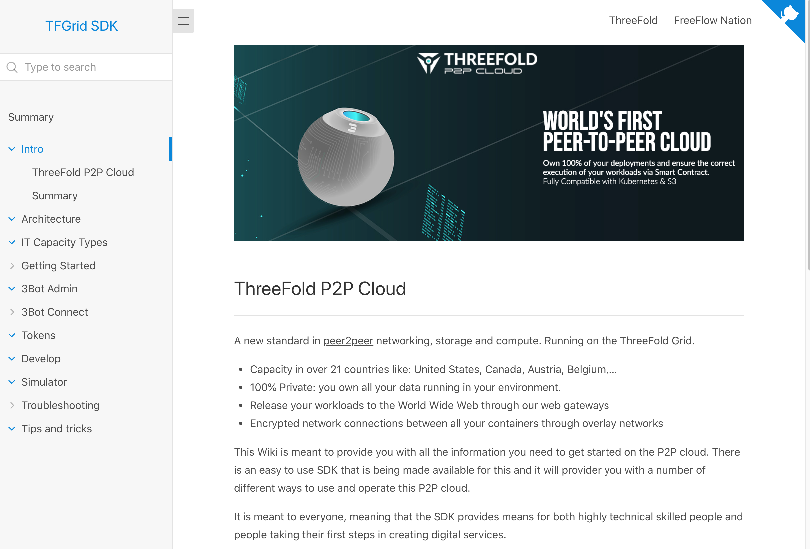

# info_tfgridsdk



### Manual Content

- [**Intro**](src/intro/README.md): This sections respresent an introduction the technolgy available through the SDK and the creator(s) and maintainer(s).  It should only have information about the technology in general, not about how to use it and what to with it.
- [**Getting started**](src/gettingstarted/README.md):  In this section we collect all the information needed to get the SDK up and running.  All pre-requisites and software components needed for a local install and for the future what needs done to have you
- [**SDK**](src/sdk/README.md): This is where the information sits describing the SDK, how to use the SDK. 
- [**Use cases**](src/usecases/README.md): Use case descriptions and examples to take forward yourself. 
- [**Tips and Tricks**](src/tips_tricks)


### Run the wiki yourself

PS: we have a new tool how to serve the wiki, its easier to use and has more support for the future (based on an own implemented server & docsify)

#### Get the documents (content)

The documentation is online but can also be downloaded for reading purposes and or updating/editing. 

```bash
mkdir -p ~/code/github/threefoldfoundation
cd ~/code/github/threefoldfoundation
clone https://github.com/threefoldfoundation/info_tfgridsdk/ -b development
#if you are on OSX do:
sh install_osx.sh
```

#### if you are on linux

- build the tool in https://github.com/threebotserver/publishingtools
- make sure tf_wiki is in path

#### this is only a prelease

by tonight normally we should have a new version which has easier install and also support for multiple wiki & website.

#### Run the server

```bash
cd ~/code/github/threefoldfoundation/info_tfgridsdk
run.sh
```

now go to: http://localhost:3000/index.html#/intro

### How to contribute

Contribution is welcome.  The TF Grid and the technology is an open source project and we welcome external help to make this project even better.  This manual is all about how to get started with the Software Development Kit,from downloading it and installing the SDK to executing workloads.

The steps needed to get the documentation on your device are:
- install the tool & get the content, see above
- if you want to edit, create your own branch to edit

Learn how to use the tool well:

- see https://github.com/threefoldfoundation/info_tfgridsdk/blob/development/src/tips_tricks/tfweb.md


#### Helping us to improve and edit the wikis

- all md files are under src/docs directory, please make sure you get all your changes there.
- to make link in md file to open in new tab use this 
- if you are planning ot make massive adjustments, please create your own branch and  clone / pull that branch.  When done please create a well described pull request and push it forwards for integration.

#### Branches and there purpose

**Master** This branch containes the information which is currently considered as production content.

**Development** This branch is used to be the staging branch before things are pulled into master.  Normally we try to have at the end of the day all the branches that are used for personal development and work to be pulled into the development branch.  Development is pushed into master every few days.

**Other branches**  Everyone that wants to participate in this projects, please create your own branch from development (clone the developement branch from the repository and create your own branch).  Please consider dooing a pull request at the end of every day in order for the branches not to divert too much.


### Owners

This repository is maintained by:

@weynandkuijpers

### Meetings
The team holds a update meeting twice a month, on monday at 17:00

<!-- TODO: create and enter a zoon link for the meeting -->
Zoom URL: 

### tips and trics

```
<a href="http://example.com/" target="_blank">Hello, world!</a>
```

