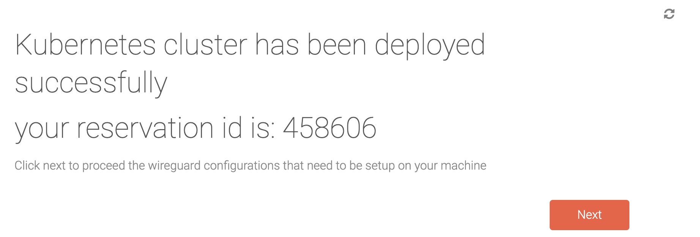
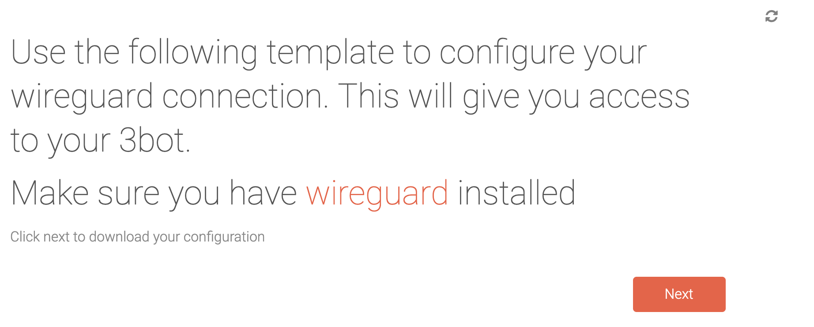

# Deploying a Kubernetes Cluster
## Deployment of a Kubernetes cluster through the chatflow

Within the 3bot Admin console, a chatflow has been created to reserve capacity to run Kubernetes cluster on. 

Through this chatflow, the kubernetes cluster is reserved and configured simply by collection of a number of parameters : 
- IPv4 vs. IPv6
- Number of worker nodes
- public ssh key (allowing to access the container using ssh)
- cluster secret
- network definition (choice between reuse of a netork that has been set up earlier or new one)
- ip addresses to access all workers

This information is sufficient to create the cluster.

If you choose to define a new network, this needs to be activated using Wireguard (see explanation on network).

Once this is done you can ssh into the virtual machine from your account that you used the ssh key from. 

## How to deploy a Kubernetes Cluster using the Jupyter Notebooks?
In the Navbar you will find the section "NEED THE NAME" that has pre-made notebooks. These will guide you through all the steps you need to take to setup a network, but do not limit you when it comes to parameter as you can edit the scripts as you go.

## How to deploy a Kubernetes Cluster using the CodeServer?
Within the SDK you'll find the CodeServer in the left hand navbar.
In here you will find all files and code you need to set up a network and have total control over it, set your parameters, choose your nodes, etc.
