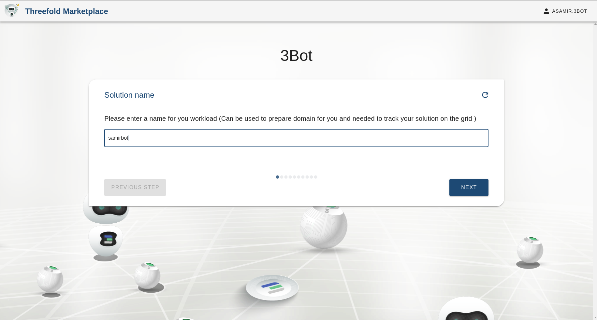
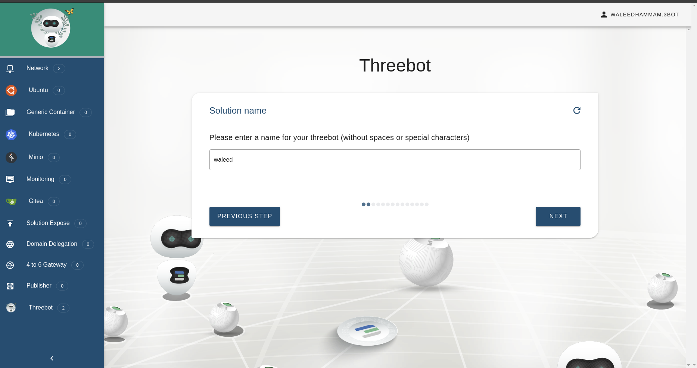
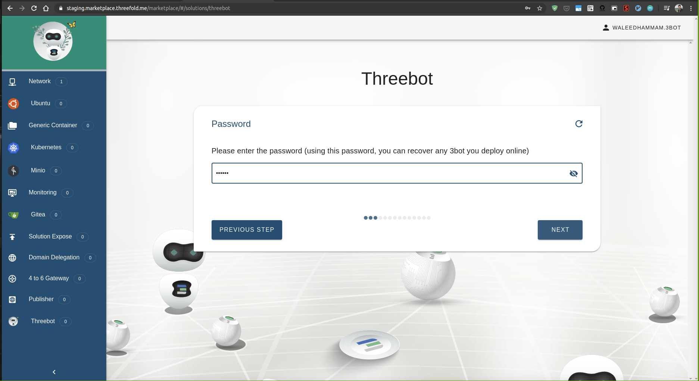
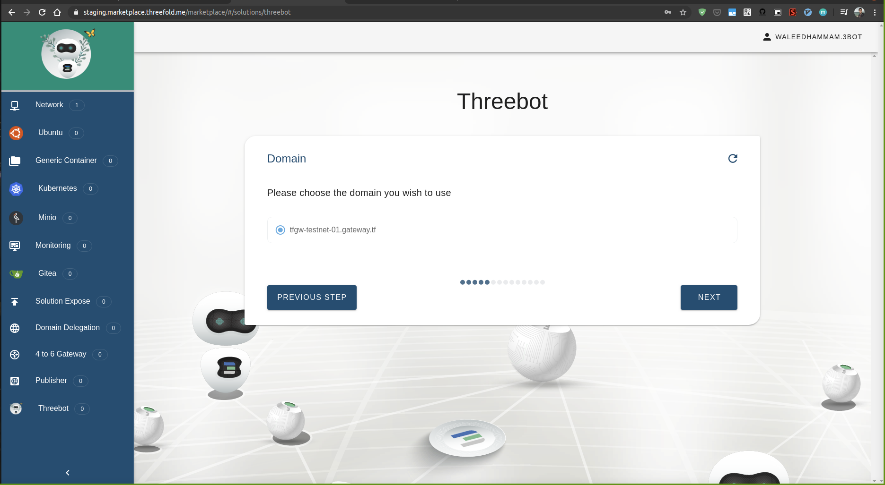
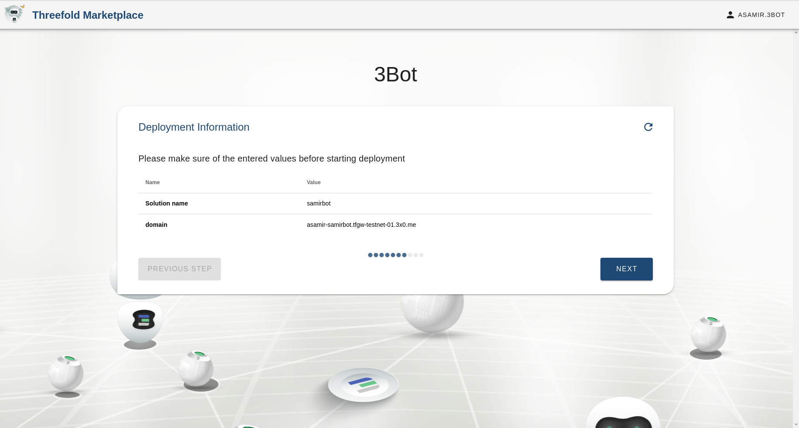
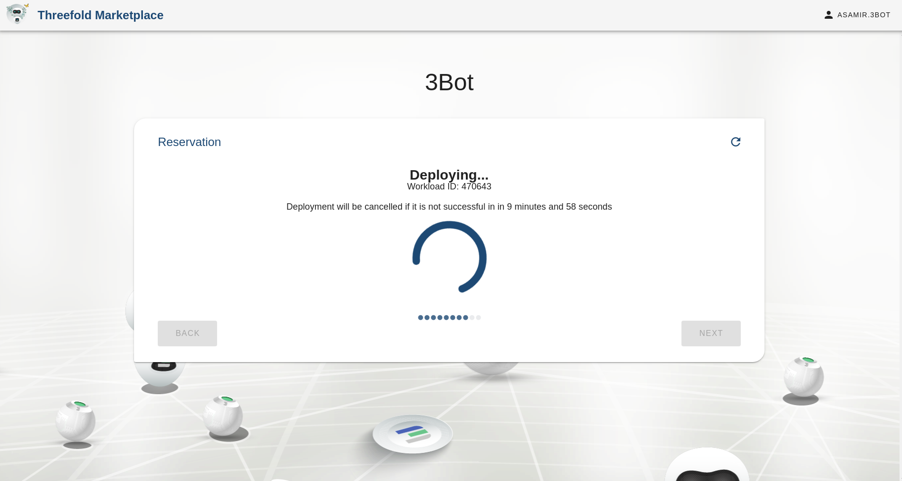
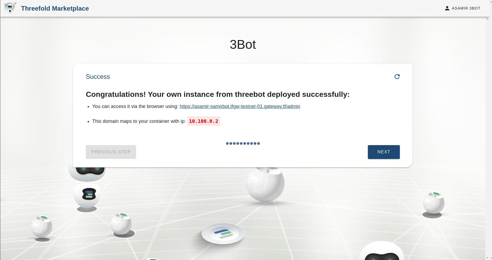
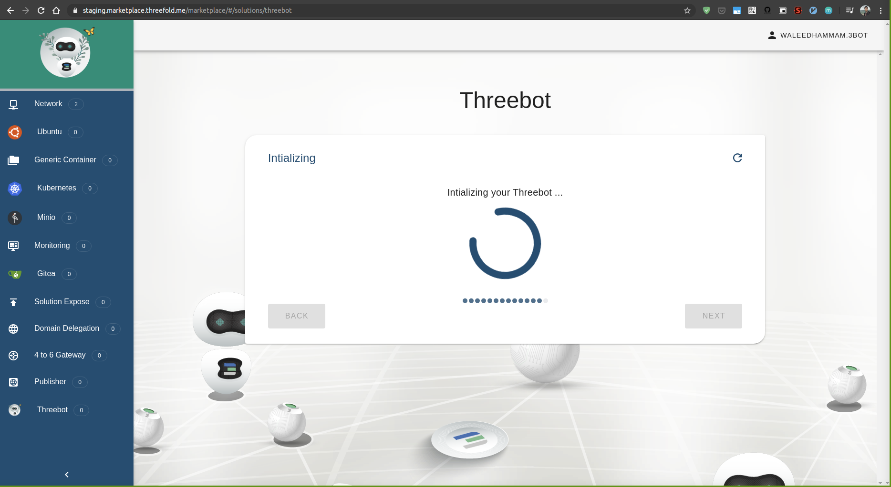
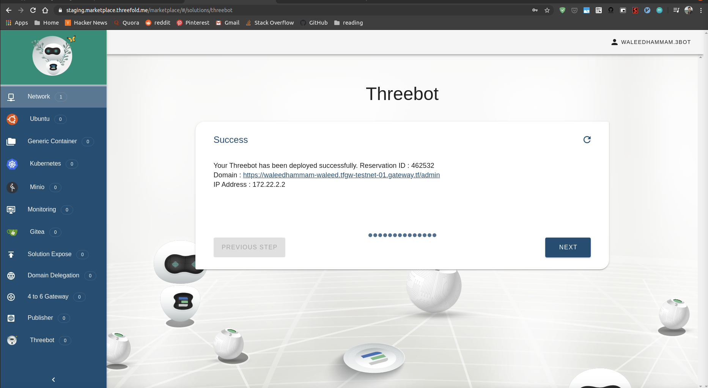

# Online / hosted 3Bot solution

Deploy your 3Bot online

## Accessing the solution

Go to [TF Grid Marketplace Testnet 2.2](https://marketplace-testnet.grid.tf) and click on 3Bot

## Steps

Add the solution name.
Keep in mind it will also be the subdomain.

Select the backup & restore password.
Your solution has backup and restore you could access them through the dashboard.

Select the network you want to deploy the solution with.

Add your ssh key, needed to access the container later.

Select the domain you want to deploy your solution on from the available ones.

Select the branch of the sdk you need your solution with.

Select your solution container resources.

Select the container expiration time.

Select the farm you want to deploy your container on.

Summary of your choices for the solution.

Payment step for the container using 3Bot staging app.

Deploy your online solution.

This step will initalize your 3Bot container to be ready to use.

Deployment successful, you could access your 3Bot now using the domain name or the ip address.

Go to the domain and sign in using 3Bot connect with the 3Bot identity you deployed your solution with.

You will find your admin dashboard and initial backup has been already made.

You could now access codeserver, notebooks, farm management or any package.

