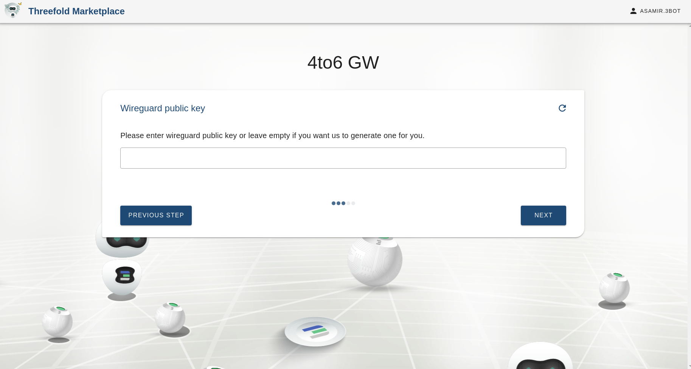
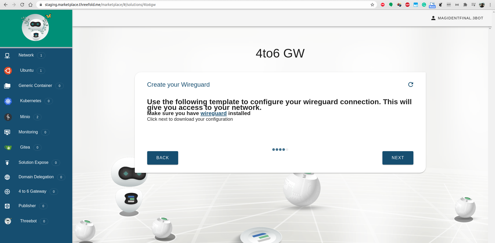
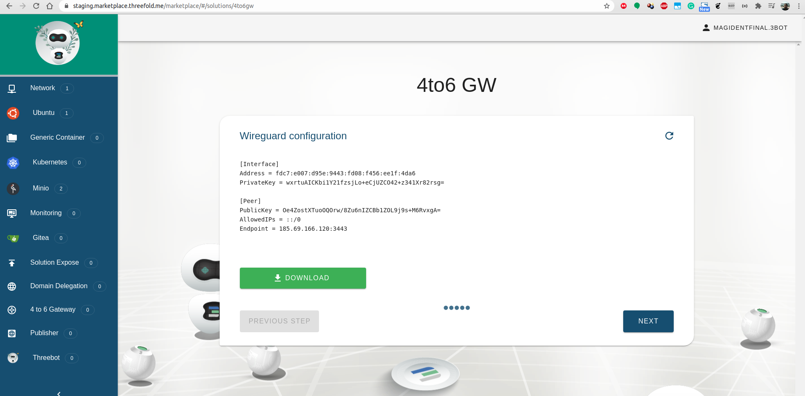

## 4to6GW deployment
4to6gw provides access to IPv6 addresses for users with IPv4 networks only through a Wireguard tunnel.

## Steps

#### Select Gateway

#### Set Public Key (Optional)
You could leave it empty in which case a keypair will be automatically generated.

#### Click next to start deployment

#### Make sure wireguard is installed

#### Download Configuration

#### Set up your Wireguard Connection

