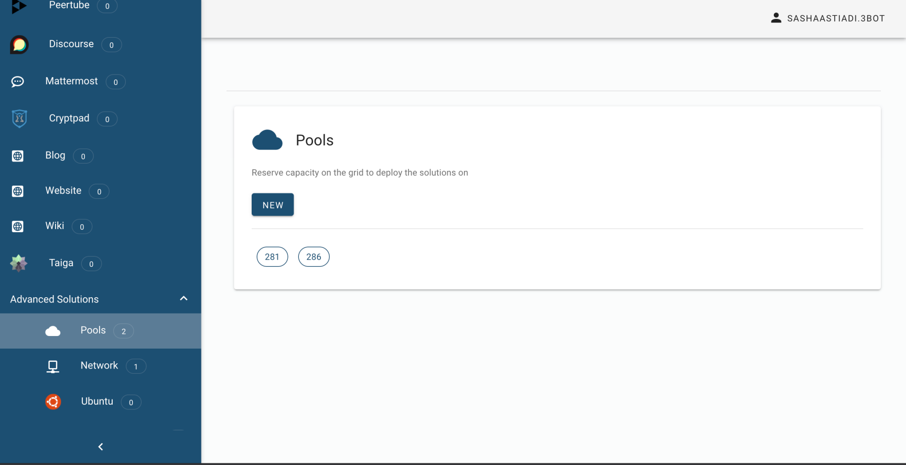
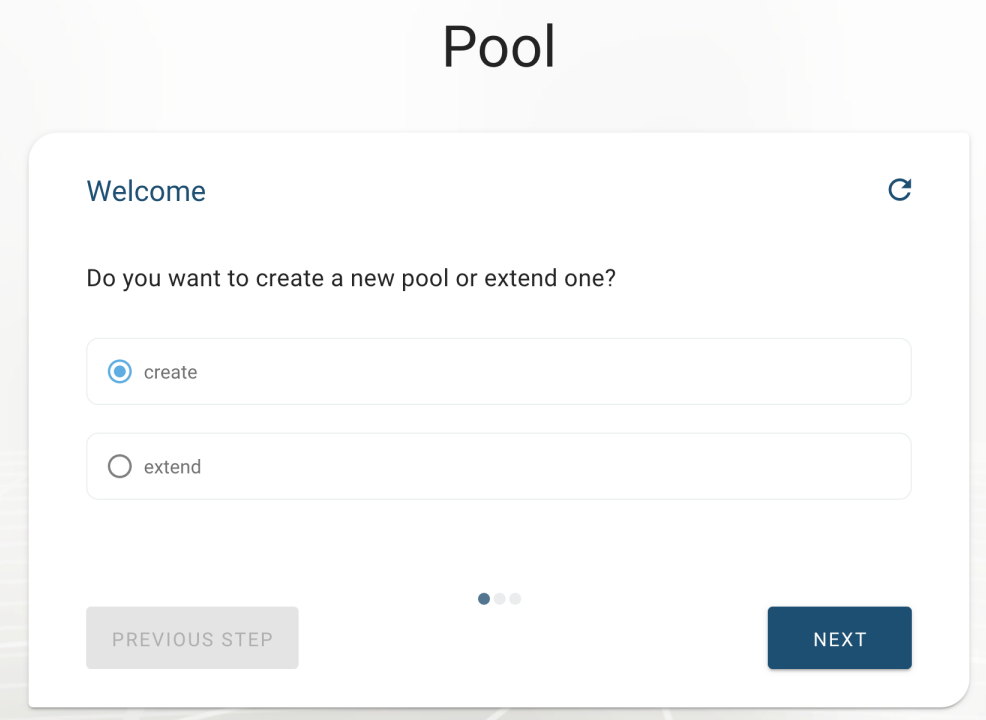
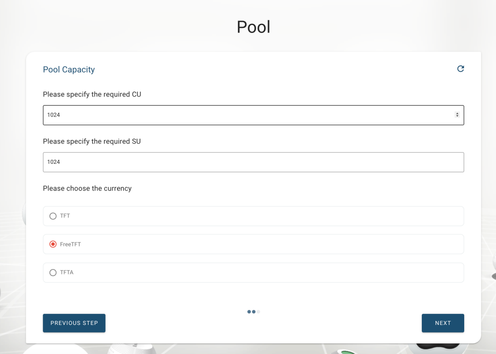
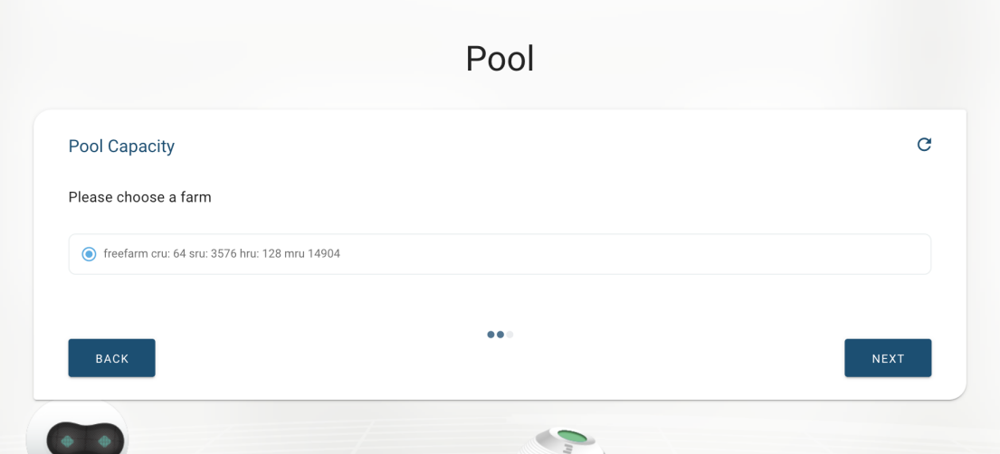
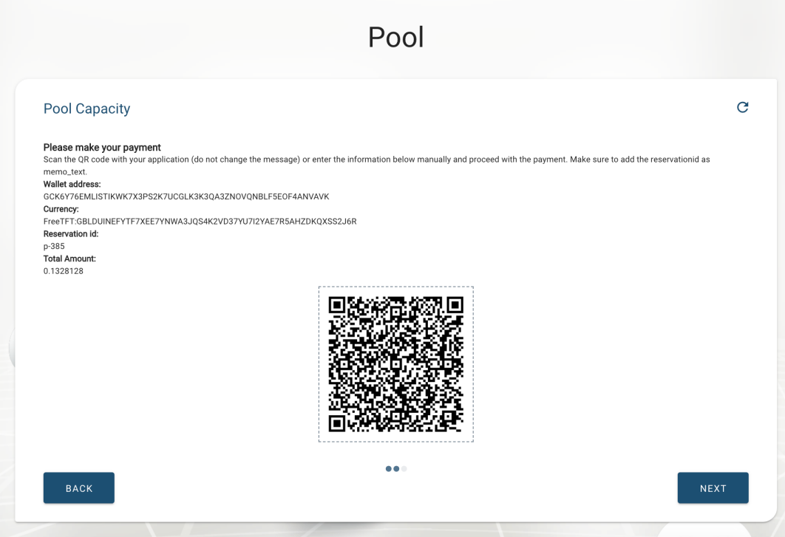
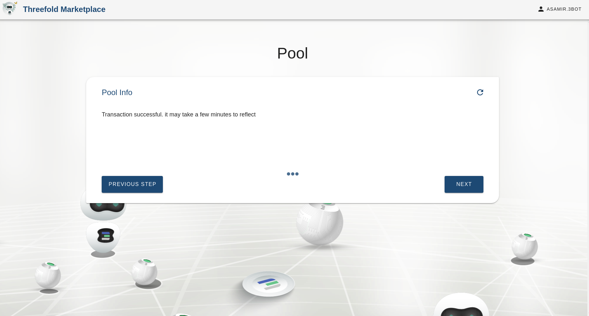
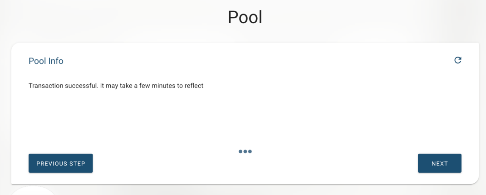

# Introducing: Capacity Pools

Capacity Pool is one of the most exciting features made available on TF Grid 2.2 (Testnet) version- A feature to reserve capacity on the grid to deploy your solutions on.

By doing just a few clicks, you will be able to reserve IT Capacity for your projects directly by creating multiple capacity pools. 

You could directly order the capacity from your chosen farms, simply by putting the amount of Storage Unit (SU) and Capacity Unit (CU) you need, and conduct a direct payment via your stellar wallet for your reservation. You will be able to also extend your current capacity pool to a larger quote once it’s activated.

You could now already try to reserve IT Capacity by using FreeTFT on TF Grid Marketplace 2.2 (Testnet).

## How to Reserve IT Capacity

### Select 'Pools' from the 'Infrastructure Solutions'

### Choose 'Create' to Create a New Capacity Pool

Select __'Create'__ if you have not created any capacity pool before, or if you would like to create a new separate pool from your already existing one. Select __'Extend'__ if you would like to reserve more capacity on one of the pools you have created.

### Specify the Amount of CU and SU You Want to Add to the New Capacity Pool

__CU__ stands for __Compute Unit__; it is the amount of data processing power specified as the number of virtual CPU cores (logical CPUs) and RAM (Random Access Memory). __SU__ stands for __Storage Unit__; it is the size of data storage capacity. CU and SU are components of __TF's Cloud units__; the components that account for farmed and used capacity. Cloud units are the compute, storage and network equivalent to kWh - kilowatt-hour - the unit of energy. 

Feel free to go to [__Grid Concept__](https://wiki.threefold.io/#/grid_concepts?id=some-examples-of-cu-and-su-in-detail) section of TF Grid Wiki to learn more about Cloud Units.

After you specified your workload demand, plesase choose __'FreeTFT'__ as your payment method, since on a testnet environment, we would only be paying our IT Capacity with FreeTFT.

### Choose Your Farm Preference to reserve IT Capacity From

Please keep in mind that on testnet we only listed one 'demo farm' as a farm to reserve testnet IT Capacity from. On a mainnet environment there would be more than one farm available to choose from, you would eventually be able to choose to reserve IT Capacity from one of your preferred farms.

### Prepare to Pay for the Reserved IT Capacity

Scan this QR Code by using one of your testnet stellar wallets to begin the payment process of your reserved IT Capacity. You could also do it manually by copying the __Wallet Address__, __Reservation ID (Memo Text)__, and __Total Amount__ you would have to pay for your capacity.

### Pay for Your Capacity via Stellar Wallet

Open your stellar wallet and send the FreeTFT total amount to the IT Capacity reservation wallet address. This is an example of a payment page from a [Testnet Interstellar Wallet](interstellar_wallet.md). You could also use a [Testnet Solar Wallet](solar_wallet.md), or any other existing Testnet stellar wallet to pay for your capacity.

### Confirm Your Payment

Go back to the Marketplace page, click __next__ on the previous payment page to check if you have successfuly made the payment via your wallet. The screen would show the above instruction once the payment is successfully made. Please resend the payment via wallet if you did not do it successfully, or [__contact our helpdesk__](https://threefoldfaq.crisp.help/en/) for payment assistance.

### Click on 'Restart' to go back to the main 'Pool' Page

Go back to the beginning of the walkthrough to see the list of your existing capacity pools.

### Click on 'Pool Number' to check on your New Capacity Pool's Workload

 Each capacity pool is named after few digits of auto generated numbers and is always listed on the first page of your __Pools__ submenu. Click on __'Pool Number'__ to See the details of each __capacity pool's workload__. It will take a few minutes after your successful reservation transaction for the details of the active cloud units and active storage units to be properly updated. Please [__contact our helpdesk__](https://threefoldfaq.crisp.help/en/) for any help and assistance in managing your capacity poola.
