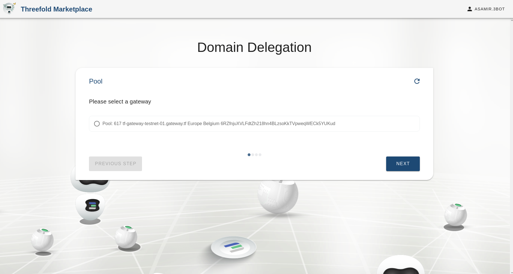
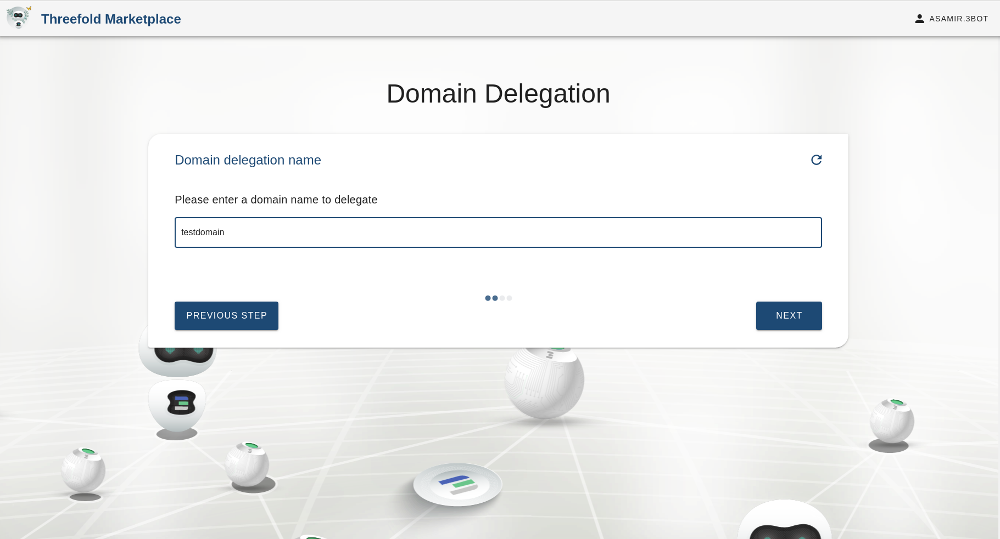
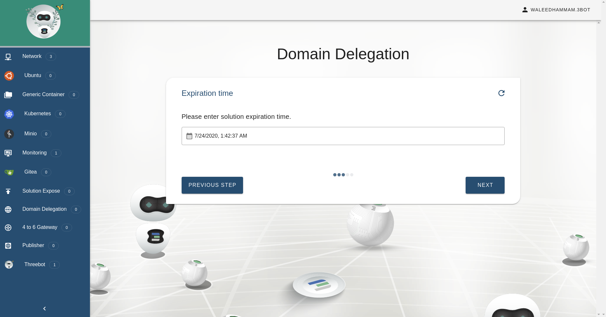
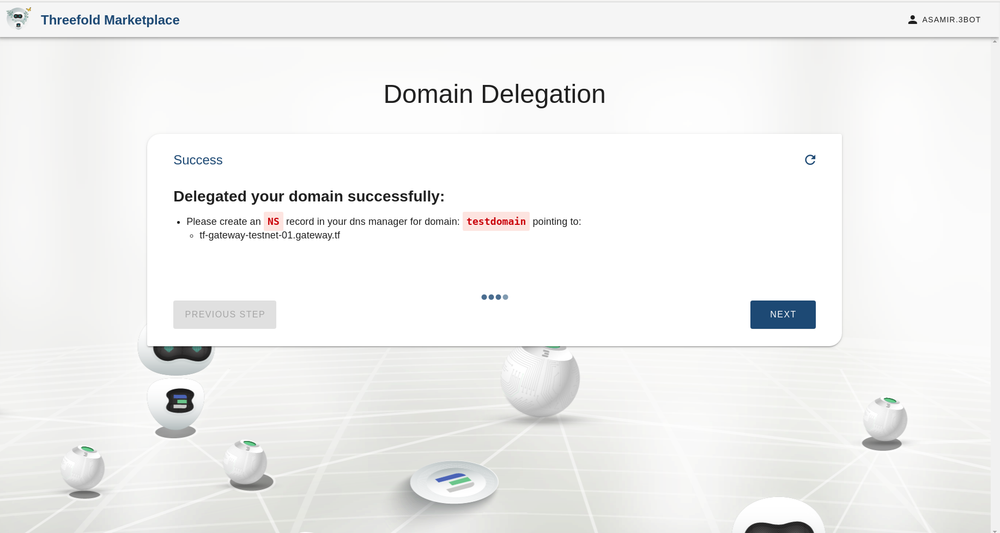
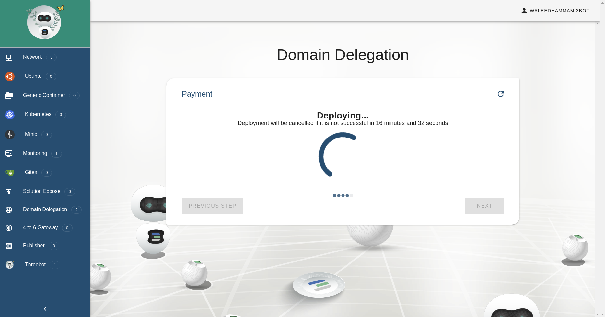

# Domain delegation

Delegate your domain to one of the tf gateways

## Accessing the solution

Go to the marketplace https://marketplace.grid.tf/marketplace and click on Domain Delegation

## Steps

## Add the domain name and select one of the available gateways

## Select the expiration time

## Select the solution currency

## Depoly the solution

## Congrats the solution has been deployed now

