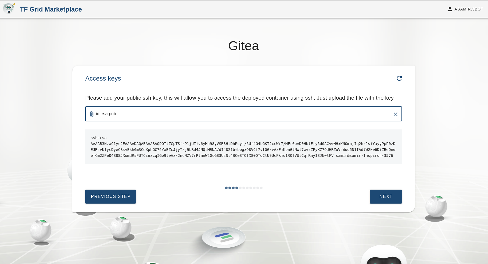
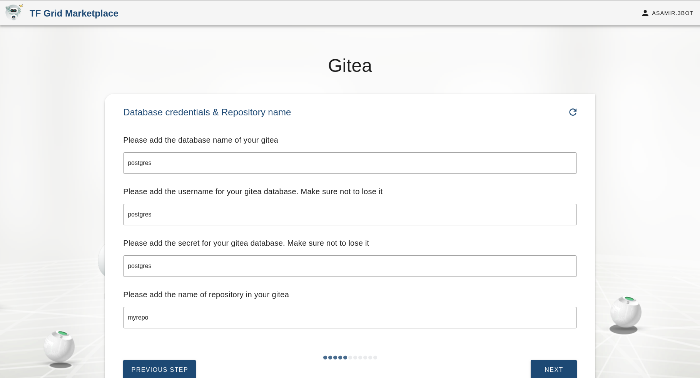
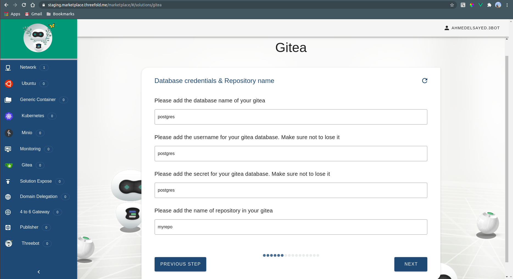
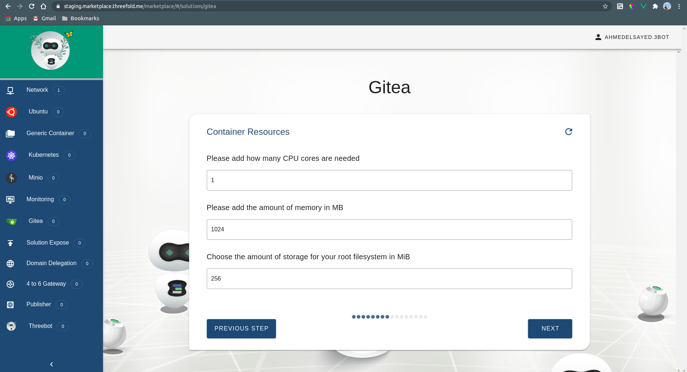
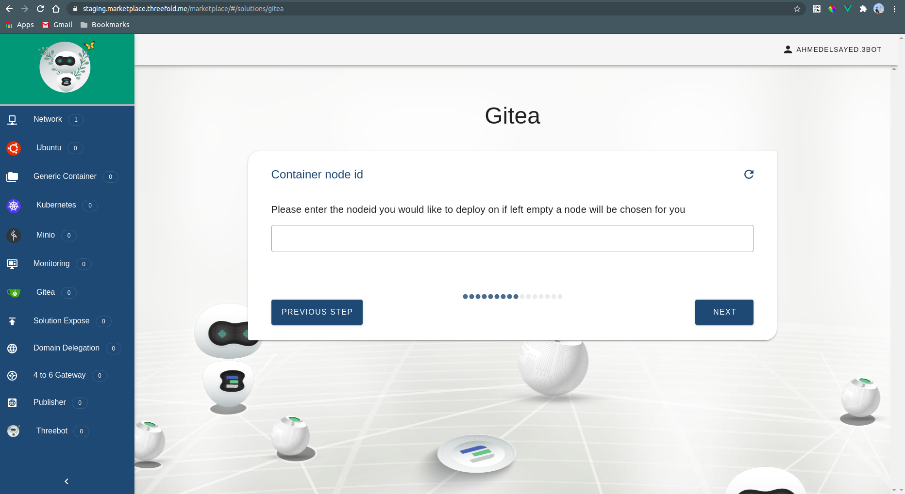
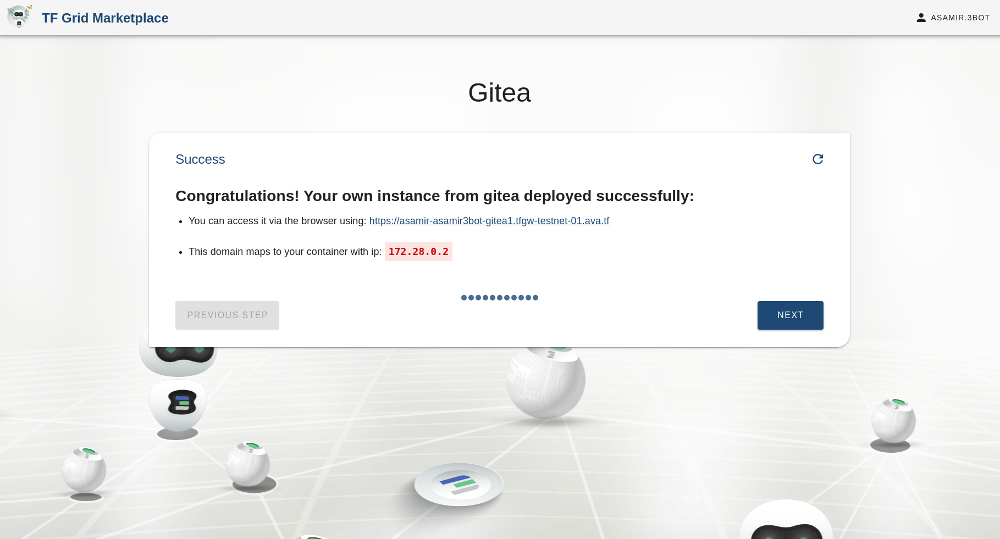
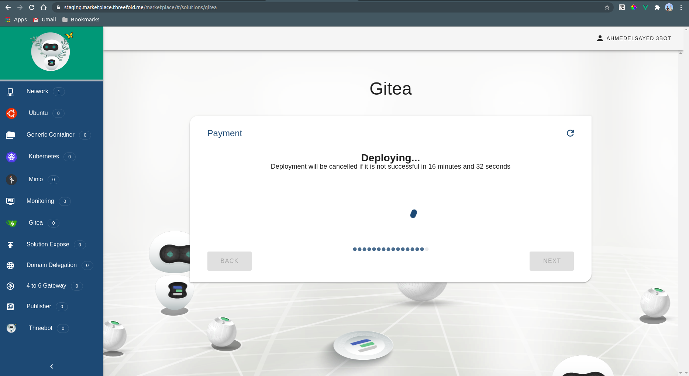
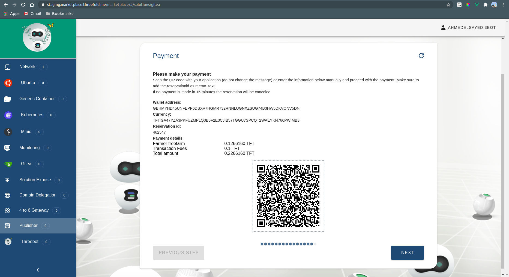

## Gitea

### Welcome

### Solution name

Choosing the name of the solution to be deployed. This allows the user to view the solution's reservation info in the dashboard deployed solutions

### Choosing network

Choosing the network to be used from a list of existing networks created by the user

### Access keys

Uploading your public key for SSH access

### Expiration

Now we need to tell the grid how long we want our solution to stay alive on the grid

### Database info

PostgreSQL instance information

### Container resources

Here we specify the CPU and Memory resources allocated for the container

### Container node id

Here we can provide a node id corresponding to a current node on the grid to deploy the container on. If there is no specific node to be used then it is left empty.

### Selecting farm

If the nodeid is left empty, we can choose the farms on which the container can be deployed on. The farms are basically a group of nodes where multiple solutions can be deployed on. We can either choose the farm name from the drop down list or leave it empty to randomly choose any farm.

### Selecting solution IP

Here we choose the IP to access the solution

### Confirmation

Here we confirm the specifications we entered in the chatflow

### Deployment 

### Payment

We select the wallet that we will pay with to proceed with the payment for the solution that will be deployed.

### Accessing the container

### Accessing the UI
