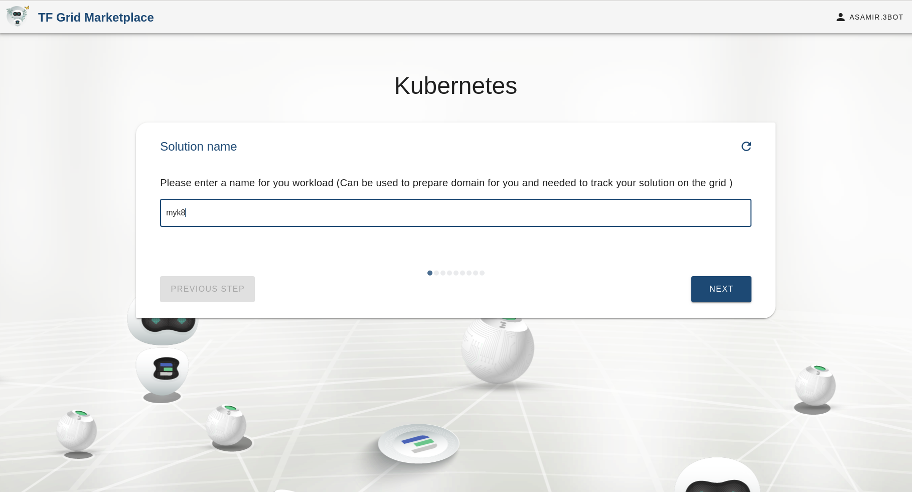
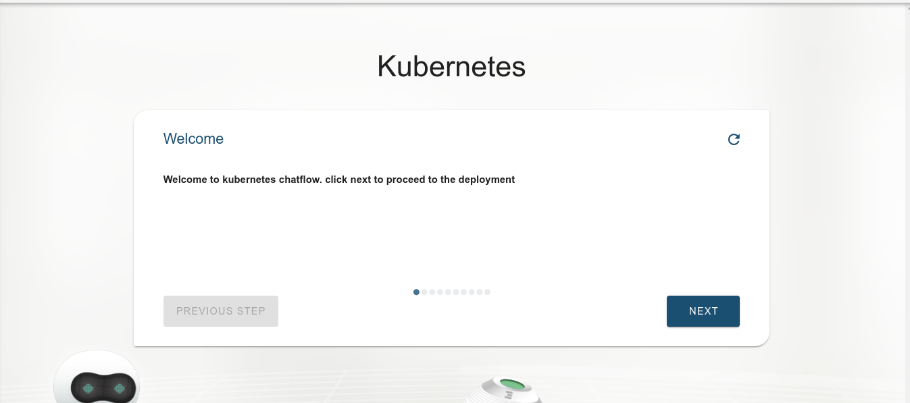
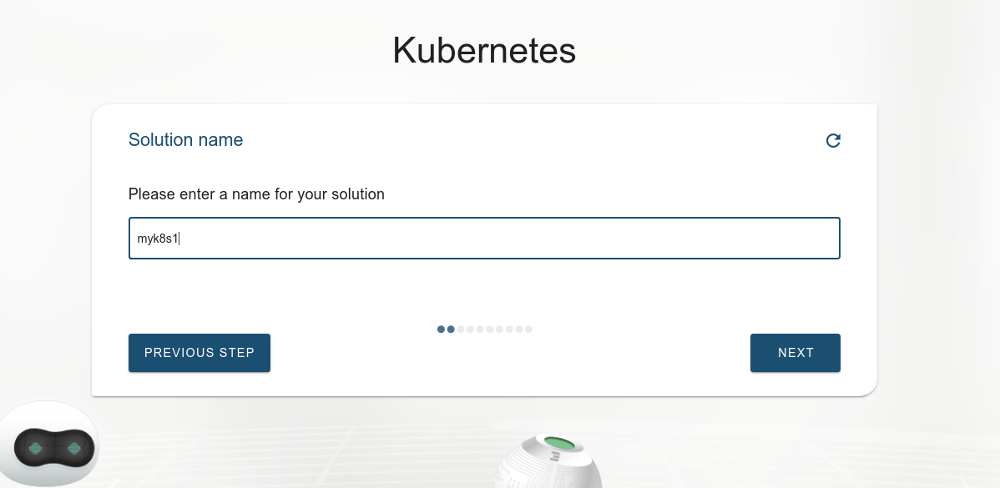
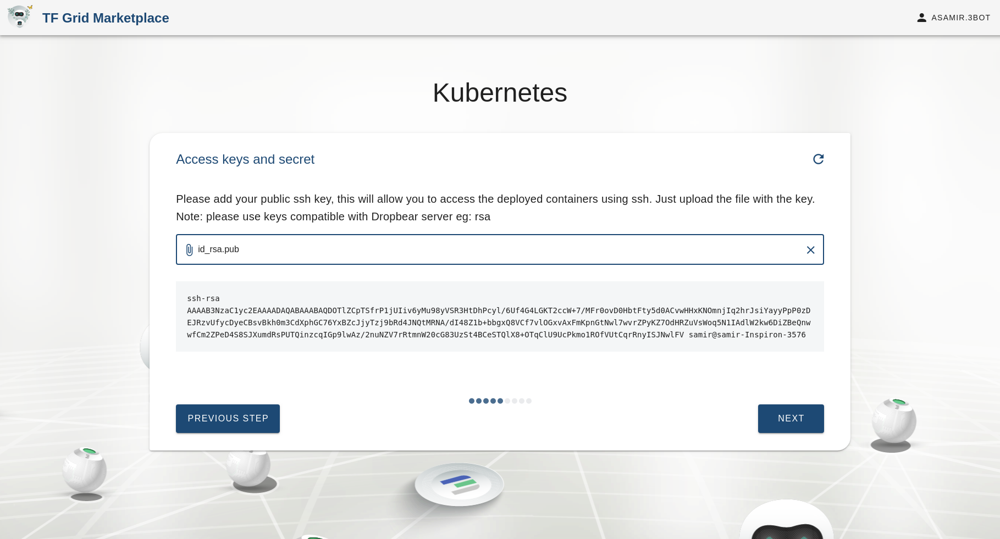
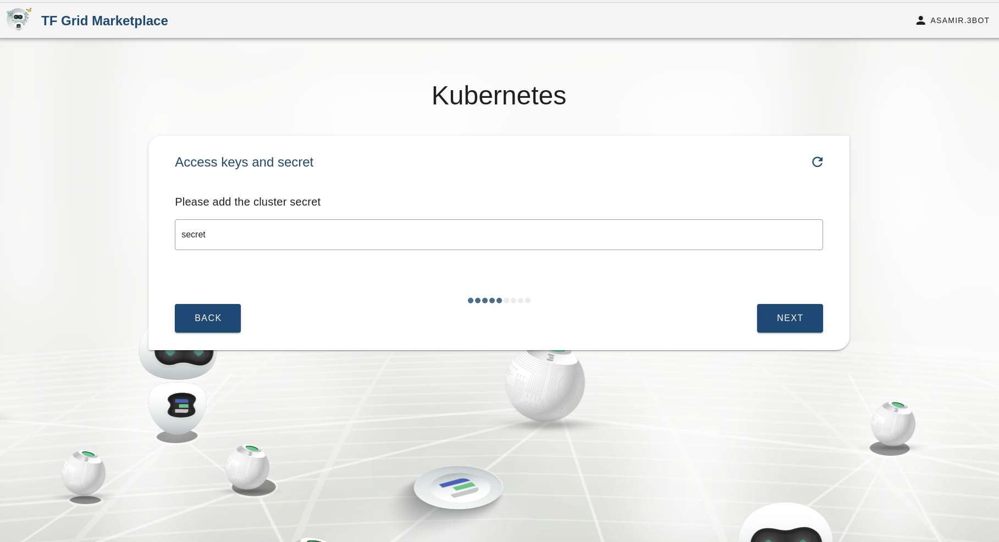
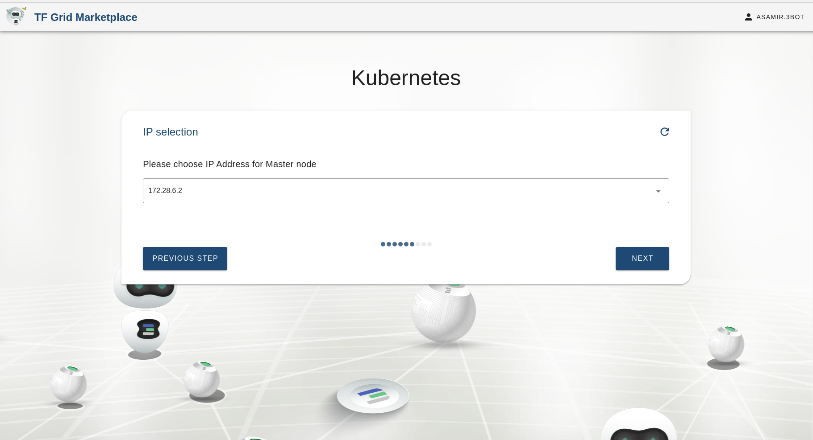
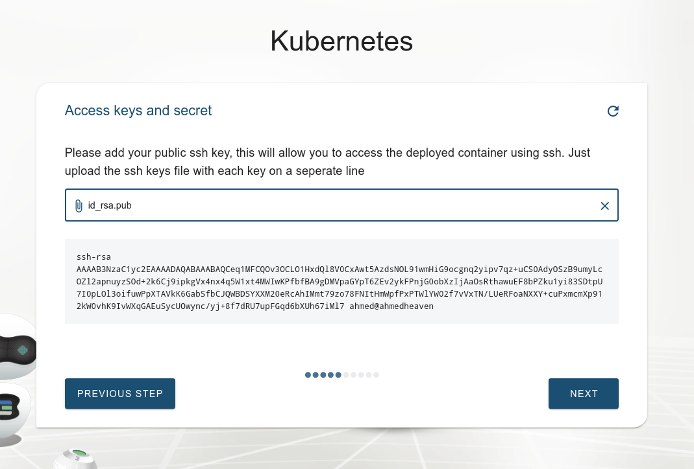
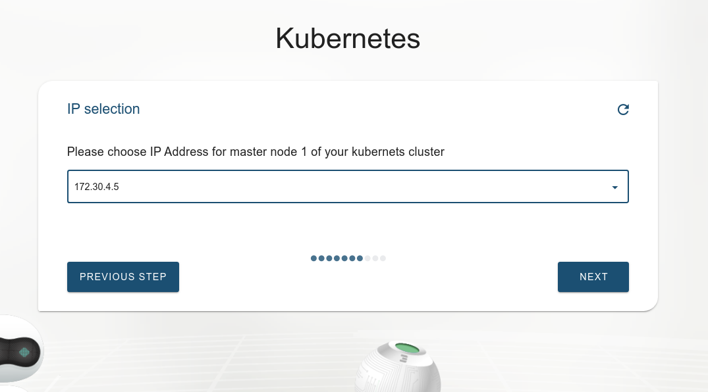
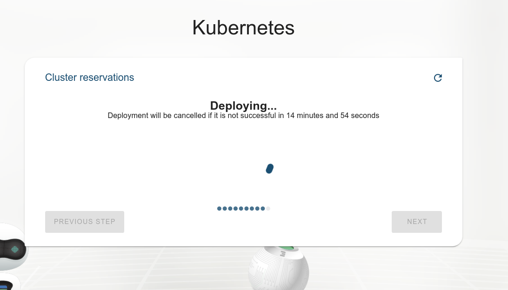

## Kubernetes cluster deployment

This solution is used to deploy a Kubernetes cluster with zdb using a chatflow.

In this guide we will walk you through the provisioning of a full-blown kubernetes cluster
on the TF grid.

We will then see how to connect to it and interact using kubectl on our local machine.

Finally we will go through some examples use cases to grasp the features offered by the cluster.

## What is Kubernetes
A [Kubernetes](https://kubernetes.io) cluster is a set of node machines for running containerized applications. At a minimum, a cluster contains a worker node and a master node.

Optionally (if you want to deploy the charts);
- helm (v3) ([install instructions](https://helm.sh/docs/intro/install))
## Accessing the solution

### Choosing deployment name

Choosing the name of the solution to be deployed. This allows the user to view the solution's reservation info in the dashboard deployed solutions

### Choosing network

Here we choose which network we connect our kubernetes cluster to

### Choosing the nodes specification

Here we specify the size of the nodes that will be selected for deployment. We also specify the number of master nodes and worker nodes that will be in the cluster

### Uploading your public Key

This step is necessary to access the kubernetes machine and authorize you to be able to SSH into it

### Choosing a secret for the cluster

Now it's time to choose the secret for your kubernetes cluster, make sure you don't forget it.

### Expiration

Here we specify for how long you want to reserve kubernetes cluster on our grid

### Set the IP Addresses for the solution master nodes

We select IP addresses equal to the number of master nodes we entered earlier.

### Set the IP Addresses for the solution worker nodes

We then select IP addresses equal to the number of worker nodes we entered earlier

### Confirm your reservation

Here we confirm the specifications we entered in the chatflow

### payment

Finally we select the wallet that we will pay with to proceed with the payment for the solution that will be deployed.

After the deployment of the Kubernetes cluster is complete, the user with the ssh keys will have access to the deployed cluster.

### Deployment information

### Accessing the cluster

