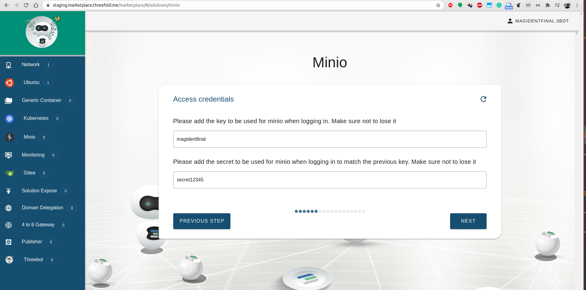
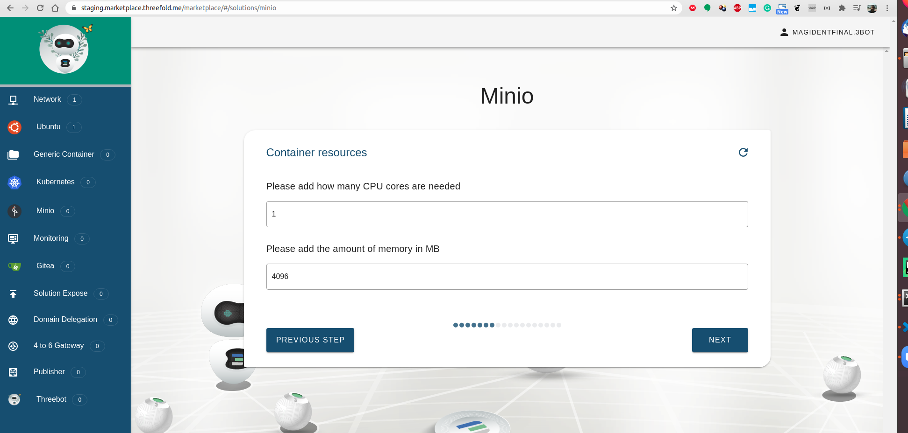
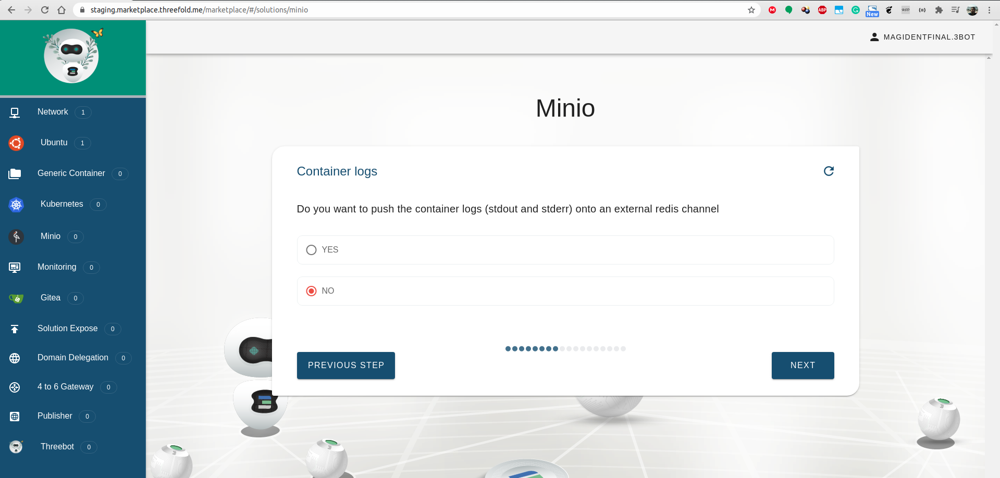
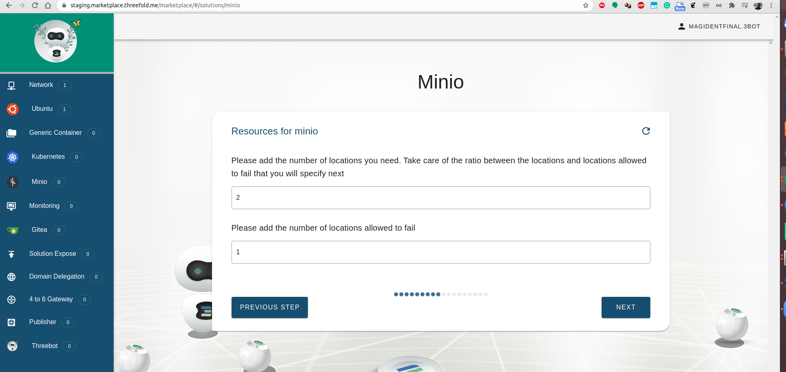
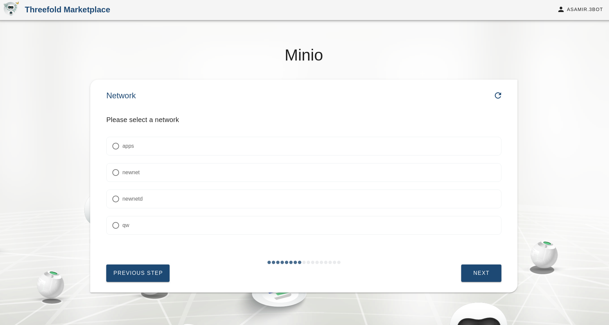
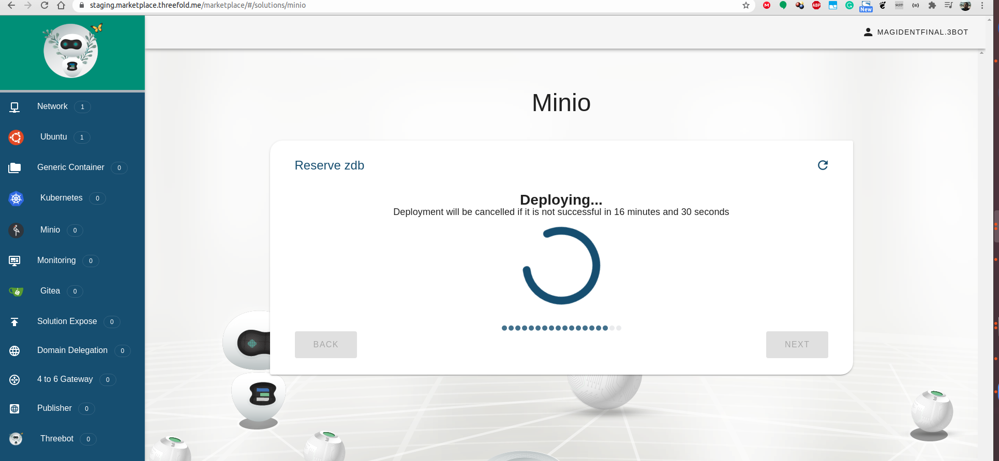
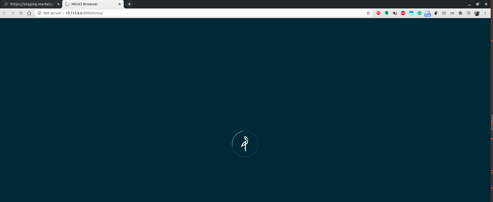
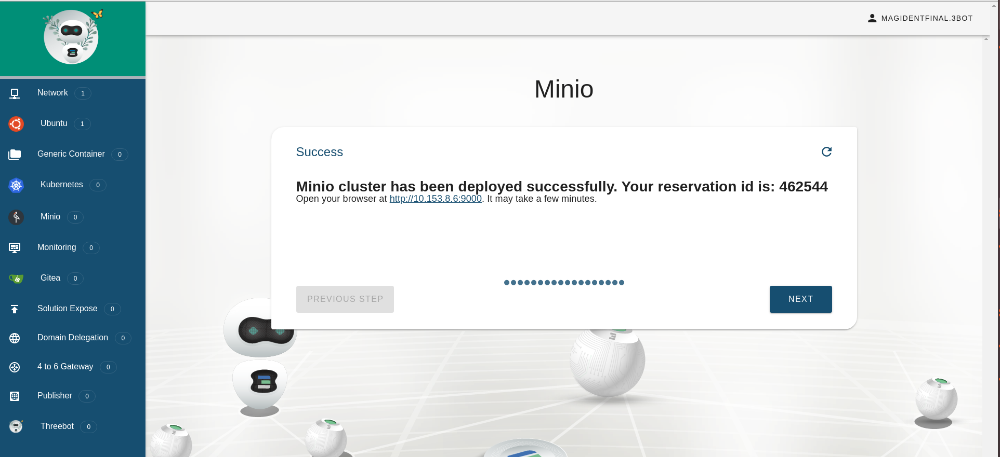

## Minio deployment
Minio is an object storage server with a nice ui and S3 APIs.
This solution will help create a Minio deployment in a Single or Master/Slave mode.

## Steps

#### Choose Name

#### Choose Network

#### Setup Type

#### Choose Storage Type

#### Set Credentials (AK/SK)

#### Set Container Resources

#### Optional Container Logs

#### Specify Number of Shards

#### Add you SSH Key

#### Select IP

#### Confirmation

#### ZDB Reservation
The solution does two reservations, one for ZDB which will be used as backend for Minio and the next for Minio containers.

#### Success

#### Access your Solution
