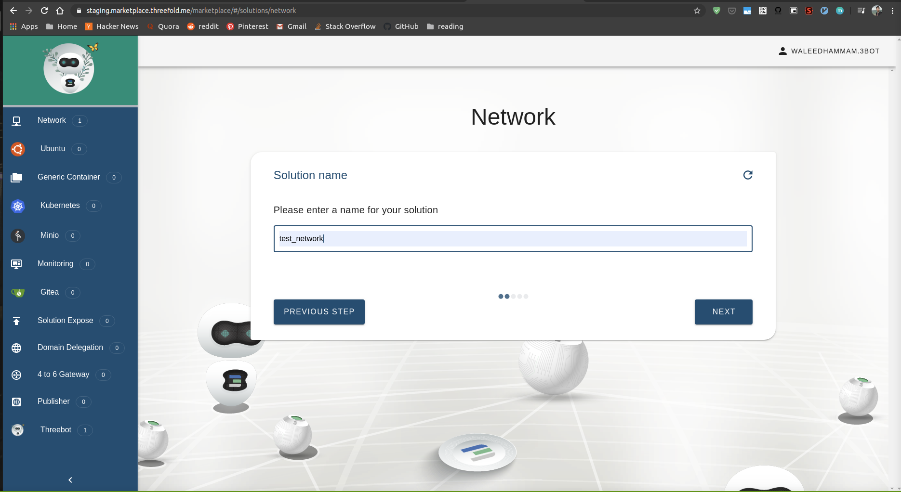
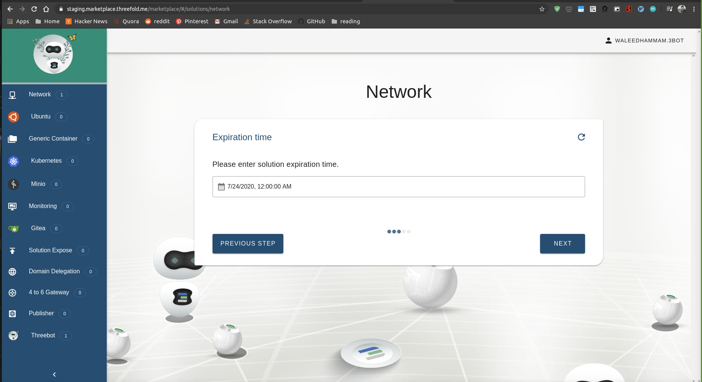
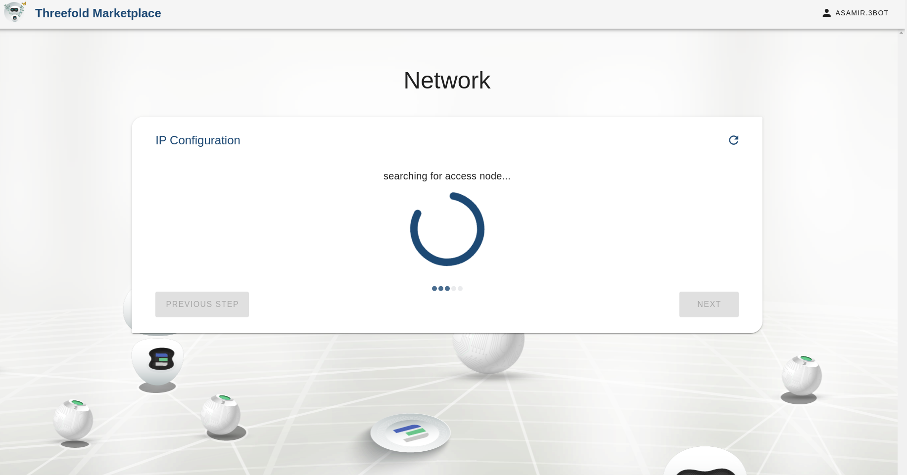
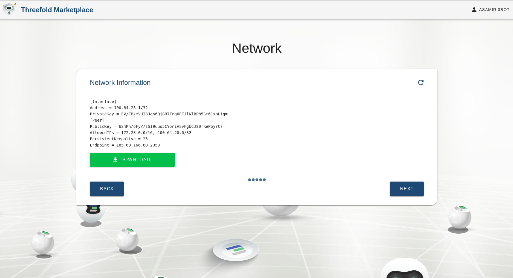
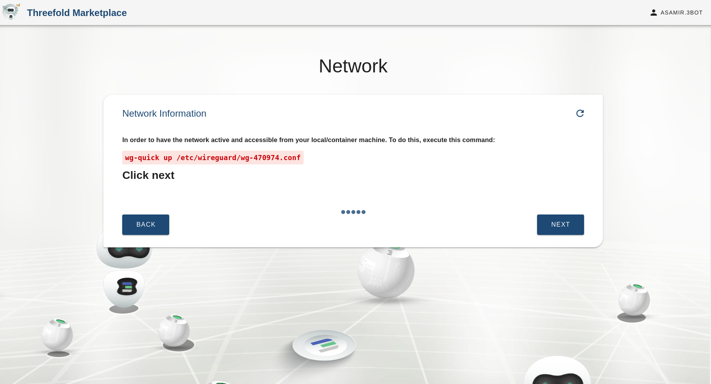

# Network solution

This chatflow is used to deploy a network on the grid and to connect your solutions together.

## Accessing the solution

Go to the marketplace https://marketplace.grid.tf/marketplace and click on Network

## Inputs

The solution takes some configurations from the user, we will list them and explain their meaning

- `Network name` : a name for the network to deploy on and also to reference in the reservation manager.
- `Payment currency`: a currency that will be used for the payment
- `Expiration time`: a network expiration time (minutes=m ,hour=h, day=d, week=w, month=M) is how long you want that solution to live on the grid
- `IP version` : (IPv4 or IPv6) Version of the entrypoint node.
- `IP range` : Configure network manually by choosing an IP range to use or the deployer can choose for you and generate an IP range automatically

## Chatflow steps

### Choosing the network name

### Expiration time

Choosing the expiration time for the network on the grid

### Select the farm you want to deploy on

Choosing the expiration time for the network on the grid

### The network IP Range

We decide the IP range the network and all of the other solutions connected on it will operate on

### Payment currency

Choosing a currency that will be used for the payment

### Choosing how to reach the entry point node

To reach your solution on the grid you can use IP v6, problem is some countries don't have that infrastructure so we provide them access with an IP v4 entry point.

### Wireguard install

Just ask you to make sure you have Wireguard installed

### Wireguard configurations

While the grid is built around IP v6 you need you to connected to the network, and that's done using wireguard.

### Configuring your machine

Now you need to configure your machine to access the network by applying the wireguard configurations

## Access solution info from the main screen

