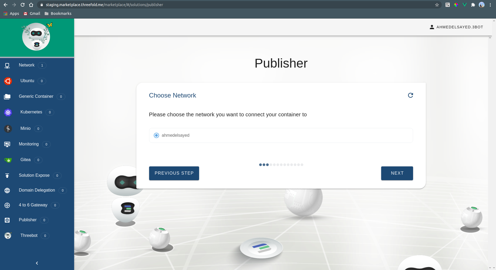
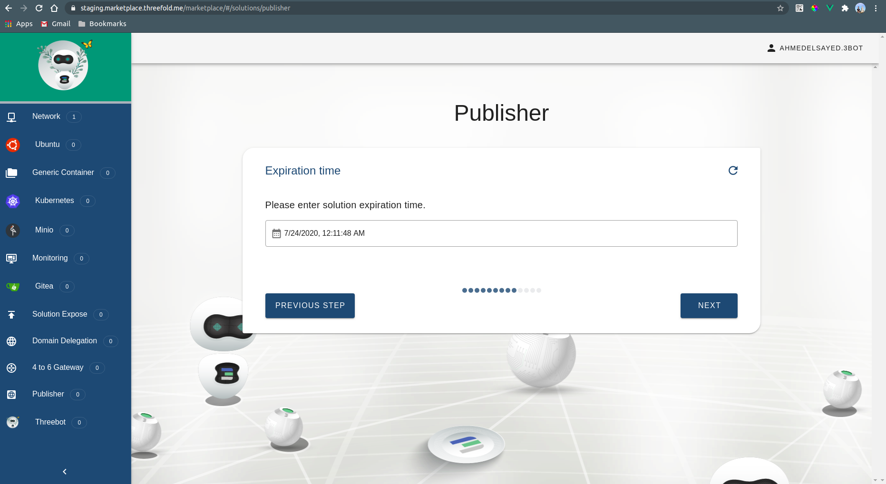
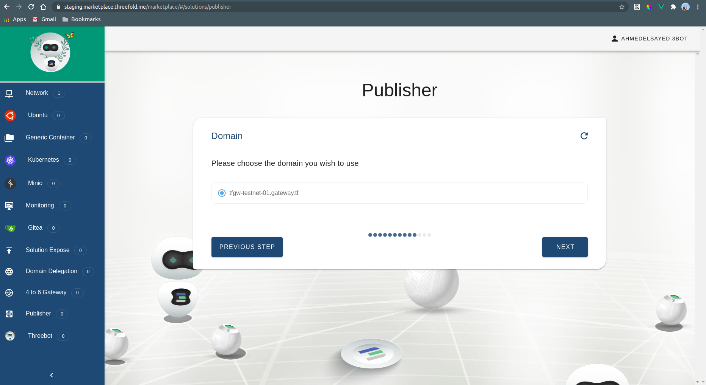
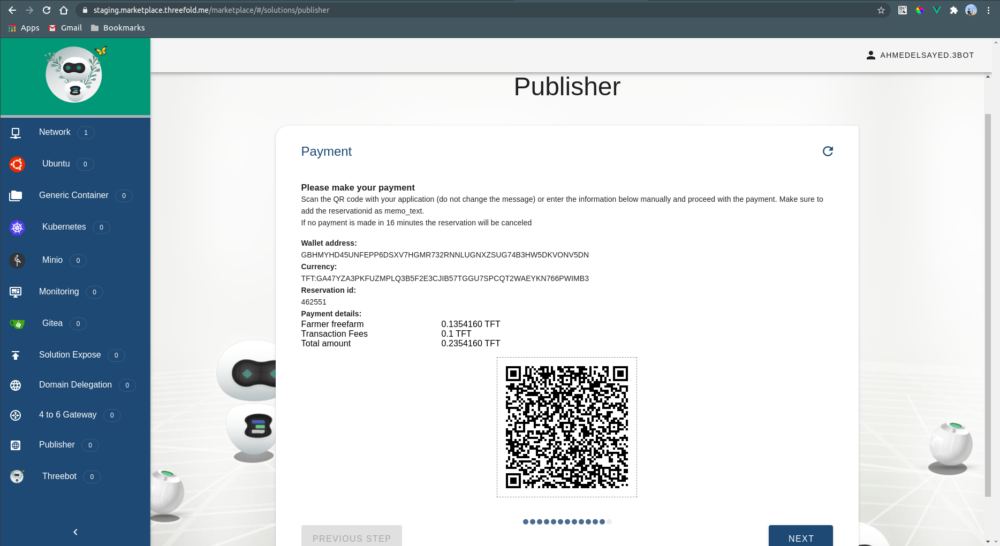
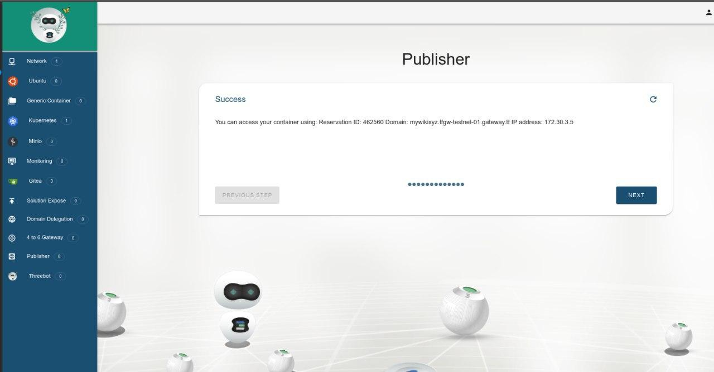

## Publisher

Publisher is a web [publishing platform](https://github.com/threefoldfoundation/publishingtools) can be used to host wikis, websites, and blogs (you can find examples of deploymentns on sdk.threefold.io)

### Accessing the solution

#### Choosing the solution name

Choosing the name of the solution to be deployed. This allows the user to view the solution's reservation info in the dashboard deployed solutions

#### Choosing the network name

Choosing the network to be used from a list of existing networks created by the user

### Access keys

Here we upload the keys to the deployed container

### Choosing a farm to deploy on

We can choose the farms on which the container can be deployed on. The farms are basically a group of nodes where multiple solutions can be deployed on them. We can either choose the farm name from the drop down list or leave it empty to randomly choose any farm.

#### Choosing the private IP address of the container

Choosing the private IP address that will be used to access or communicate with the deployed solution

### Choosinng the expiration time

Setting the expiration time

### Domain to expose the system on

Choosing a domain to expose the system on

### Confirmationn

Confirmation of the submitted choices.

### Payment

Payment step

### Deployment info

### Accessing the solution

