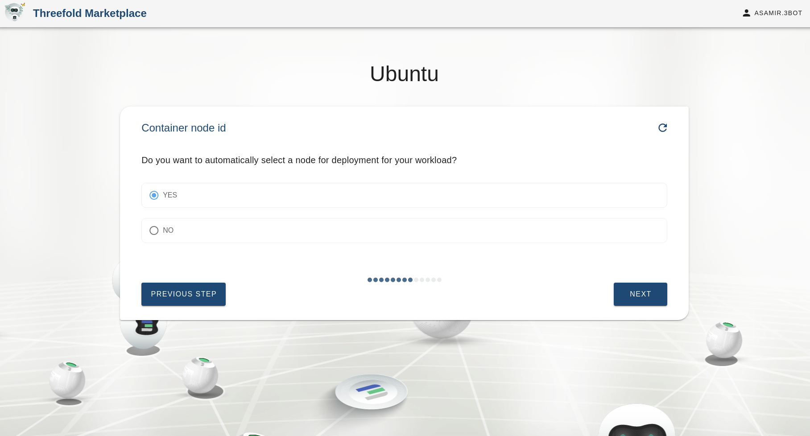

# Ubuntu
A free and open-source Linux distribution based on Debian.
Ubuntu is officially released in three editions: Desktop, Server, and Core(for internet of things devices and robots). This package is used to deploy a Ubuntu container from an official Flist on the grid using a chatflow.

### You need to create a pool and a network first before deploying your ubuntu container

# Steps to deploy solution

### Add the solution name. Keep in mind it will also be the subdomain.

### Choose your ubuntu version

### Choose container resources
Here we specify the CPU and Memory resources allocated for the container

### Select a pool for your solution

### Choose a network

### Choose whether you want to push the container logs onto an external redis channel or not

### Access keys
Uploading your public key for SSH access

### Select node or leave it empty
Here we could provide a node id corresponding to a current node on the grid to deploy the container on. If there is no specific node to be used then it is left empty.

### Choosing private IP

### Choose whether you want to assign a global Ipv6 address for your container or not

### Confirmation
Here we confirm the specifications we entered in the chatflow

### Deploying your solution

### Deployment successful, you could ssh into your container now using ip address.
