# Ubuntu
A free and open-source Linux distribution based on Debian.
Ubuntu is officially released in three editions: Desktop, Server, and Core(for internet of things devices and robots). This package is used to deploy a Ubuntu container from an official flist on the grid using a chatflow.

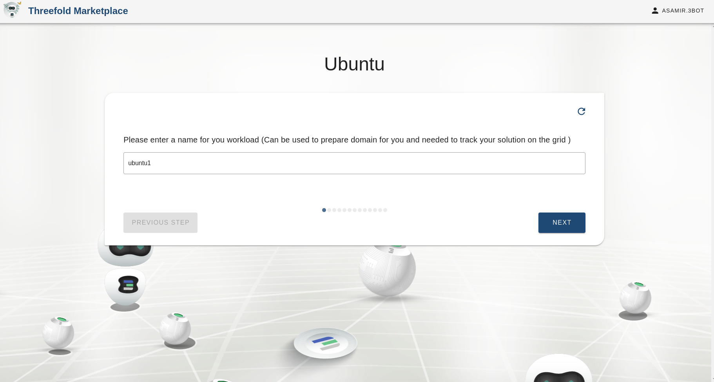

### Choose network

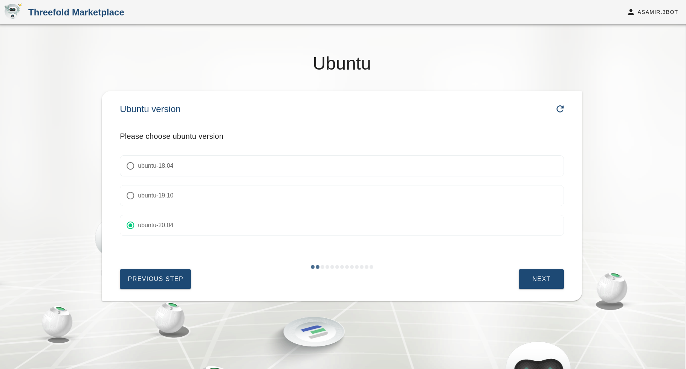
Choosing the network to be used from a list of existing networks created by the user

### Choose container resources

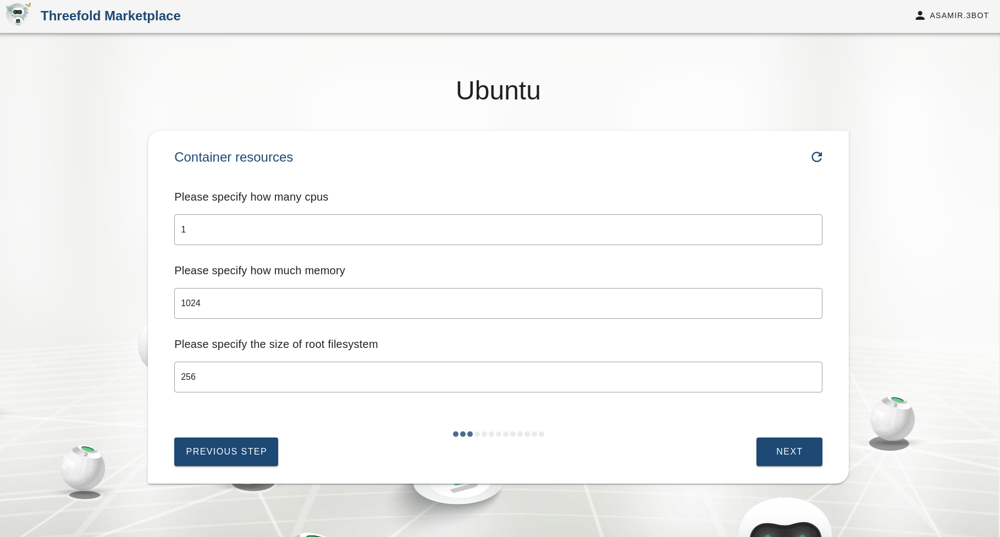
Here we specify the CPU and Memory resources allocated for the container

### Select node or leave it empty

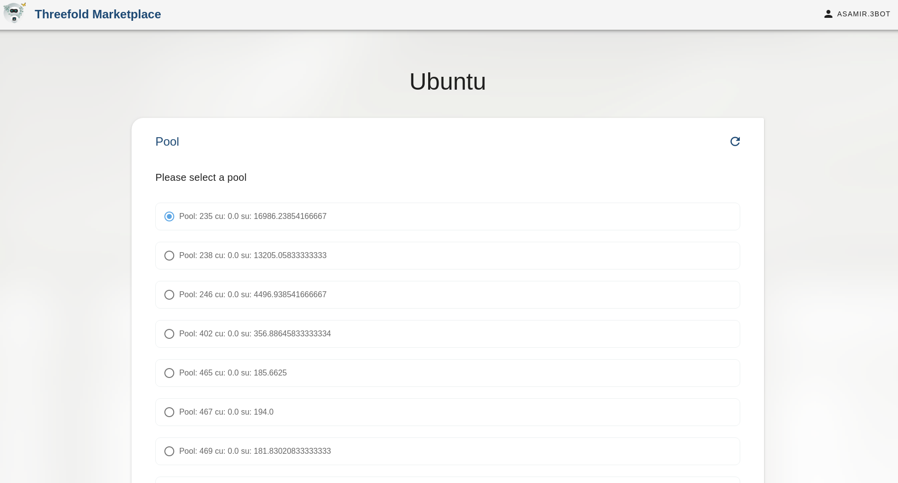

Here we can provide a node id corresponding to a current node on the grid to deploy the container on. If there is no specific node to be used then it is left empty.

### Select farm or leave it empty

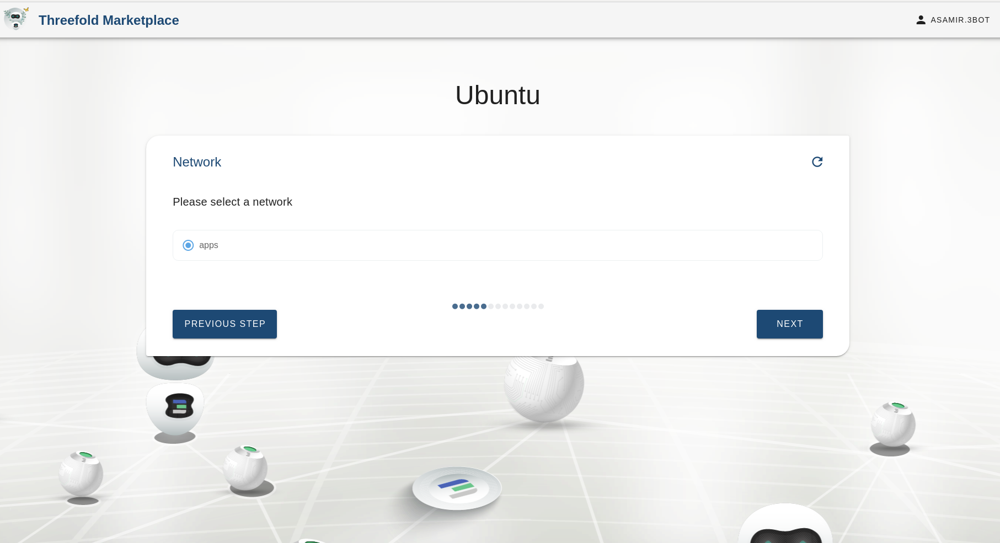
If the nodeid is left empty, we can choose the farms on which the container can be deployed on. The farms are basically a group of nodes where multiple solutions can be deployed on. We can either choose the farm name from the drop down list or leave it empty to randomly choose any farm.

### Choose solution name

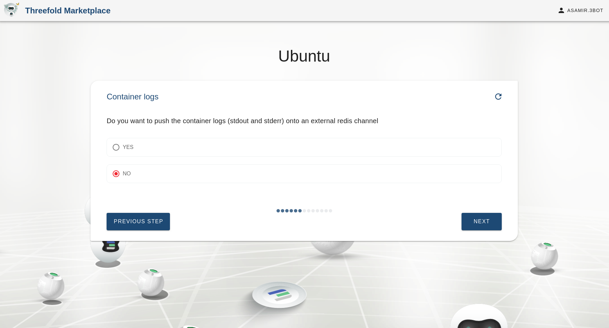
Choosing the name of the solution to be deployed. This allows the user to view the solution's reservation info in the dashboard deployed solutions

### Choose ubuntu version

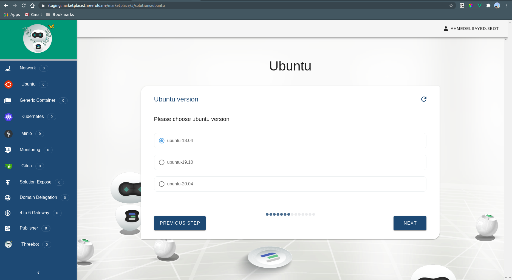
We currently support 20.04, 18.04 and 16.04

### Access keys
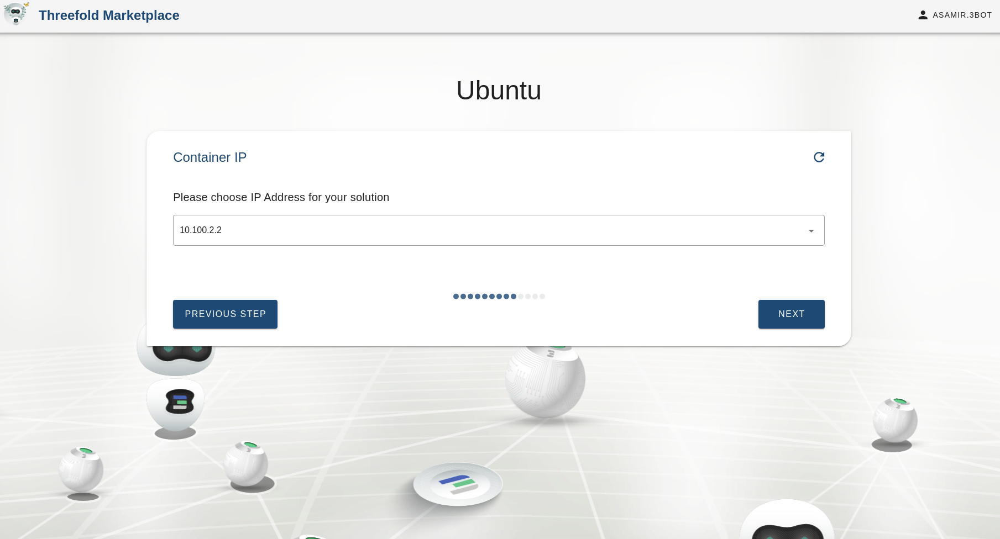
Uploading your public key for SSH access

### Choosing private IP
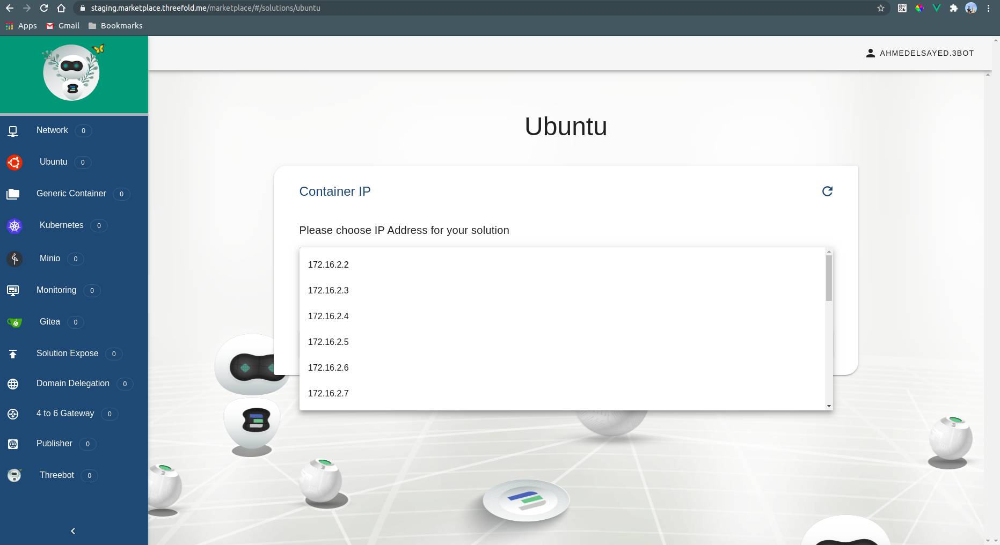

### Expiration Date
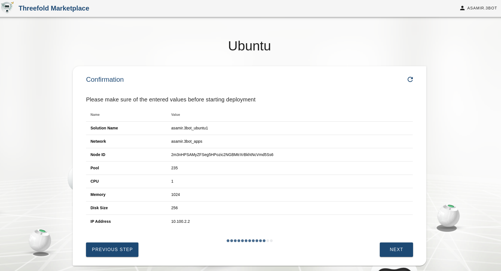
Now we need to tell the grid how long we want our solution to stay alive on the grid

### Confirmation
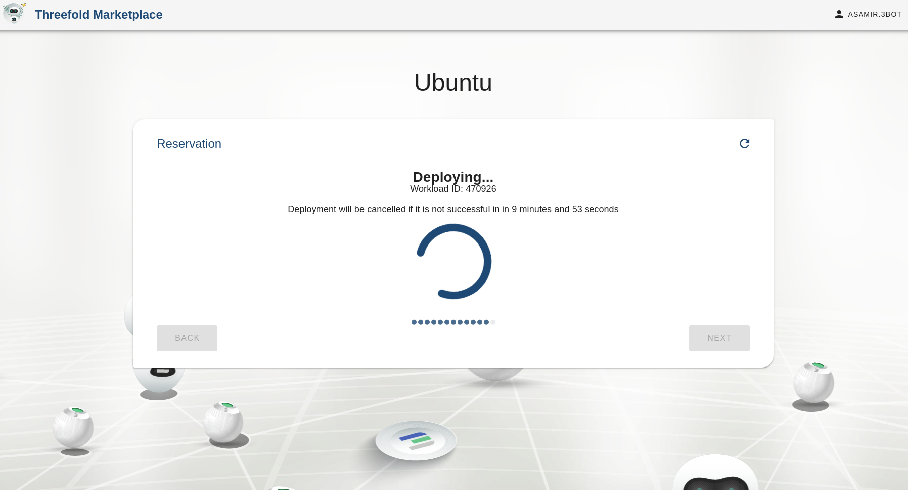
Here we confirm the specifications we entered in the chatflow

### Payment
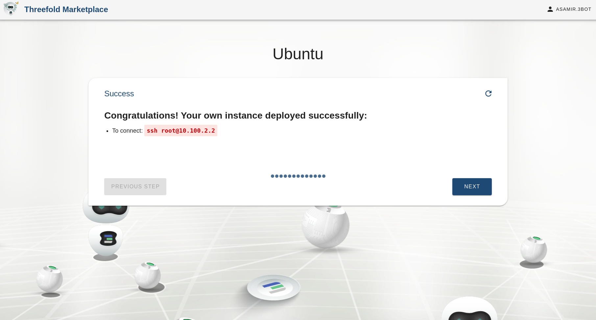

### Deployment info
