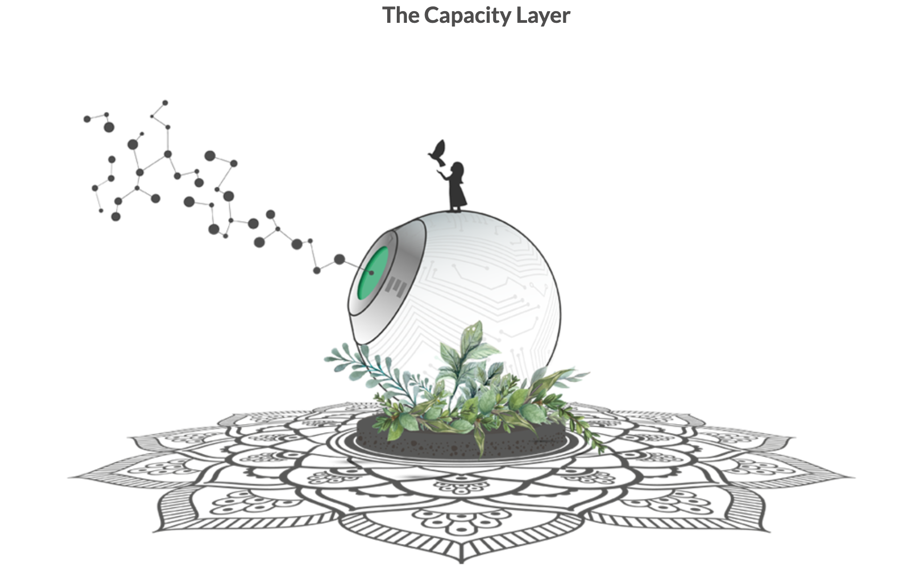

## Node

The low-level provider for digital capabilities is hardware.  Hardware provides components that enable software to create, process, transmit and store data.  Nodes run an operating system to expose all embedded components in such a way that applications can use these components.  Operating systems come in many different types, kinds, sizes and purposes.  None of the existing operating systems have the characteristics of what the TF Grid needs:
- **autonomy**.  TF Grid needs to create compute, storage and networking capacity everywhere.  We cannot rely on remote (or local) maintenance of the operating system by owners  or operating system administrators
- **simplicity**. The be everywhere, for anyone, good for the planet it has to be simple.  Simplicity will get you the maximum return out 
- **stateless** In a grid (peer2peer) setup the sum of the components is providing a stable basis for single elements to fail and not bring down the whole system. Therefore the single elements have to be stateless and state needs to be stored in the grid.

With nothing good enough to do this jon ThreeFold invented an efficient, simple stateless operating system called [Zero-OS](https://github.com/threefoldtech/zos)

3nodes are servers which run the [Zero-OS](https://github.com/threefoldtech/zos) software and provide storage, compute & networking capacity.  All 3nodes together make up the capacity layers for the TF Grid.  Today we have about 600 3nodes in the field. See more details [here](http://www2.cloud.threefold.io)

All of these 3nodes have bootloader software installed on a local storage device.  The Zero-OS is delivered to them over the network and the boot facility is hosted on the TF grid itself.

### 3node operations

To install a 3node and make it part of the TF Grid a few steps need to be completed:

1. acquire some hardware
2. create a farm
3. create and download a bootloader (of a mechanism of your choice)
4. power the hardware with electricity and internet access
5. Boot!

All details regarding this process are listed in the TF Grid [wiki](https://wiki.threefold.io/grid/readme#/grid/tf_farming/v2_jsx_farmsetup).  The actual bootloader is very small and brings up the network interface of you hardware and then queries (web) servers for the remainder of the installation files needed.  The operating system is not installed on any local storage facility nor is any state with regards to this operating system stored locally, the hardware does not store any state of the OS and all of it's containers and other Zero-OS primitives.

The mechanism to allow this to work in a safe and efficient manner if a Threefold innovation called flist.  This is explained in more detail [here](architecture_flist.md)

### Zero-OS

Zero-OS is a very lightweight and efficient operating system.  It supports a small number of primitives, meaning low-level functions it can perform natively in the operating system.  There is no shell, local nor remote, and it does not allows for inbound network connections. There is a dedicated GitHub repository for [Zero-OS](https://github.com/threefoldtech/zos/tree/master/docs)
