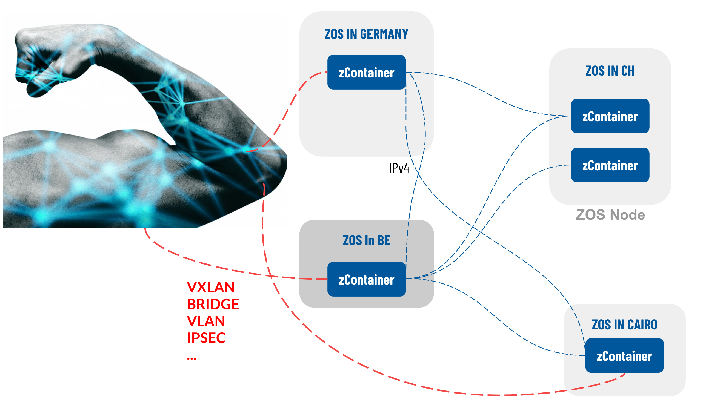

## Network Architecture

### Introduction
True peer-to-peer (peer2peer) is a principle that exists everywhere in the Threefold technology stack, especially in the networking part of this. Farmers produce capacity by connecting hardware to the network and installing Zero-OS. The peer2peer network of devices forms the TF Grid. This TF Grid is a universal substrate on which a large variety of IT workloads could run.

### Peer-to-peer networking
The TF Grid is built by 3Nodes (hardware + Zero-OS) that are connected to the Internet by using the IPv6 protocol. To futureproof this grid IPv6 has been chosen as the native networking technology. The TF Grid operates on IPv6 (where available) and creates peer-to-peer network connections between all the containers (and other primitives). Please find more about Zero-OS primitives here [link]() 
<!--
 TODO #43 Insert link to Zero-OS primitives
-->

This creates a many-to-many web of (encrypted) point-to-point network connections which together make a (private) secure overlay network. This network is completely private and connects only the primitives that have been deployed in your network.

Characteristics:
- connect all containers point-to-point
- all traffic is encrypted
- high performance
- the shortest path between two endpoints multi-homed containers
- could span large geographical areas and create virtual datacenters
- all created and made operational **without** public access from the internet

### Networking possibilities 
The grid is built by 3Nodes connected to the internet (IPv6) and watchers on these 3Nodes initialize outbound connections to blockchain databases (BCDB) to "read" what they have to do. The 3Nodes by design do not accept any inbound connections from anywhere. The only exception to this is when public services are being built on these 3Nodes, then containers (or other Zero-OS primitives, not 3Nodes!) need to have a way of accepting (IPv4 or IPv6) connections.

To facilitate this need TF Grid has a feature called web gateway. The web gateway is a container that is connected to the outside network with a public (IPV4 or IPv6) address and a point-to-point encrypted connection to your private overlay network. This web gateway could exist anywhere on the grid.

This provides ample possibilities to create distributed architectures where processing and storing information happens next to the data creation point while actual access to this data could be provided through private (encrypted tunnel) and public (web gateway) locations. It leads to reliable, redundant access (create two or more and have DNS load balancing between the two) to online content and this could extend all the way to build a private CDN.

### Existing Enterprise private networks
We have also thought about the existing world of private networks, IPsec, VPN, WAN's and more and have the facility to create bridges to make those networks part of the deployed private overlay networks.

This is in an early stage as this does not have out focus right now, but with the right level(s) of interest this could be built out by the [TFTech](http://www.Threefold.tech).

