# Deploy your first solution

In this section we will guide you trough all the steps required to deploy your first workloads on the TFGrid.

We will start from scratch and guide you to the deployment of a Ubuntu container.

This tutorial will use the example "chat flows" to deploy the solution. The chat flows are wizards that guide you through different steps asking you questions to help you generate a reservation understandable by the grid.

If you are looking for some example how to do this programmatically, head to the [Develop](code.md) section.

## Index

1. [Register your identity on the TFGrid](#Register-your-identity-on-the-TFGrid)
2. [Install the 3SDK](#Install-the-3SDK)
3. [Get yourself some token](#Get-yourself-some-token)
4. [Deploy your private overlay network](#Deploy-your-private-overlay-network)
5. [Deploy a Ubuntu container and connect to it](#Deploy-an-ubuntu-container-and-connect-to-it)

### Register your identity on the TFGrid

As a first step, you need to get yourself an identity. The identity system is based on some public/private key pair.

The easiest way to generate this identity is to download the **3Bot Connect** application on your smartphone.

The app can be found on the [Google Play store](https://play.google.com/store/apps/details?id=org.jimber.threebotlogin&hl=en) and [Apple Appstore](https://apps.apple.com/us/app/3bot-connect/id1459845885).

For a more detailed documentation about the installation and usage of the **3Bot Connect**, head to the dedicated section:

- [3Bot connect installation](3botconnect_install.md)
- [3Bot connect overview](3botconnect_overview.md)

### Install the 3SDK

#### Downloads the 3SDK binary

Now that you have an identity, the next step is to retrieve the 3sdk binary on your system.

You can find the binaries for GNU/Linux, macOS and Windows on the [release page of the github repository](https://github.com/threefoldtech/jumpscaleX_core/releases)

If you are hitting an issue or want to build from source, head to the full installation process documented at [3sdk_install](3sdk_install.md).

#### Start the 3SDK

Once you have the 3SDK binary available, you can now use it to start the installation process.

To do so, execute the 3SDK binary. This will open a shell in which plenty of actions are available to you. For this tutorial you only need to use one `container threebot`

After typing the command, a wizard will guide you through the rest of the installation process. (Complete documentation is once again available in the [associated section of the manual](3sdk_use.md))

After the full installation process is done, you should be able to reach the webUI of the 3SDK at [https://localhost:4000](https://localhost:4000)  and it should look like:

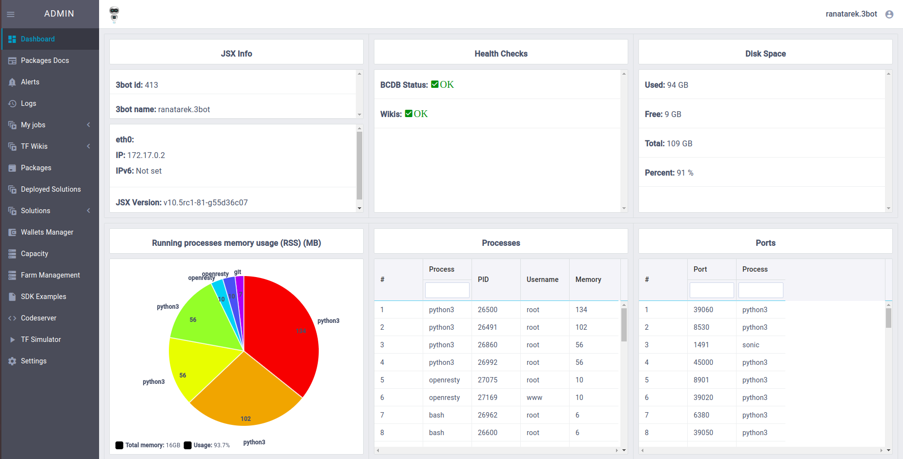

### Get yourself some token

The next step before we get to actually deployed workloads on the grid, is to get yourself some tokens.

At the time of writting, there are three types of tokens available:

- [FreeTFT](https://github.com/threefoldfoundation/tft-stellar/#freetft)
- [TFT](https://github.com/threefoldfoundation/tft-stellar/#tft)
- [TFTA](https://github.com/threefoldfoundation/tft-stellar/#tfta)

The FreeTFT's is a special token that has been created to allow developers and interested parties to play with the grid for free using free capacity by certain farmers.

Each user is eligible to get 1000 FreeTFT. To claim yours, head to [https://getfreetft.testnet.threefold.io](https://getfreetft.testnet.threefold.io).

To get yourself TFT, multiple options are possible, head to the [Tokens](tokens.md) section to know more.

### Deploy your private overlay network

You are now all set to start deploying workloads on the TFGrid. Yeah !

Before we get to deploy the actual Ubuntu container, we first need to create a private overlay network. If you are curious how the overlay network works, some documentation is available at [Overlay network](capacity_network.md)

The technology used to implement the network overlay is [Wireguard](https://www.Wireguard.com/). Make sure you have installed Wireguard on your device to able to continue: [Wireguard installation](https://www.wireguard.com/install/)

For this tutorial we will use the network wizard that will guide us through the creation of your network.

To start the wizard click the left menu on Solutions then Network


First step is to choose the name of your network. This name is only used to identify the network later on when deploying workloads.

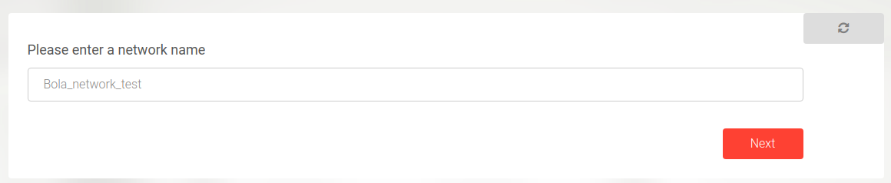

Second step is to choose the expiration time of your reservation. Each capacity reservation made on the grid is always bound to an expiration date. Once the date is reached, the capacity is released back to the grid and your workloads deleted.

For this tutorial one day will be more than enough.

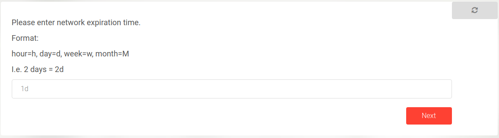

Third step is to configure an `entrypoint` into your network so you can actually access your network from your device (laptop/PC/mobile). An `entrypoint` is responsible to route the traffic coming from your device to all the other nodes of the network.

The nodes running on the TFGrid all communicate over IPv6. While this is very convenient for the nodes, not everyone has access to IPv6 already. For this reason we allow people to configure `entrypoint` using IPv4 address.

The third step lets you choose between IPv6 or IPv4 for your `entrypoint`. If you are not sure what to choose, pick IPv4.

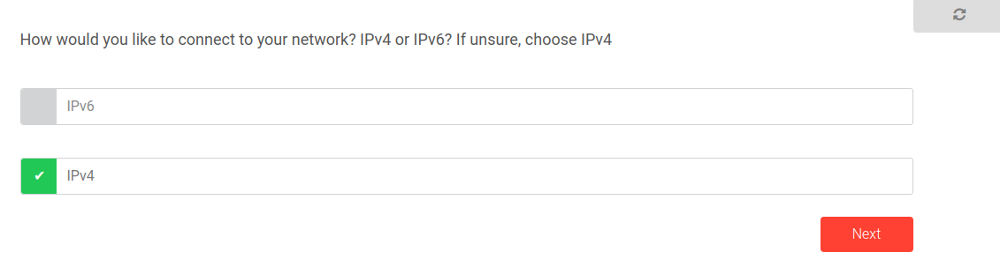

Fourth step is there to let you configure the subnet used by your network. To make it easy here we just let the wizard pick one for us.

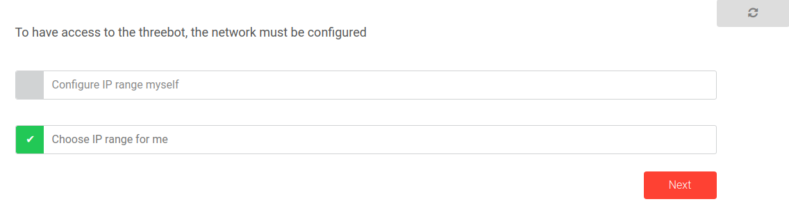

Fifth step shows you the configuration you need to download in order to configure your device. Just click the download button and save the configuration locally and configure you device.

Depending on your platform the configuration of Wireguard can look a bit different. But all the information required is shown in the configuration you have downloaded.

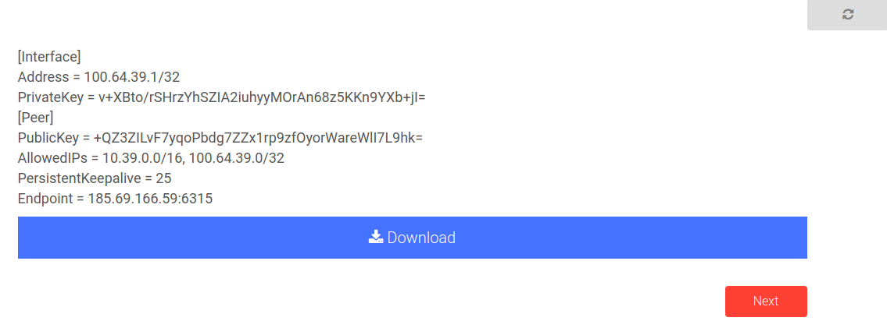


On Linux system, you can just use the `wg-quick` command directly with the file sent from the chatflow, like so:

```
wg-quick up my_first_network.conf
```

On MacOS, open the wireguard application and clock on the plus icon on the lower left corner. Add a new empty tunnel and copy the configuration or import the file if you have downloaded it from the chat flow.

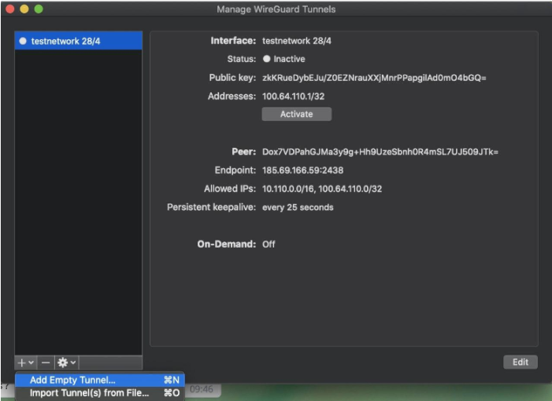

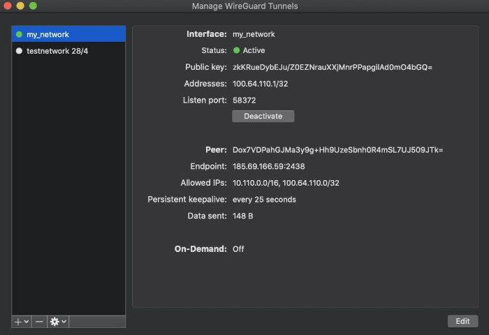

On Windows the process is very similar. Open the wireguard application and click on the plus icon on the lower left corner. Add a new empty tunnel and copy the configuration or import the file if you have downloaded it from the chat flow.


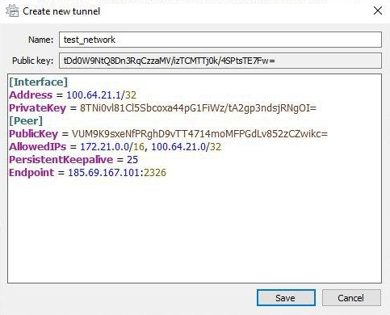


### Deploy a Ubuntu container and connect to it

Now that you have a network in place. We can deploy containers and connect it to the network. To do so we will use the Ubuntu Chat flow

To start the wizard click the left menu on Solutions then Ubuntu


1. First step to deploy Ubuntu is to choose the network on which you want to deploy your Ubuntu container. Use the same name you entered previously when creating the network

    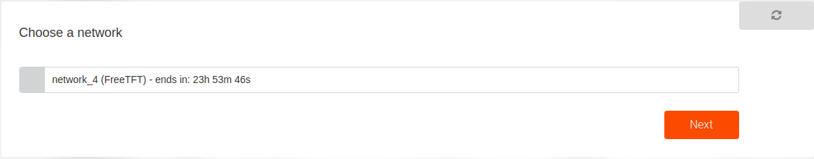

2. Second enter a name to give your Ubuntu solution. This will be used locally to save the details of the deployment.

    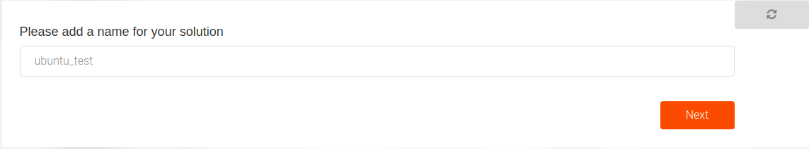

3. Next choose the version of Ubuntu on you want. We currently support versions 18.04 and 16.04
    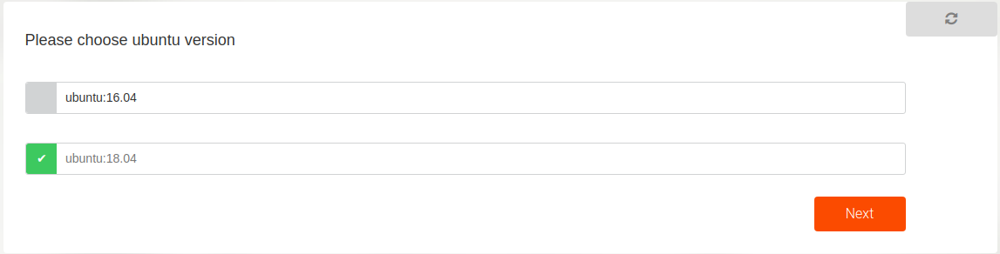

4. Then choose how much CPU and Memory resources you want allocated for the container
    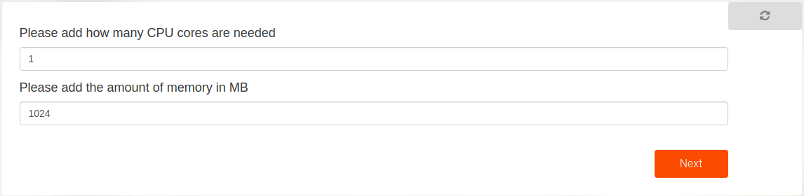

5. In order to access this container after it is deployed, you will need to upload your public ssh key. Usually your public and private ssh key pairs are found in `~/.ssh` where the public key ends in `.pub`

    

6. The next step is to choose the expiration time of your Ubuntu reservation. Each capacity reservation made on the grid is always bound to an expiration date. Once the date is reached, the capacity is released back to the grid and your workloads deleted.

    For this tutorial one day will be more than enough.

    

7. After that you will encounter an optional question asking for a node ID to deploy the container on. If there is a specific node you want your container to be on then provide its ID otherwise leave it empty. To discover nodes where to deploy your solution the easiest place to look for them is the explorer: https://explorer.grid.tf

    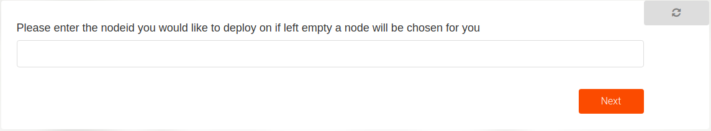

8. If you left the nodeid empty, you can then choose the farms on which the container can be deployed on. The farms are basically a group of nodes where multiple solutions can be deployed on. You can either choose the farm name from the drop down list or leave it empty to randomly choose any farm.

    

9. You can now choose an IP address that will be given to your Ubuntu container in your network. This is the IP address you will be using to access the container.

    

10. Then read carefully the options you selected previously until this point in the chatflow and confirm them by clicking next to proceed.

    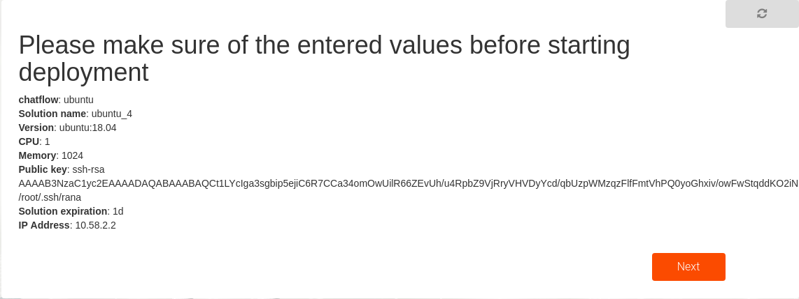

11. Now that you have chosen all the resources and details required, you will need to proceed with the payment for the solution that will be deployed. As previously mentioned, you will have your wallet setup and funded with an amount of the currency you chose your network with. The following overview will show the price of the deployment and the details regarding the address to be payed to. By clicking on the wallet you will pay with and then next then you accept the payment to be automatically done from it.

    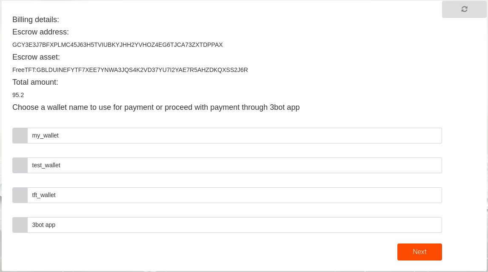

12. Once the amount is available in the wallet and the payment is successfully completed, the deployment process is continued. After the deployment is successful which may take a couple of minutes sometimes, the following message is shown with details regarding the reservation id which is a unique id used for your specific container deployment. It also views the IP address that is to be used to connect to the container.

    

13. You can now simply access the deployed Ubuntu container by the following command

    ```bash
    ssh root@IP_ADDRESS
    ```

    where the IP address is the one you chose in the chatflow earlier and is shown in the previous success message.

You can view _all_ your deployed solutions that haven't expired such as the network and the Ubuntu container you created by clicking the left menu on **Deployed Solutions**.
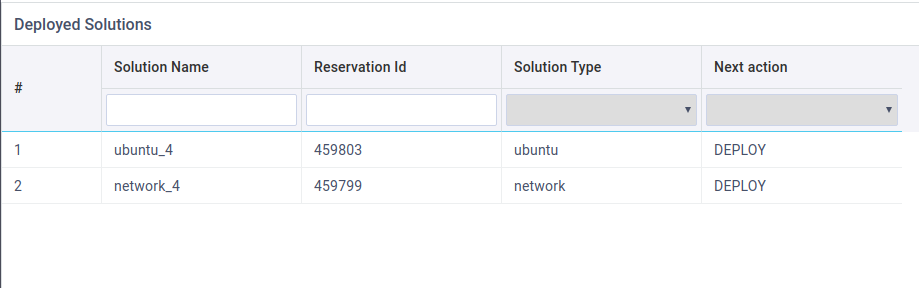
