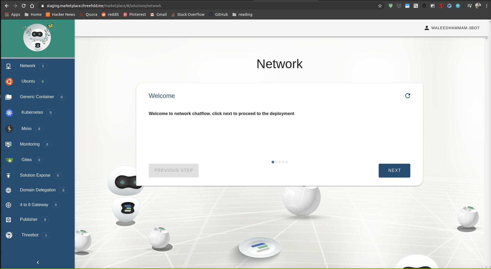
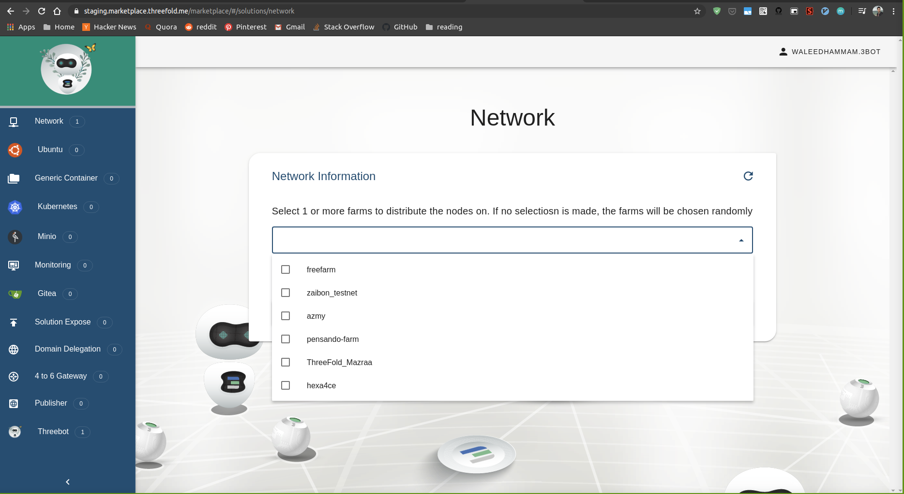

# Getting started with the network

Any solution you choose to deploy will need the prior provisioning of an overlay network in order to reach the deployment.
We support both IPv4 and IPv6. 

If you are curious how the overlay network works, some documentation is available at [Overlay network](../3_smartcontract_for_it/capacity_network.md)

The technology used to implement the network overlay is [Wireguard](https://www.Wireguard.com/). Make sure you have installed Wireguard on your device to be able to continue: [Wireguard installation](https://www.wireguard.com/install/)


## Network Solution

The below chatflow is used to deploy a network on the grid and to connect to and between your solutions.

### Accessing the solution

Go to the marketplace https://marketplace.grid.tf/marketplace and click on Network


### Inputs

The solution takes some configurations from the user, we will list them and explain their meaning

- `Network name` : a name for the network to deploy on and also to reference in the reservation manager.
- `Payment currency`: the currency that will be used for the payment.
- `Expiration time`: a network expiration time (minutes=m ,hour=h, day=d, week=w, month=M) is how long you want that solution to live on the grid.
- `IP version` : (IPv4 or IPv6) Version of the entrypoint node.
- `IP range` : Configure your network manually by choosing an IP range to use or the deployer can choose for you and generate an IP range automatically.

### Chatflow steps



#### Choosing the network name


#### Expiration time


Choose the expiration time of your reservation. Each capacity reservation made on the grid is always bound to an expiration date. Once the date is reached, the capacity is released back to the grid and your workloads deleted.
As the marketplace is meant to get you a flavour of what the grid is capable to do, it only allows to reserve for a limited period. In the sdk, of course, there are no limits to the expiration date. 


#### Select the farm you want to deploy on


You can explicitly ask for 1 or more farms to choose from. If none is selected, farms are chosen randomly. 

#### The network IP Range


The IP range the network and all of the other solutions connected on it will operate on can be self-selected or randomly chosen. 

#### Payment currency


Choosing a currency that will be used for the payment. Three currencies are currently available: TFT, TFTA and FreeTFT. FreeTFT is only available if farmers have accepted this currency. 

#### Choosing how to reach the entry point node

Here, the wizard asks to configure an `entrypoint` into your network so you can actually access your network from your device (laptop/PC/mobile). An `entrypoint` is responsible to route the traffic coming from your device to all the other nodes of the network.
The nodes running on the TFGrid all communicate over IPv6. While this is very convenient for the nodes, not everyone has access to IPv6 already. For this reason we allow people to configure `entrypoint` using IPv4 address.


You can choose between IPv6 or IPv4 for your `entrypoint`. If you are not sure what to choose, pick IPv4.

#### Wireguard install


Just asks you to make sure you have Wireguard installed, the in-built protocol to configure your network.  
The grid is built around IPv6, Wireguard will make the connection to the network you just created.

#### Configuring your machine


You need to configure your machine to access the network by applying the wireguard configurations.
This screen shows you the configuration you need to download in order to configure your device. Just click the download button and save the configuration locally and configure you device.

Depending on your local system the configuration of Wireguard can have a different look. But for all, the information required is shown in the configuration you have downloaded.


#### On Linux system

you can just use the `wg-quick` command directly with the file sent from the chatflow, like so:

```
wg-quick up my_first_network.conf
```

#### On MacOS

Open the wireguard application and click on the plus icon on the lower left corner. Add a new empty tunnel and copy the configuration or import the file if you have downloaded it from the chat flow.


#### On Windows

The process is very similar. Open the wireguard application and click on the plus icon or on `Add Tunnel` on the lower left corner. Add a new empty tunnel and copy the configuration or import the file if you have downloaded it from the chat flow.


### Access solution info from the main screen

Once you have done the configuration of your network, you can still find the details by clicking on the chosen network name. 


