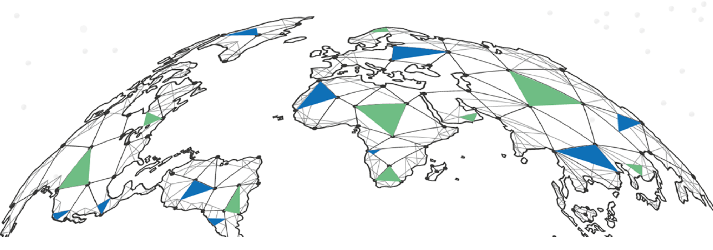

# Getting started

There are 3 main steps to get started

1. There are 3 main steps to get started
2. Install the 3SDK tool to bootstrap your 3SDK container
3. Get yourself some ThreeFold tokens to get started

## TL;DR

If you want to jump right in, use the [Deploy your first solution](getting_started_first_solution.md) tutorial. It will guide you from scratch to deploying your first solution on the grid in a step by step procedure.

## Get Yourself a 3bot Connect

As a first step, you need to get yourself a **3bot.connect** identity.  

This can be done by downloading the app on your smartphone and creating yourself an identity.  Please be aware that this is to be your digital identity on the grid, and holds the keys to access it.  The app provides you with access to  ThreeFold social media platforms, has a wallet for managing TFT's and provides support access.  

The app can be found on the [Google Play store](https://play.google.com/store/apps/details?id=org.jimber.threebotlogin&hl=en) and [Apple Appstore](https://apps.apple.com/us/app/3bot-connect/id1459845885).

## Install the 3SDK tool to bootstrap your 3SDK container

In the second step, you need to install the TFGrid SDK.  

The TFGrid Software Development Kit is available for local installation and will be available for grid deployment (with secure web access).  

For local installations we use Docker container technology to run the SDK software locally. Going forward we recommend to move to the TF Grid based version as this will provide you access from all web browsers on any device.

The TFGrid SDK is the interface where you get access in different ways to build and deploy digital services on the peer2peer grid.  
You can install your TFGrid SDK hosted on the TFGrid, or on a local OS, for this manual we consider you use the SDK on your own machine.

- [3sdk_install](3sdk_install.md)
- [3sdk_use](3sdk_use.md)

## Get yourself some ThreeFold tokens to get started

- Last you will need TFT tokens in your **3bot.connect** app.

There are three type of token available (2020 H1): [FreeTFT](https://github.com/threefoldfoundation/tft-stellar/#freetft)'s,  [TFT](https://github.com/threefoldfoundation/tft-stellar/#tft)'s and [TFTA](https://github.com/threefoldfoundation/tft-stellar/#tfta)'s.

The FreeTFT's is a special token that has been created to allow developers and interested parties to play with the grid for free using free capacity by certain farmers.

Each user is eligible to get 1000 FreeTFT. To claim yours, head to [https://getfreetft.testnet.threefold.io](https://getfreetft.testnet.threefold.io).

To get yourself TFT, multiple options are possible, head to the [Tokens](tokens.md) section to know more.
