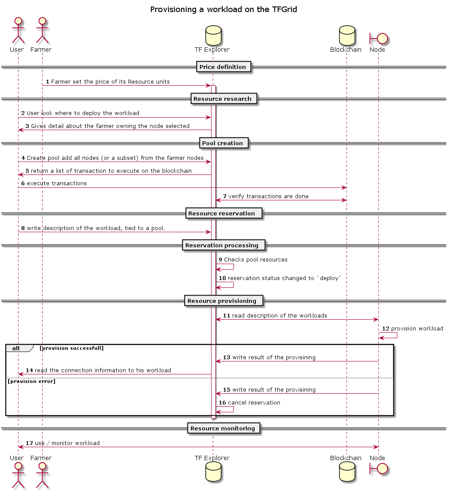

# Smart contract for IT Detail Explanation

This chapter contains a detailed explanation about how the IT smart contract is built.
What are the different component that compose it?

## Reservation

The reservation model consists of 3 parts:
- The reservation contract (immutable)
- The workload parameters (immutable)
- The reservation state (mutable)

The parameters are defined entirely when the reservation is created, and is immutable after this, parameters are different based on the workload type.
The state is mutable, and after the reservation has been created, this will be updated continuously by both the customer 3Bot and the farmer 3Bot (and possibly other 3Bots who will sign to trigger actions).

### Reservation contract
The reservation contract holds all data related to the block-chain, payments and workload type.

The following fields are available on the contract:
- id
- node_id
- pool_id
- customer_tid
- signing_request_provision
- signing_request_delete
- workload_type
- epoch (creation date)
- description
- metadata

The contract holds information like the contract ID (globally unique), node that will deploy the workload, pool id where the workload is funded.
It also holds information about who can sign for the actual deployment and deletion of the workloads,
All fields in the data object are immutable after the
reservation is created (i.e. the customer signs the data).

### Reservation state

The reservation state is updated throughout the lifetime of the reservation. It also
contains the signatures needed to have the farmer 3Bot take action. In order for
the farmer 3Bot to start provisioning the workloads, or delete the workloads,
the `signing_request_provision` and `signing_request_delete`, respectively, need to be filled with valid signatures.

A valid signature is a signature for the reservation data, with a private key owned by one of the 3Bots listed in the reservation data (in the `signatures_provision` and `signatures_delete` fields).
These fields also define the minimum amount of signatures required.
For example, a signature request for provisioning might list 3 3Bot ids which can sign, but only specify a `quorum_min` of 2. As such, only 2 out of the 3 listed 3Bot ids would need to sign before the node is allowed to deploy the workloads.

### Reservation parameters
Specific to different workload types. Parameters also can not be changed once the reservation is created

#### Signature validity

A signature is created by signing a piece of data using a private key. Afterwards,
the corresponding public key can be used to check if the signature is valid. A [signature field](#signingsignature) is valid if it meets the following conditions:

- It contains at least the minimum amount of signatures required, as defined in
the `quorum_min` field of the corresponding [signing request field](#signingrequest), 1 if there is no such corresponding signing request.
- All signatures are valid with a public key owned by a referenced 3Bot (referenced in the aforementioned accompanying [signing request field](#signingrequest) or possibly other fields).

##### Signature algorithm

- signature algorithm: [ed25519](https://ed25519.cr.yp.to/)
- public key size: 32 bytes
- private key size: 32 bytes
- signature size: 64 bytes

### Data model

The following is an overview of the types used, their fields, and what these fields are used for.  You can find a full definition of the types in [provision](provisioningflow.md)

#### Reservation

The [reservation object](provisioningflow.md) is the high-level object for dealing with a reservation on the threefold grid. It is composed of the [reservation.contract](#reservationdata) object.

Next to the reservation contract, there is also a reservation state. These fields describe the current state of the reservation, as well as the signatures provided by authorized 3Bots to advance the state of the reservation.

- `NextAction`: This field describes what action should be performed next. Given the [enum values](provisioningflow.md), we can roughly describe a reservation life cycle as follows:

  - user create the reservation, initial status is `created`
  - user sends the reservation to the explorer, status goes from `create` to `sign`
  - user sign the reservation, status goes from `sign` to `pay`
  - as a result of registering the reservation on the explorer, the user got a list of transactions to do in other to pay the farmer involved into the reservation. Once the user has actually executed the transactions, the explorer checks the token have actually arrived, the status goes from `pay` to `deploy`. Check the [payment documentation](smartcontract_payment.md) for more detail information on how to pay for a reservation.
  - when a reservation has a state `deploy`, the node can now pick it up and provision the workloads.

  From here there are 2 possibility:

  - the reservation expires, it's state goes from `deploy` to `delete`.
  - or the user decides to delete the reservation before it expires. It validates the condition defined in `SignaturesDelete` field. The state does from `deploy` to `delete`
  - when a reservation has a state `delete`. The node decommissions the workloads, and reports the workloads to be deleted, and once all workloads have been marked as deleted, the reservation state goes from `delete` to `deleted` and the reservation life cycle is ends.

- `SignaturesProvision`: A list of `signatures` needed to start the provisioning (deploy) step.
i.e. after enough valid signatures are provided here, the nodes can start to deploy the workloads defined. The validity of signatures and the amount of valid signatures required is defined by the `SigningRequestProvision` field in the [data]((provisiond.md#reservation-data) object.

- `SignaturesFarmer`: the [signatures](#signingsignature) of the farmer 3Bots, which declares that the farmer agrees to provision the workloads as defined by the reservation once there is consensus about the provisioning (see the previous field). Every farmer who deploys a workload will need to sign this. To find out which 3Bots need to sign, you can iterate over the workloads defined in the [reservation data](#reservationdata), and collect a set of unique farmer id's from them.~~

- `SignaturesDelete`: Much like `SignaturesProvision`, however it is used when a currently deployed workload needs to be deleted (before it expires). It is tied to the `SignaturesDelete` field in the `data` object.
- `epoch`: The date of the last modification
- `results`: A list of [reservation results](#reservationresult). Every workload which is defined in the reservation
will return a result describing the status. This allows fine-grained error handling for individual
workloads.

#### Reservation.Contract

The reservation contract contains all required info for the workloads to be deployed,
as well as info about who can sign to start the provisioning and deletion, and the expiry
dates for the reservation. As the JSON representation of the data is signed by the customer
after creating the reservation, all of these fields are immutable after being created.

- description: Description of the reservation/workloads.
- signing_request_provision: The list of 3Bots which can sign for the provisioning to happen,
and the minimum amount of signatures required to do so, as described in [signing request](#siginingrequest).
- signing_request_delete: The list of 3Bots which can sign for the early deletion of the workloads
to happen, and the minimum amount of signatures required to do so, as described in [signing request](#signingrequest).

#### SigningRequest

A signing request defines who (which 3Bots) can sign for a particular action,
and the minimum amount of required signatures. The minimum amount of people needed
can be anything between 1 and the number of signers.

- `Signers`: A list of 3Bot ids who can sign. To verify the signature, the public
key of the 3Bot can be loaded, and then used to verify the signature.
- `QuorumMin`: The minimum amount of requested signatures. At least this amount of 3Bots need to sign before the signature request is considered fulfilled.

As an example of how this might be applied in practice, consider the following
signing request:

- `Signers: [3Bot_a, 3Bot_b, 3Bot_c]`
- `QuorumMin: 1`

This means that any of the 3 listed 3Bots can sign the data, and the request is fulfilled as soon as anyone signs. For instance, a workload for testing is used by 3 developers, and any of those can choose to have the workload deployed or deleted.
If however another person signs (perhaps a 4th developer who is new in the company), the signature will not be valid, as he is not listed in the `signers` field, and therefore he is not able to deploy the workload.

Note that `quorum_min` is a _minimum_ and as such, it is possible, and legal, for more than 1 of the listed persons to sign.
I.e. if both `3Bot_a` and `3Bot_b` sign, the request is still fulfilled.

#### SigningSignature

A signature has the actual `signature` bytes, as well as the id of the 3Bot which signed. The 3Bot id is used to verify that this 3Bot is actually allowed to sign, and to fetch its public key to verify the signature. Additionally, the time of signing is also recorded.

- `tid`: Id of the 3Bot which signed.
- `signature`: The actual signature in binary form
- `epoch`: Time of signing

#### Reservation.Result

A result is used by a 0-OS node to add a response to a reservation. This result can inform users if an error occurred, or more commonly, it can relay back vital information such as the IP address of a container after it is started.
The result object has a `WorkloadId` field, which is used to map the result to the actual workload. With the workload request, the `NodeId` can be inspected, to get the nodes public key. The key can then be used to verify the signature of the data, proving that it is indeed this node which created the reply, and that the `DataJSON` (TODO:remove this field) has not been tampered with after it was created.

- `Category`: The type of workload for which the reply is
- `WorkloadId`: The id of the workload for which the reply is. This will be the same as one of the `workload_id`s in the [reservation data](#reservationdata).
- `DataJson`: The full data as a JSON object
- `Signature`: The bytes of the signature. The signature is created by the node which creates the reply. The data signed is the `data_json` field. This proves the authenticity of the reply as well as the integrity of the response data
- `State`: Did the workload deploy ok ("ok") or not ("error")
- `Message`: Content of the message sent by the node
- `Epoch`: Time at which the result has been created
- `NodeId`: the node ID of the node that deployed the workload

## Reservation flow Diagram

## Actors

- **User**: a digital avatar of a user. This is the one buying capacity on the grid.
- **Farmer**: a digital avatar of a farmer. It owns some node in the grid and is responsible to set the price of its node capacity.
- **TF Explorer**: Public directory listing all the nodes/farmers in the grid
- **Blockchain**: money blockchain, money transaction are executed on this chain using ThreefoldToken (TFT).
- **Node**: Hardware running 0-OS and responsible to provide capacity to the TFGrid
