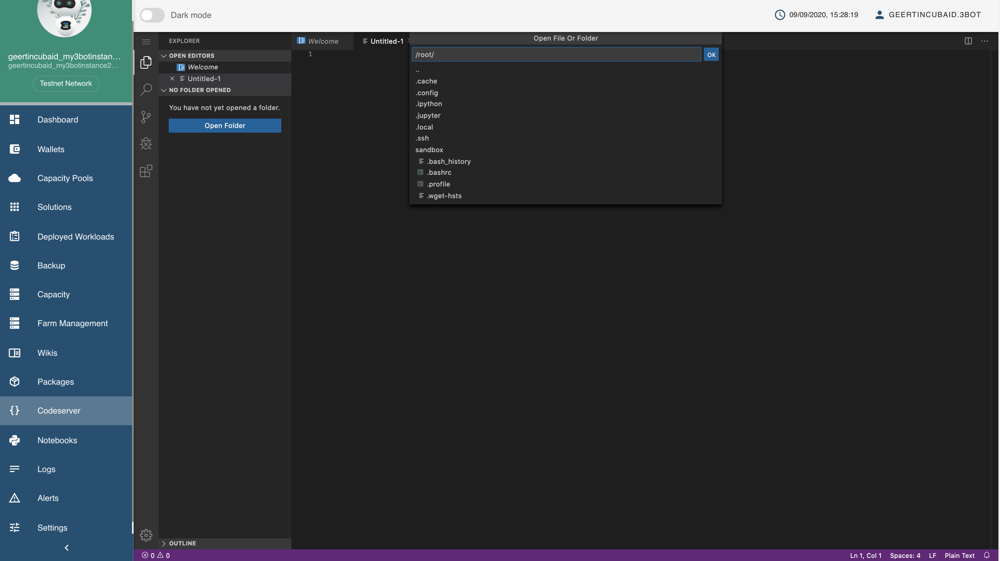
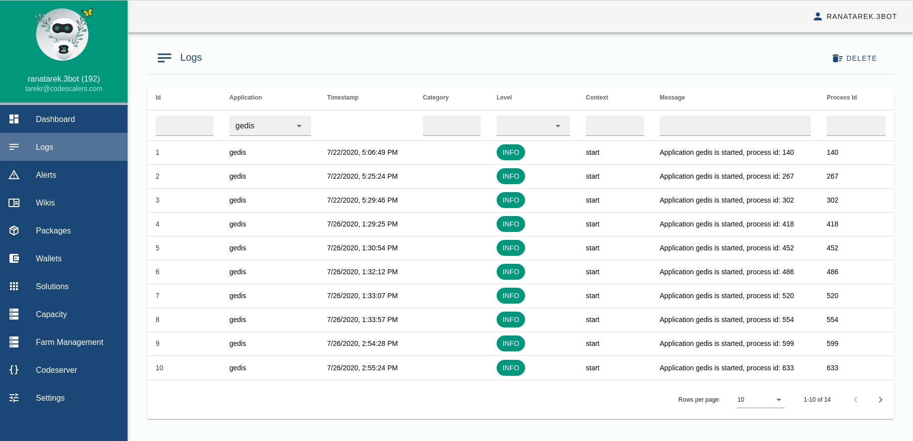

# 3Bot Admin Panel Overview

The 3Bot Admin Panel is a versatile platform to administrate, monitor and control processes and activities on the ThreeFold_Grid. As the features and capabilities of our product are expanding, we're making sure that your experience of running projects and solutions on top of the ThreeFold_Grid is as intuitive and frictionless as possible.

The admin panel has 2 viewing options, light and dark mode. You can switch between both using the slider on the top bar.

### Sidebar

The sidebar allows easy navigation between the different features offered within this admin panel. Each of the features is shortly explained below and in this wiki.

### Dashboard

It provides “at-a-glance” visibility into active resources, shows system versions, network (testnet, mainnet), processes status, memory consumptions, pools and some health checks.

### Wallets

Your 3Bot comes with a built-in [**3Bot Wallet**](3bot_sdk_wallet) that lists all your existing 3Bot wallets. You also have the option to create new wallets or to import existing ones from the Stellar Network (mainnet or testnet, aligned with the network that hosts your 3Bot).

Please go to [**3Bot Wallets**](3bot_sdk_wallet) to learn more.

### Capacity Pools

Your 3Bot comes in handy with a built-in [**Capacity Pools**](3bot_capacity_pools) reservation; a feature to reserve capacity on the grid to deploy your solutions on.

Please go to [**Capacity Pools**](3bot_capacity_pools) to learn more.

### Package management system

Easy way to install/stop packages available on the filesystem or from a trusted git repository

### CodeServer code editor

If you want to edit code from the dashboard directly you could do so using CodeServer package.

### Access rights to the 3bot virtual system administrator

The dashboard is protected by ThreeFold Connect. Therefore, to access it, users need to start a 3Bot server using their saved identity or the 3Bot name that was added by the initial user giving them access to the dashboard.

#### Giving admin access to other users could be done from `Settings`.

### Change Identity

The user can also choose to use multiple identities as long as these identities are registered on the ThreeFold Connect App. This could be done in the `Settings` as well.

### Logs

Allows seeing logs per application.

### Alerts

Advanced alerts system allow you to have a view of different alerts as reported (bugs, questions raised and events of different nature).

