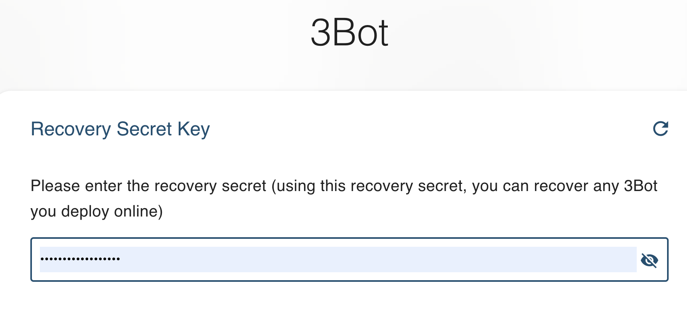
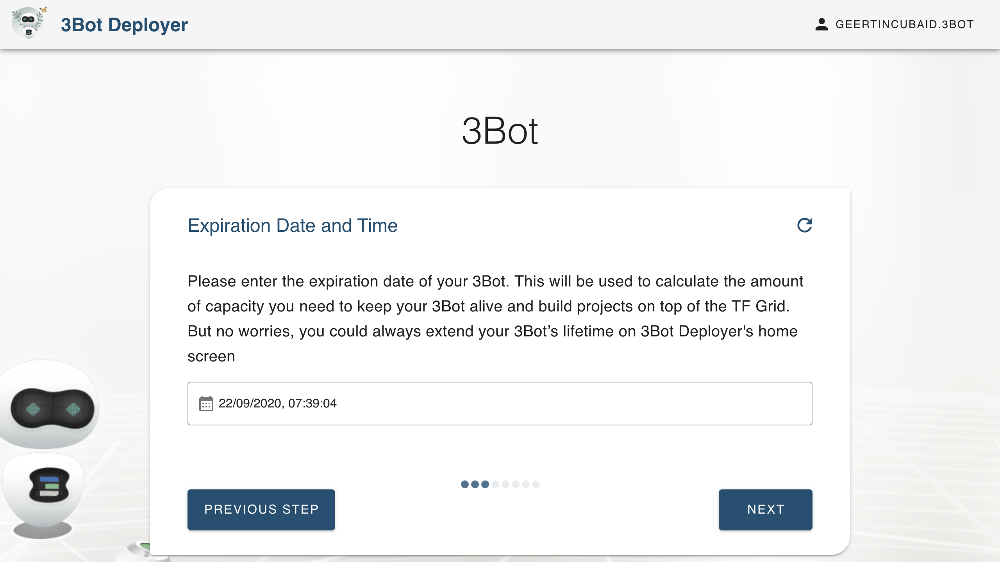
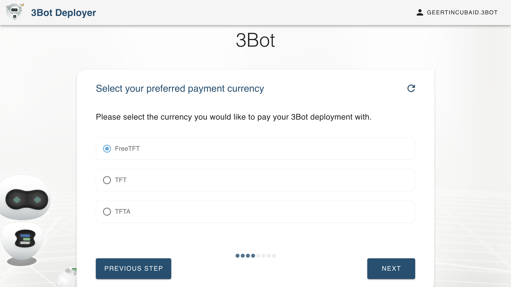
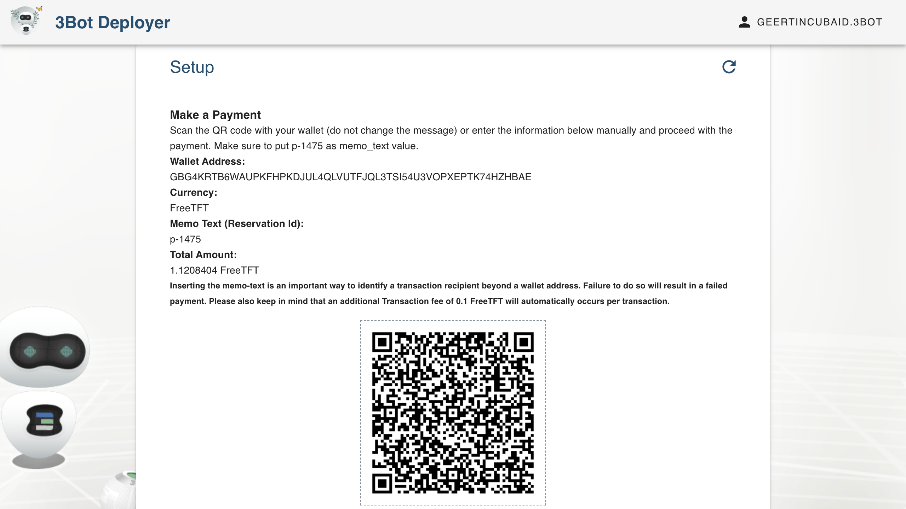
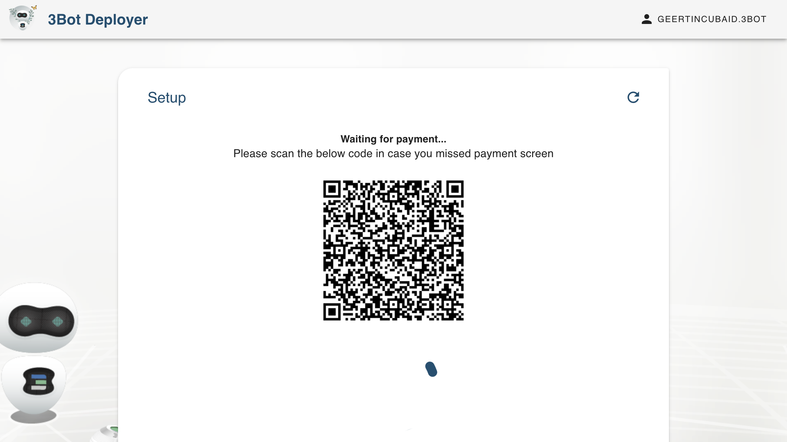
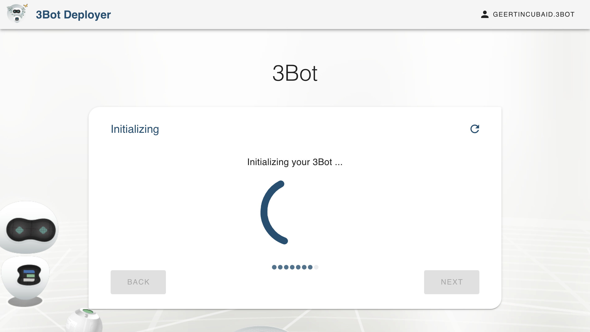
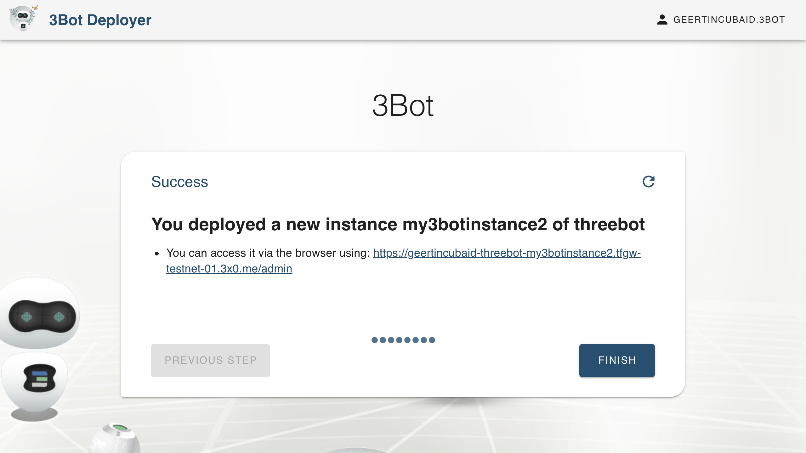

# Get a Hosted 3Bot

Simplifying the deployment experience on top of the ThreeFold Grid has been a priority for ThreeFold since we launched the 3Bot SDK. We are now creating an even better, more user-friendly experience by allowing users to deploy their 3Bot online on a hosted environment. The 3Bot Admin Panel is a versatile platform to administrate, monitor, and control processes and activities on top of the ThreeFold Grid.

## How to Deploy a Hosted 3Bot

- For __Mainnet hosted 3Bot__ Go to [3Bot Deployer Website](https://deploy3bot.grid.tf)
- For __Testnet hosted 3Bot__ Go to [3Bot Deployer Website For Testnet](https://deploy3bot.testnet.grid.tf)

> IMPORTANT: Please keep in mind that the Mainnet 3Bot and Testnet 3Bot live on two different networks. The 3Bot you would need would depend on your network preference (testnet or mainnet). The two networks are completely separated, and thus every activity done on testnet cannot be applied to the mainnet, and vice versa. For example, You would not be able to purchase capacity on TF Grid mainnet by using the testnet TFT you have on your testnet wallet.

### Difference between 3Bot on Mainnet and 3Bot on Testnet

In brief, The TF 3Bot Mainnet is the 3Bot that is living on our main network, launched for commercially widescale use where users reserve capacity with TFT. Meanwhile the Testnet 3bot is the 3Bot living in a test network, created to test all the functionality of the Mainnet, where IT Capacity reservation transactions are done using testnet TFT that does not hold any commercial value and made for testing purposes only. 

As a user, you would get the same taste of 3Bot experience on both networks, but your 3Bot will object to limitation of testing environment and testing mode on testnet network.

> please go back to the [__TF Grid: Where Are We Now?__](https://manual.threefold.io/#/?id=tf-grid-where-are-we-now) section on the homepage to learn more in depth about TF Grid's current state of releases and the difference in between TF Grid Mainnet and Testnet.

# Deploy a Hosted 3Bot

 After choosing your network preference for the 3Bot deployer, you are now ready to start deploying a 3Bot by followinng these steps below.

### Name Your 3Bot

This name will be used to identify this 3Bot. Keep in mind that this name would also be used as your 3Bot's subdomain (a part of your 3bot's web address that will be used to access it).

### Select the Back Up & Restore Password
Your solution has a backup and restore feature accessible via 'dashboard'.

### Choose the 3Bot's Expiration Time

The expiration time determines your preference on how long you would want to keep this 3Bot alive on top of the TF Grid. This will also calculate the amount of the internet capacity you would need to purchase to keep the 3Bot online. No worries, you could always extend your 3Bot's living span by extending your capacity. 

### Select Your Payment Currency

Choose how you would like to pay for the internet capacity you're going to use to deploy your 3Bot.

### Pay for Your Capacity by using a Stellar Wallet

You will be shown a payment details as below. Send the required amount to the mentioned address on your screen by using a stellar wallet. Please do not forget to mention the reservation ID on the memo text section when you're sending your payment. The memo text is used to identify a payment. Sending a payment without a memo-text could result in a failed transaction.
##### Remark: 
If you are working on the mainnet of the ThreeFold grid, TFT are to be used for payment on the Stellar mainnet. 
The testnet of the TFGrid is connected to the Stellar testnet, so also testnet tokens are to be used. 

### Wait Until Your Payment is Succeeded

### After payment, the 3Bot creation, deployment and initialization process starts

### Congratulations, Your Hosted 3Bot is Now Live!
Congratulations, Your 3Bot has been successfully deployed. You could access your 3Bot by entering the website address (IP Address) mentioned below onto your web browser.

Go to the web address mentioned and initialize your 3Bot by using the 3Bot Connect App on your mobile phone; connecting your 3Bot ID with your hosted 3Bot.

### Access Your Dashboard
After agreement on the Terms and Conditions and an explanation on prerequisites, you will be redirected to your main 3Bot Dashboard where your first initial backup is automatically made.

### Explore the 3Bot Admin Panel's Features
You could now access all the features of your 3Bot, such as the Code Server, Python Notebooks, Farm Management, and many more. Feel free to click on [3bot Dashboard](3bot_admin.md) section to learn more about your hosted 3Bot features.
