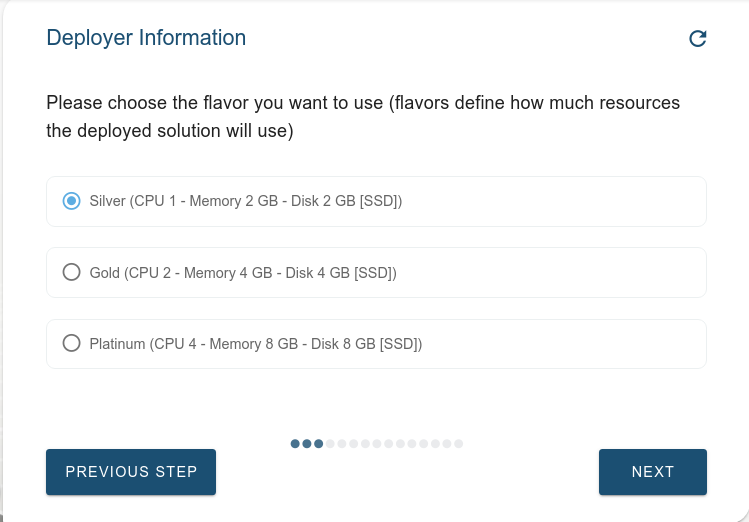
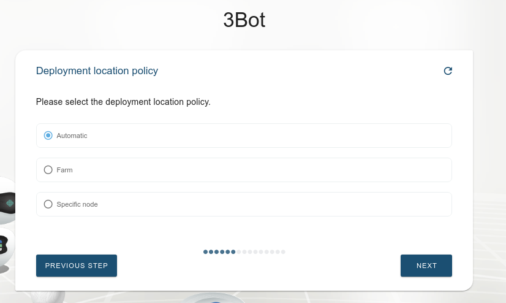
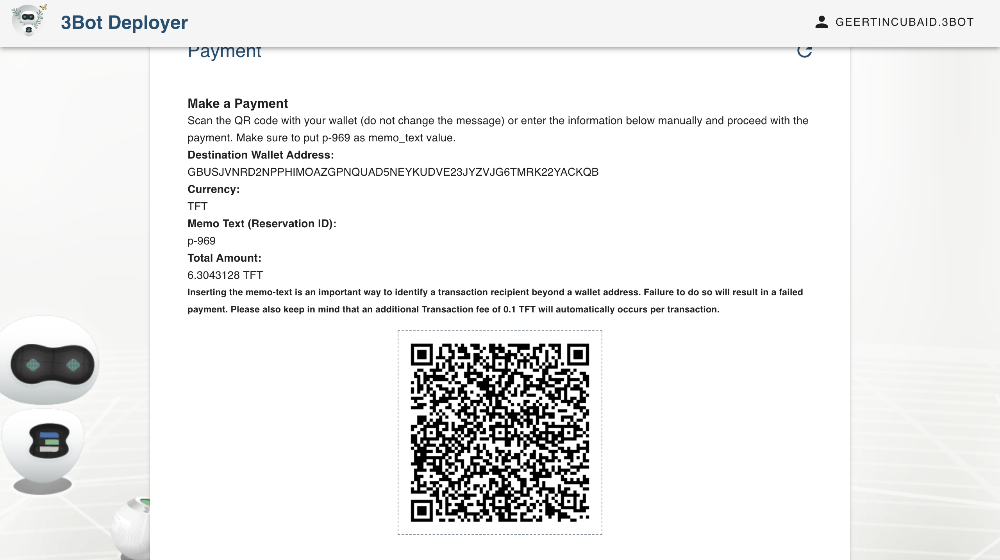
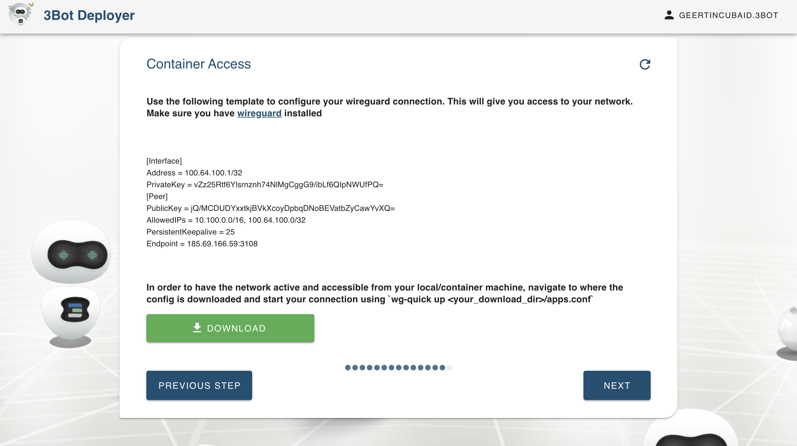
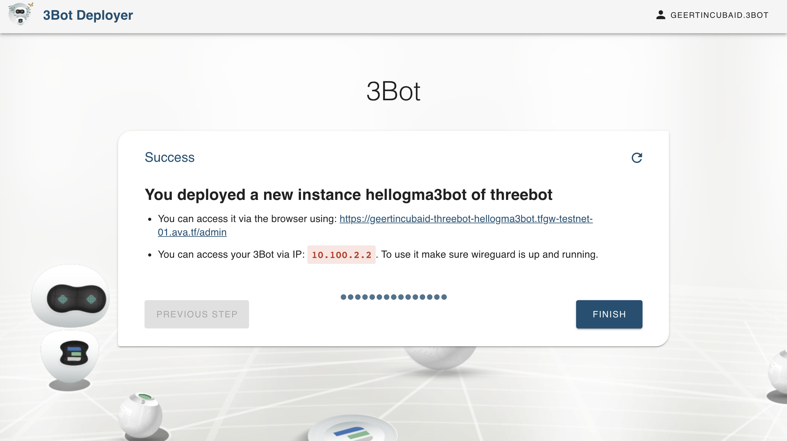
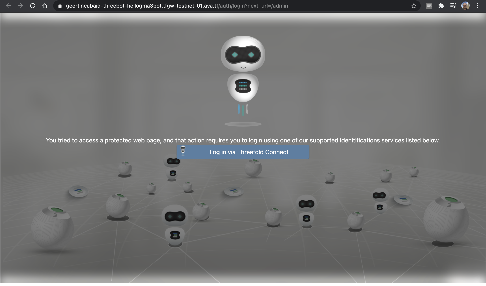

# Get a Hosted 3Bot

3Bot is your virtual system administrator which helps you to deploy solutions on top of the ThreeFold Grid.

## How to Deploy your 3Bot

- For __Mainnet__ Go to [3Bot Deployer Website](https://deploy3bot.grid.tf)

### Create a 3Bot

In the welcome step you are requested to either recover a previously created 3Bot or to create a new one. 

If you choose to create a new 3Bot, please go through following steps: 

### Name Your 3Bot

This name will be used to identify this 3Bot. Keep in mind that this name will also be used as your 3Bot's subdomain (a part of your 3Bot's web address).

### Choose the 3Bot Configuration

The 3Bot comes in 3 sizes. Depending on the intensity you intend to use this hosted 3Bot, choose the flavour that best fits your needs. Example: people intending to develop within the 3Bot might need more resources available. The flavor can still be changed after deployment. 

### Introduce a SSH key (optional)

If you intend to ssh into your 3Bot container, the ssh key can be provided in the next step. 
Evidently, please also keep this key securely on your local machine. If you loose it, you will loose the capability to ssh into the container. 

### Select the Back Up & Restore Password

Your 3Bot has a backup and restore feature accessible on the dashboard. A password protects these capabilities, please store it safely or remember it well. 

### Choose How You Wish to Select the Deployment Location

Either you choose to have the location of your 3Bot be chosen automatically, on farm level or on node level.
We assume that this choice will become more relevant over time, with a growing grid. It will allow you to have your 3Bot local, close to where you are residing, both for performance reasons (reduce latency) and for data ownership reasons (to keep your data close to you, e.g. in a jurisdiction that is yours).

### Choose the Deployment Location

If you opt for a specific farm, you have the option now to choose from available farms. 

### Choose e-mail Settings

E-mail settings are meant to send or receive notifications related to any messages for your 3Bot. Configuration of this e-mail can be configured in the next step. 

### Setup and Initialisation

Once all info is know, the deployment of your 3Bot can start. 
Multiple steps happen now behind the scene: 
- The infrastructure is prepared for a 3Bot deployment.
- A pre-funding of this capacity is done
- The right hardware capacity is selected, according to your choice.
- The network is generated.
- Gateways are being prepared.
- The 3Bot is deployed.
- The 3Bot is initialized so you can start working with it as soon as you have done the payment.

This process can take a while. 

 

### Choose the 3Bot's Expiration Time

The expiration time determines your preference for how long you want to keep this 3Bot live. This will also calculate the amount of internet capacity you need to purchase in order to keep the 3Bot online. No worries, you can always extend your 3Bot's life span by extending your capacity reservation. 

### Pay for Your Capacity by using a Stellar Wallet

You will be shown payment details as below. Send the required amount to the mentioned address on your screen by using a stellar wallet. Please do not forget to mention the reservation ID on the memo text section when you're sending your payment. The memo text is used to identify a payment, therefore sending a payment without a memo-text could result in a failed transaction.

##### Remark: 

- If you are working on the mainnet of the TF Grid, production TFT is to be used for payment on the Stellar Mainnet (as is visible in your ThreeFold Connect wallet). This can be simply done by scanning the QR code in the Threefold connect app. 
- The testnet of the TF Grid is connected to the Stellar Testnet, so Testnet TFTs are to be used (you cannot use your ThreeFold Connect wallet). 

### Wait Until Your Payment Has Succeeded

Payment can take some time. The screen gives an overview of the amount, currency, destination wallet and reservation ID. Once processing the payment is detected, it goes to the next step. 

### Set up Wireguard (optional)

If you want to access the 3Bot container, you need to set up a wireguard connection on your local computer, and copy-paste or download the parameters to do so. 

### Congratulations, Your Hosted 3Bot is Now Live!

Congratulations, Your 3Bot has been successfully deployed. 

You can access your 3Bot by entering the website address (IP Address) mentioned below onto your web browser.

Go to the web address mentioned and log into your 3Bot by using the ThreeFold Connect App on your mobile phone; connecting your 3Bot ID with your hosted 3Bot.

### Access Your Dashboard

After agreement on the Terms and Conditions and an explanation on prerequisites, you will be redirected to your main 3Bot Dashboard where your first initial backup is automatically made.

### Explore the 3Bot Admin Panel's Features

You could now access all the features of your 3Bot, such as the Code Server, Python Notebooks, Farm Management, and many more. Feel free to click on [3Bot Dashboard](3bot_admin) section to learn more about your hosted 3Bot features.
