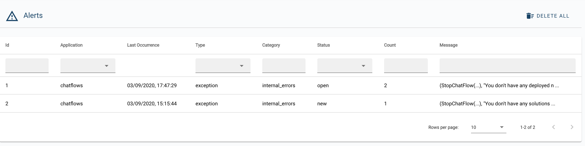

# 3Bot Alerts

__3Bot Alerts__ is an advance alert administration system aims to provide a history of alert reports and record all the deployment issues throughout your entire 3Bot solution processes. Here you could find the registery of bugs or errors that occured for every deployment process you have done in the past, complete with a filtering system of dates, categories, deployment types, statuses and the details of each alert message.

Simply click on each __alert message__ to see the detail of the issue report.

## The Alert Filtering Explained:

- __ID__: the unique ID Number for each issue report
- __Application__: The original application or solution deployment process where the issue occured
- __Last Occurence__: The last time when the particular issue was documented to occur
- __Type__: The type of issue (system, operator, monitor, bug or question)
- __Category__: Internal or External Error
- __Status__: New, Open, Closed, or Reopened
- __Count__: The frequency of issue occurence
- __Messages__: The details of the issue.