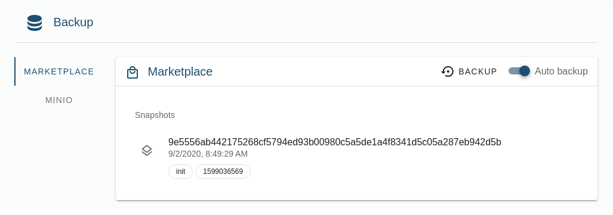
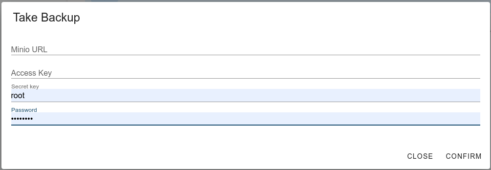
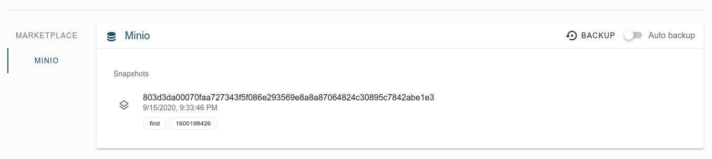

# 3Bot Backup


The 3Bot backup is a service that backs up the data of your 3Bot, with this backup you can recover your 3Bot. The first backup is made when you initialize your hosted 3Bot.

## Backing up

The backup service has 2 options:
- Marketplace
- Minio

### Marketplace backup

The marketplace backup is a service that is installed by default when you initialize a hosted 3Bot. It takes a snapshot of your data the moment your hosted 3Bot is live. If you want you can select to make automatic backups that occur every 24hours.



### Minio backup

The minio backup is a service that is not installed by default. For it to make backups of your 3Bot, you need to run your own instance of minio.

> Follow this detailed guide to deploy an instance of [minio](../chatflows/solutions/storage/solution_storage.md)

If you wish to run minio backups you can enable it by clicking on __Minio__ -> __Init Now__.

Following is required to make minio backups:


- Minio url
- Access key
- Secret key
- Password 




## Recovering with marketplace backup

For a backup to be recovered you need to have:
- The 3Bot name
- The password associated with it.

If you wish to recover your 3Bot you can use following deployers:

- For __Mainnet hosted 3Bot__ Go to [3Bot Deployer Website](https://deploy3bot.grid.tf)
- For __Testnet hosted 3Bot__ Go to [3Bot Deployer Website For Testnet](https://deploy3bot.testnet.grid.tf)

Select __Deploy a new 3Bot__ -> __Recover__

Follow the steps in the chatflow and you should be able to recover your 3Bot.

## Recovering with minio backup
Working with the backups with minio requires some manual work. It backs up the configuration in `~/.config/jumpscale`, and if autobackup is enabled it'll do so every 24 hours.


- right now visiting https://localhost/backup/actors/minio/restore will restore the last snapshot available
- if you want to restore the latest snapshot from shell

```
JS-NG> restic = j.tools.restic.minio_backup 
JS-NG> restic.restore("/")
```
- you can also restore to a specific snapshot using  `restore(target_path, snapshot_id=None)`
And to get all the snapshots
```
JS-NG> restic.list_snapshots()
[{'time': '2020-09-15T21:33:46.03926206+02:00', 'tree': 'f30c8c50a623ff234cff9bf6d3fcdc1e724c216ec6b39e1bcdb', 'paths': ['/home/xmon/.config/jumpscale'], 'hostname': 'xmon-home', 'username': 'xmon', 'uid': 1000, 'gid': 1000, 'tags': ['first', '1600198426'], 'id': '803d3da00070faa727343f5f086e293569e8a8a87064824c30895c7842abe1e3', 'short_id': '803d3da0'}, {'time': '2020-09-15T21:36:07.942006235+02:00', 'parent': '803d3da00070faa727343f5f086e293569e8a8a87064824c30895c7842abe1e3', 'tree': 'fea100443018ce096f907c0f8fb7ab6cb35bb1fbd84283679b3d18de86dadd5d', 'paths': ['/home/xmon/.config/jumpscale'], 'hostname': 'xmon-home', 'username': 'xmon', 'uid': 1000, 'gid': 1000, 'tags': ['sec', '1600167'], 'id': '37023399988884c4e65407ffde8dab281d9d0376f1d73', 'short_id': '373399'}]
```


