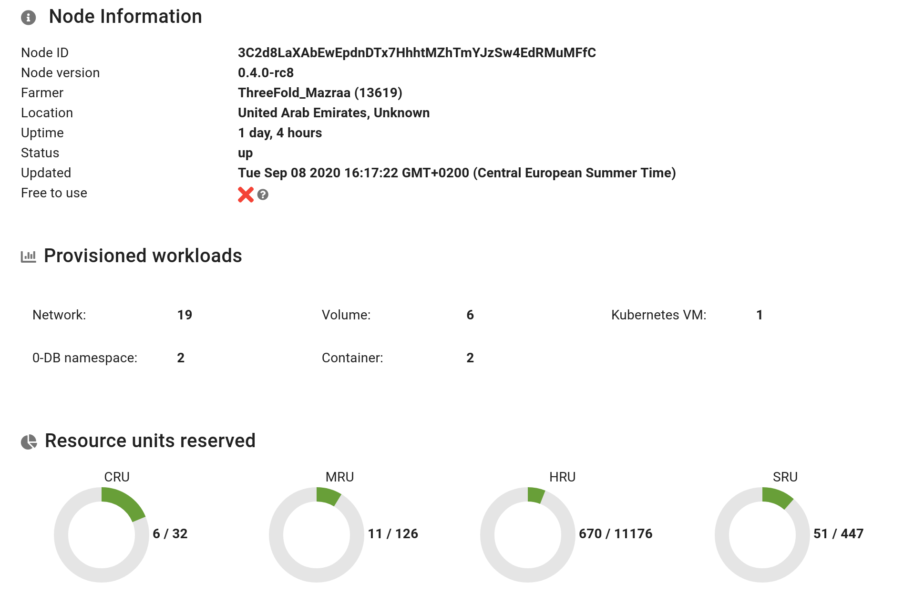

# Capacity explorer

This page let you explorer the TFGrid. It shows some statistics about the overall usage of the grid and the detail about all the nodes and gateways currently active.

Using the `Capacity finder` panel, you can filter out the nodes based on their farm and resource units.

By clicking on a node or a gateway, you deploy the information view:

The information view let you inspect a specific node or gateway in more detail. Next to basic information like farm, location, uptime you can also find out how much primitive of each type is currently provision on the node and how much resource is available on the node or gateway.
