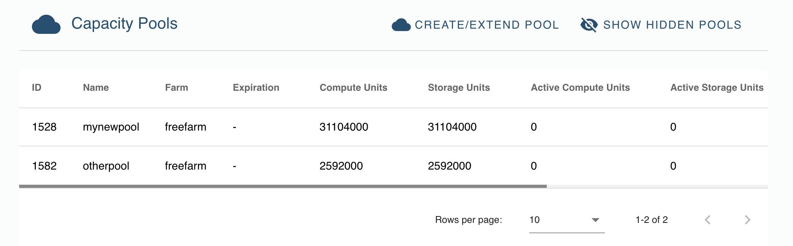
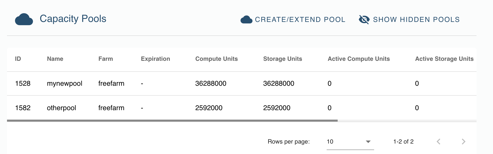

# How to Extend IT Capacity

### Select 'Capacity Pools' in the sidebar

### Choose 'Create/Extend Pool', and select 'Extend' to extend the size an existing capacity pool

Select __'Extend'__ if you would like to reserve more capacity on one of the pools you have created.

### Select the capacity pool you want to extend

The next steps are identical to the creation of a new pool. 

### Specify the extension

Specify the amount of CU you want to add to the capacity pool, the amount of SU and the pool's 'time-to-live' (amount + unit).
For the definition of the 3 fields above (CU, SU, time-to-live), please check [Create a Capacity Pool](./3bot_capacity_new.md). 

Indicate also the token you wish to pay with. It does not matter what was the token you paid with for previous capacity pool reservations. 

Remark: The values to be introduced are about the extended volumes, not the resulting capacity after extension. 

### Prepare to Pay for the Reserved IT Capacity

### Confirm Your Payment

After payment, your extended capacity pool is prepared for usage. 

### Find back your updated capacity pool in the capacity pool overview

The amount of CU and SU has been updated in the overview. 

