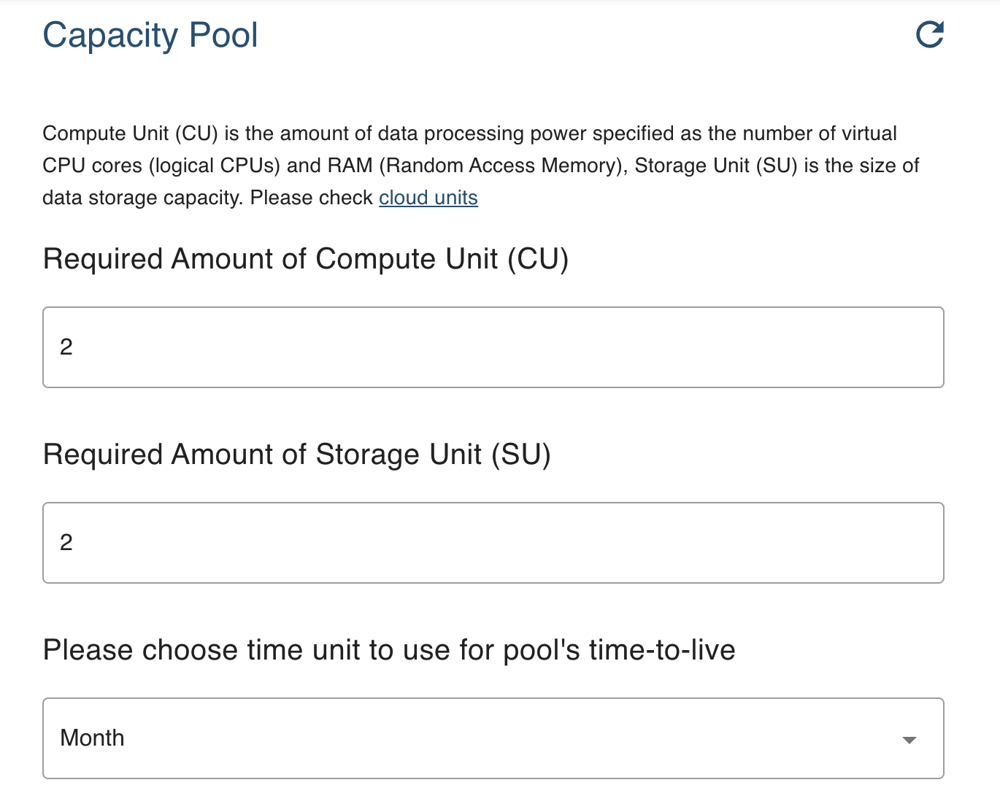
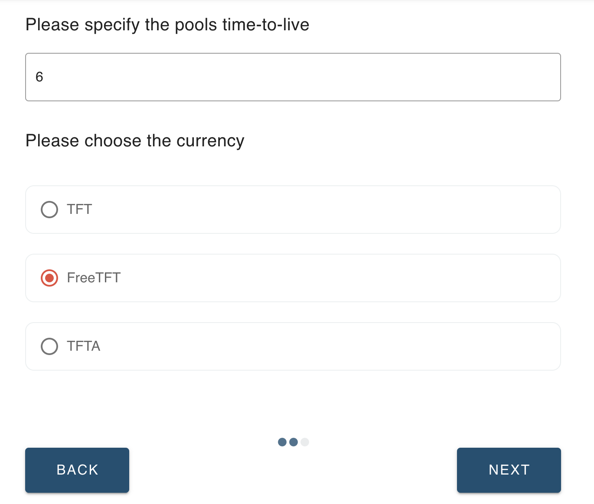

# How to Reserve IT Capacity

### Select 'Pools' from the 'Infrastructure Solutions'

### Choose 'Create' to Create a New Capacity Pool

Select __'Create'__ if you have not created any capacity pool before, or if you would like to create a new separate pool from your already existing one. Select __'Extend'__ if you would like to reserve more capacity on one of the pools you have created.

### Specify the Amount of CU and SU You Want to Add to the New Capacity Pool

__CU__ stands for __Compute Unit__; it is the amount of data processing power specified as the number of virtual CPU cores (logical CPUs) and RAM (Random Access Memory). __SU__ stands for __Storage Unit__; it is the size of data storage capacity. CU and SU are components of __TF's Cloud units__; the components that account for farmed and used capacity. Cloud units are the compute, storage and network equivalent to kWh - kilowatt-hour - the unit of energy. 

Feel free to go to [__Grid Concept__](https://wiki.threefold.io/#/grid_concepts?id=some-examples-of-cu-and-su-in-detail) section of TF Grid Wiki to learn more about Cloud Units.

After you specified your workload demand, choose the token you intend to pay with.

Remark: FreeTFT are free tokens, but also only give access to the nodes that can be paid with this token. So it gives access to only a subset of the grid. In the [TF Grid explorer](https://explorer.grid.tf) there is an indication of which nodes can be paid with FreeTFT. 

### Choose Your Farm Preference to reserve IT Capacity From

Please keep in mind that on testnet we only listed one 'demo farm' as a farm to reserve testnet IT Capacity from. On a mainnet environment there would be more than one farm available to choose from, you would eventually be able to choose to reserve IT Capacity from one of your preferred farms.

### Prepare to Pay for the Reserved IT Capacity

Pay for your capacity, either by selecting a preconfigured wallet in the Admin panel or by using a wallet that is configured in your 3Bot Connect app, by scanning the QR Code (not for testnet). A third option is to do it manually by copying the __Wallet Address__, __Reservation ID (Memo Text)__, and __Total Amount__ you would have to pay for your capacity. 
Open your Stellar wallet and send the total amount of tokens to the IT Capacity reservation wallet address. This is an example of a payment page from a [Interstellar Wallet](interstellar_wallet.md) on testnet. You could also use a [Solar Wallet](solar_wallet.md), or any other existing Stellar wallet to pay for your capacity.

Remark: check carefully on which network you are creating your capacity pool. On testnet (refreshed periodically) you need testnet tokens, on mainnet you need real tokens. 

Once payment is signed for, the payment process starts. 

### Pay for Your Capacity via Stellar Wallet

### Confirm Your Payment

Go back to the admin panel page, click __next__ on the previous payment page to check if you have successfuly made the payment via your wallet. The screen would show the above instruction once the payment is successfully made. Please resend the payment via wallet if you did not do it successfully, or [__contact our helpdesk__](https://threefoldfaq.crisp.help/en/) for payment assistance.

### Click on 'Restart' to go back to the main 'Pool' Page

Go back to the beginning of the walkthrough to see the list of your existing capacity pools.

### Click on 'Pool Number' to check on your New Capacity Pool's Workload

 Each capacity pool is named after few digits of auto generated numbers and is always listed on the first page of your __Pools__ submenu. Click on __'Pool Number'__ to See the details of each __capacity pool's workload__. It will take a few minutes after your successful reservation transaction for the details of the active cloud units and active storage units to be properly updated. Please [__contact our helpdesk__](https://threefoldfaq.crisp.help/en/) for any help and assistance in managing your capacity poola.
