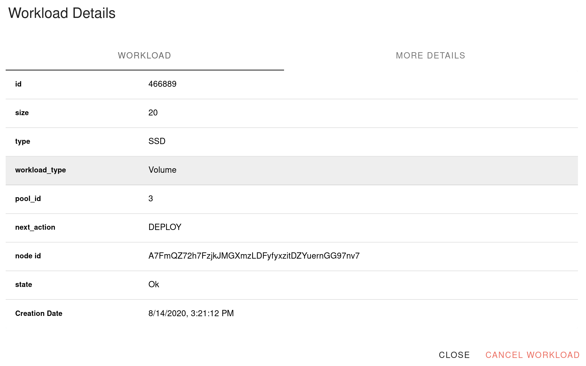

# Deployed workloads

This page let you inspect all the workloads you ever deployed on the grid. 
The table let you filter workloads based on:

* **workload ID**: The unique identifier of the workload.
* **Workload Type**: Only show the workload of a certain type.
* **Capacity Pools**: Only show workload linked to a certain capacity pool.
* **Next Action**: Only show workload that are in a certain state.

By clicking on a workload, you open the detail view:

This view will show you the most useful information based on the workload type. If you want to see the full workload detail as plain json, you can click the `More details` button.
