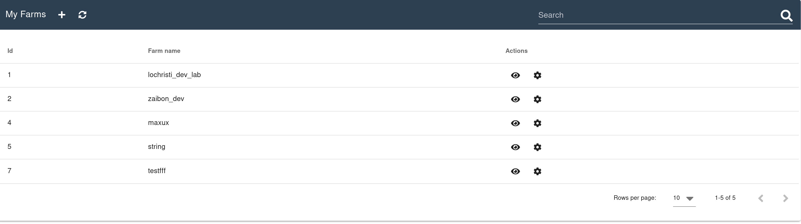

# 3bot Farm management

This section of your 3Bot let you create, manage and monitor your farms. 

<!-- * [Monitoring the nodes health and usage](inspecting-an-existing-farm) -->

## Creating a new farm

To create a new farm, click the little plus button on the top left corner:

It will open up a form to create a new Farm:

Fill the form and click the `Save` button to create the farm.

## Edit a Farm

If you want to change any of the detail about your farm, you can click on the gear icon at the right side of the farm table under the actions colum. This will open a popup containing a form that let you edit any of the farm information.

### Changing the owner of a farm

If you want to change the owner of a farm, you can do so by opening the edit popup and then change the `3Bot ID` field. Be careful when doing so because once a farm has changed owner, there is no way to get it back unless the new owner agree to do so.

## Inspecting an existing farm

The top table shows all the farms that you own:

You can click the eye icon in the action column to open the listing of the nodes belonging to the farm in the bottom table. It will list all the nodes linked to the selected farm, their health and status.

### Deleting a dead node

It can happen that some of you nodes died. If you want to clean it up and remove it from the farm, you can click the trash bin icon on the right side of the nodes tables.
