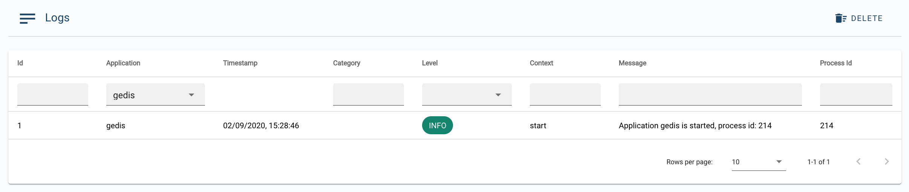

# 3Bot Logs

__3Bot Logs__ is an advance process administration system that aims to provide a history of each deployment process by recording all the logs and events throughout your entire 3Bot solutions' deployment processes. Here you can find the registery of process information, stages, bugs, or errors that occured for every deployment you have done in the past. This is complete with a filtering system of timestamp, categories, context, message and the process ID of each log.

Simply click on each __log message__ to see the detail of the log item.

## The Alert Filtering Explained

- __ID__: The unique ID Number for each event item.
- __Application__: The original application or solution deployment process where the event occured.
- __Time Stamp__: The time when the particular event was documented to occur.
- __Categories__: The type of event (system, operator, monitor, bug or question).
- __Level__: Debug, Stand Out, Information, Warning, Error, Critical.
- __Context__: The contextual detail of the event.
- __Messages__: The details of the event.
- __Process ID__: The process ID of the documented event.