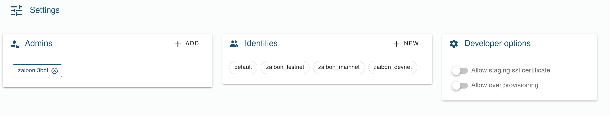

# 3Bot Settings

The settings section of the 3Bot allows you to manage who can access the 3Bot, the identities that the 3Bot can use and some developers oriented settings.

## Manage admins

An admin is a user that is authorized to login to the 3Bot. This feature is useful if you want to allow multiple people to use the same 3Bot.

To add a new admin, clock the `+` sign on the top right corner of the admin panel. This will open a farm where you can specify the 3Bot name of the user you want to authorize.

## Manage identities

An identity is what authenticate a user on the TFGrid. Any action you make on the grid (reserving capacity, deploying workloads, creating farms) is authenticated using [PKI](https://en.wikipedia.org/wiki/Public_key_infrastructure) (Public Key infrastructure).

In the 3Bot, the identity is composed of multiple fields:

* **Instance name**: this is just a name for you to remember what this identity represent. It doesn't impact anything
* **3Bot ID**: This is the unique identifier of your identity
* **3Bot name**: This is the unique name associated with your identity
* **Email**: the email address linked to your identity. This is used to verify user identity.
* **Explorer URL**: The explorer URL to use when the identity is selected. This field is interesting cause it allow your 3Bot to works against the different TFGrid network (mainnet or testnet).

### Default identity

To select which identity to use when "doing things" in 3Bot, we need to select the "default" identity. Any action executed in the 3Bot is always done using the selected "default" identity.

To select the "default" identity, click on the identity you want to use as default, this will open the detail view of the identity. At the bottom of the window you then click on `Set default` button.

### Switching TFGrid network

We saw that an identity as an explorer URL associated with it. So by having multiple identities with different explorer URL you can switch TFGrid network.

On identity could be linked to mainnet and one could be linked to testnet. By switching default identity, you can then make the 3Bot works against the different network.

## Developers options

These options are targeted to developer that want to alter the behavior of the 3Bot to allow easier development experience.

It contains 2 switches:

* **Allow for staging SSL certificate**: When switched on, all the solutions chatflows that needs to generate SSL certificate from let's Encrypt will use the staging environment from let's Encrypt to avoid hitting the rate limitation. This is mainly useful for developers of the solutions.
* **Allow over provisioning**: When switched on, the capacity planning done by the solutions chat flows are relaxed and allow to over-provision nodes that have their capacity already reserved.
