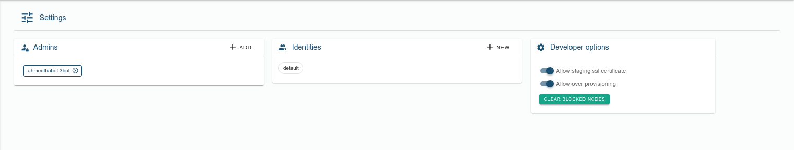
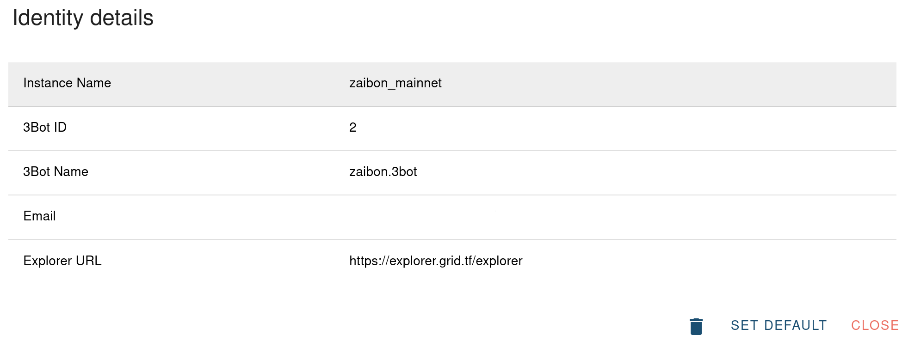
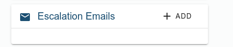
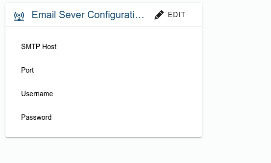
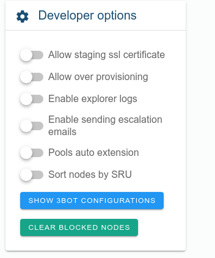

# 3Bot Settings

The settings section of the 3Bot allows you to manage who can access the 3Bot, the identities that the 3Bot can use and some developer-oriented settings.

## Manage admins

An admin is a user that is authorized to log in to the 3Bot. This feature is useful if you want to allow multiple people to use the same 3Bot.

To add a new admin, click the `+` sign on the top right corner of the admin panel. This will open a form where you can specify the 3Bot name of the user you want to add as an admin.

## Manage identities

An identity is what authenticate a user on the TF Grid. Any action you make on the grid (reserving capacity, deploying workloads, creating farms) is authenticated using [PKI](https://en.wikipedia.org/wiki/Public_key_infrastructure) (Public Key infrastructure).

In the 3Bot, the identity is composed of multiple fields:

* **Instance name**: This is just a name for you to remember what this identity represent. It doesn't impact anything.
* **3Bot ID**: This is the unique identifier of your identity.
* **3Bot Name**: This is the unique name associated with your identity (this must be the same as in the 3Bot connect application).
* **Email**: The email address linked to your identity. This is used to verify user identity.
* **Explorer URL**: The explorer URL to use when the identity is selected. This field is interesting cause it allow your 3Bot to works against the different TF Grid network (mainnet or testnet).

### Default identity

To select which identity to use when "doing things" in 3Bot, we need to select the "default" identity. Any action executed in the 3Bot is always done using the selected "default" identity.

To select the "default" identity, click on the identity you want to use as default, this will open the detail view of the identity. At the bottom of the window you then click on `Set default` button.

### Switching TF Grid network

We saw that an identity has an explorer URL associated with it. So by having multiple identities with different explorer URL you can switch TF Grid network.

One identity could be linked to mainnet and one could be linked to testnet. By switching default identity, you can then make the 3Bot works against the selected network.

## Configuring escalation emails

 

We use it to configure destination emails for escalations
 

## SMTP configuration

We use it to configure the sender email

- SMTP host: is the SMTP server address e.g smtp.google.com 
- Port: SMTP port
- username: sender Username
- password: sender Password

## Developers options

These options are targeted to developers who want to alter the behavior of the 3Bot to allow an easier development experience.

It contains multiple switches:

* **Allow for staging SSL certificate**: When switched on, all the solutions chatflows that need to generate SSL certificate from let's Encrypt will use the staging environment from let's Encrypt to avoid hitting the rate limitation. This is mainly useful for developers of the solutions.
* **Allow over provisioning**: When switched on, the capacity planning done by the solutions chat flows are relaxed and allow to over-provision nodes that have their capacity already reserved.

* **Enable Explorer logs**: when enabled we can trace all of the requests going out to the explorer.

* **Enable sending escalation emails**: when enabled and configured 3Bot will send escalation emails of anything wrong happening on the 3Bot.

* **Pools auto extension**: when pools are about the expire, this flag will make 3Bot auto extent these pools

* **Sort nodes by SRU**: when enabled, all of the deployments happening from the 3Bot will deploy on nodes with highest SRU.

And there're multiple buttons to:

* **clear blocked nodes** clears blocked nodes, and *Blocked nodes* are nodes that 3Bot failed to deploy workload on, and they get blocked for 3 hours, then if deployments fail again, they get blocked for 6 hours, .. etc

* **Show 3Bot Configurations** shows your 3bot configurations
