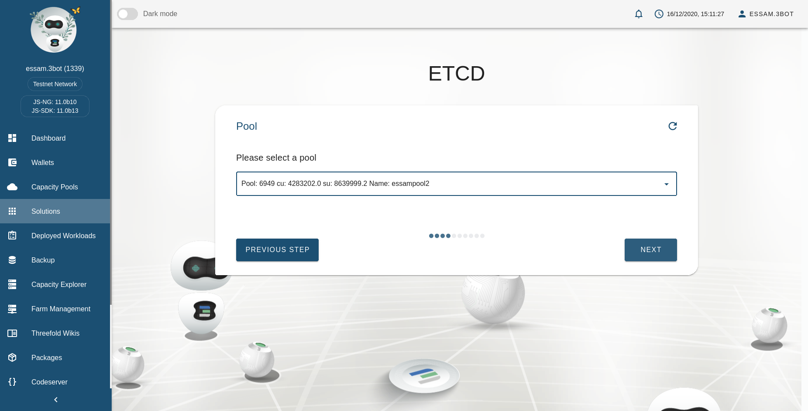
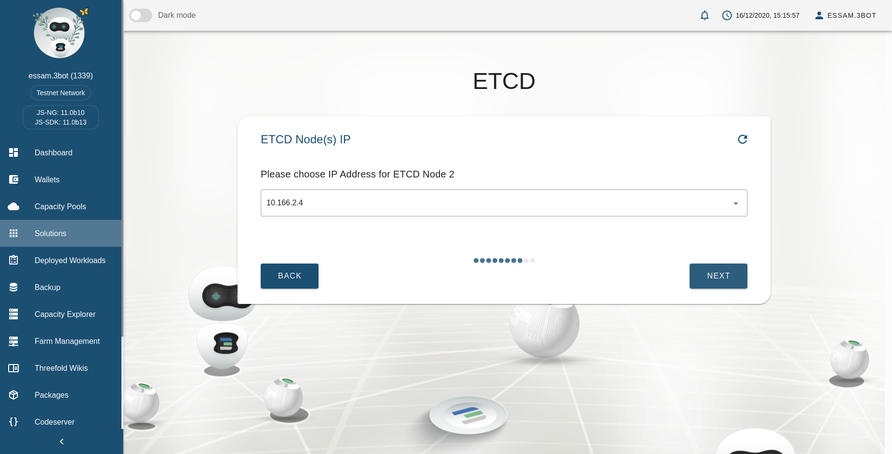
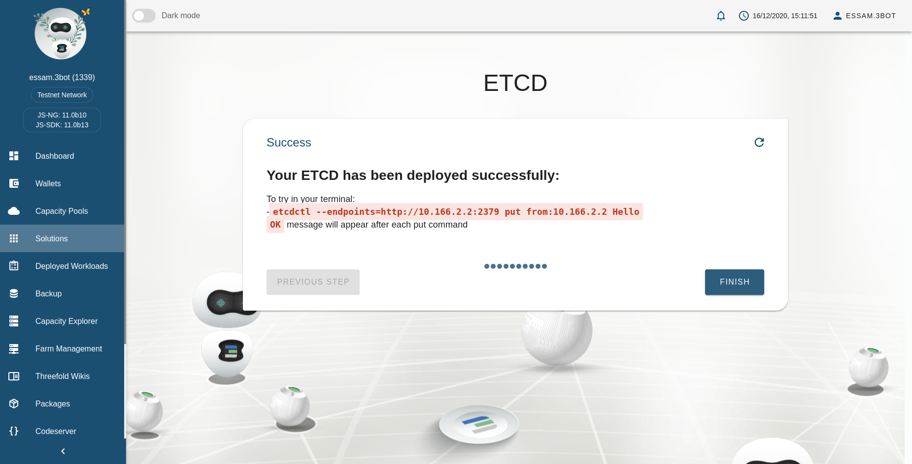
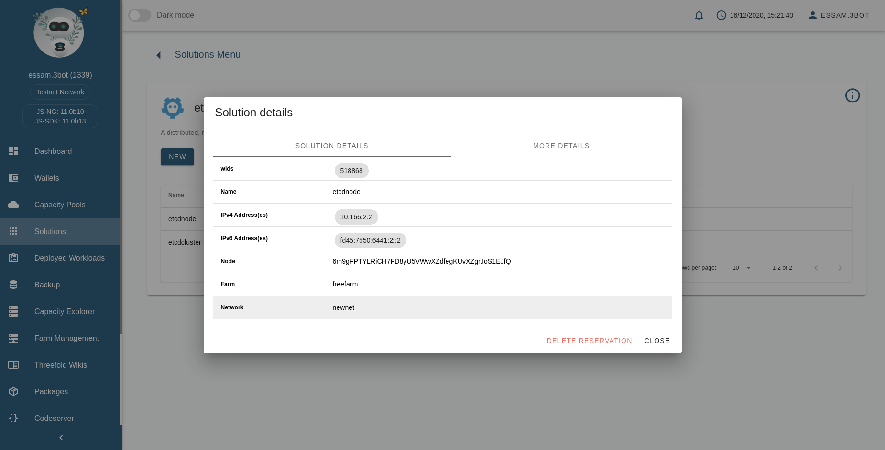

# ETCD
A distributed, reliable key-value store for the most critical data of a distributed system

## Steps to Deploy ETCD

### Add the solution name

### Choose Number of ETCD Nodes
- Single Node 

- Cluster Nodes: Here we choose cluster of 3 nodes (Odd number preferable)

### Choose Container Resources
Here we specify the CPU and Memory resources allocated for the container

### Select a Pool

### Choose a Network

### Choose Global IPv6 Address Configuration

### Ask for Automatically Select Node
Here we could provide a node id corresponding to a current node on the grid to deploy the container on. If there is no specific node to be used then it is choose `Yes`.

### Choosing Private IP

It will appear according to the number of ETCD nodes

- Single Node

- Cluster Nodes:
1. Node 1

2. Node 2

3. Node 3

### Deploying Your Solution

### Success Message

- Single Node

- Cluster Nodes

## Try ETCD From Your Terminal

> By using the command(s) from success message

- Single node

- Cluster nodes

## ETCD Info

You can access info of your solution from dashboard and will appear like the following:

### Single Node Info

### Cluster Nodes Info
