# ETCD
A distributed, reliable key-value store for the most critical data of a distributed system.

## Steps to Deploy ETCD

### Add the solution name
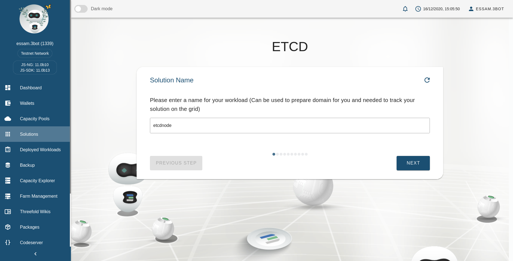

### Choose Number of ETCD Nodes
- Single Node 

- Cluster Nodes: Here we choose cluster of 3 nodes (Odd number preferable).

### Choose Container Resources
Here we specify the CPU and Memory resources allocated for each node.

### Choose Global IPv6 Address Configuration
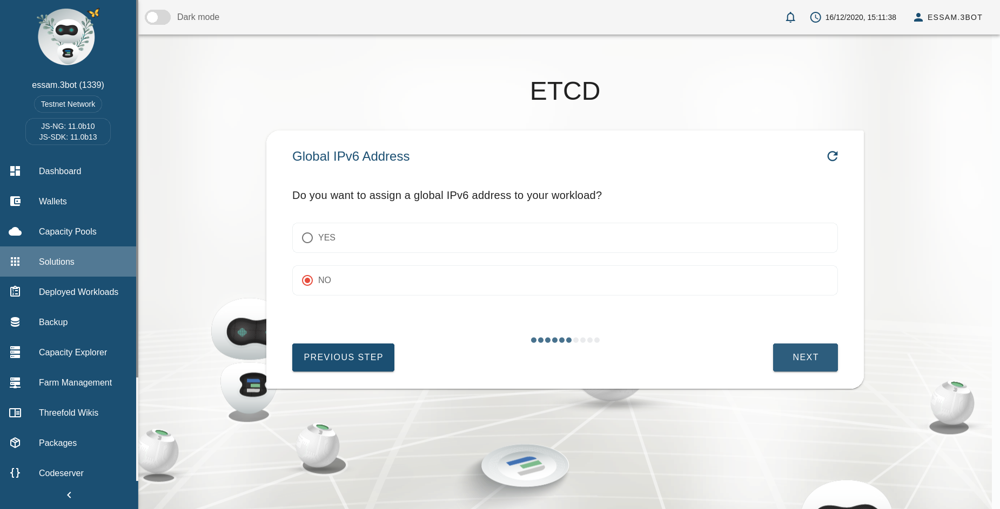

### Select Pools and Nodes

This step will be repeated according to the number of ETCD nodes that you choose before.

So you can distribute your cluster on different pools and nodes.

- Setup message appears before each node to inform you with the progress.
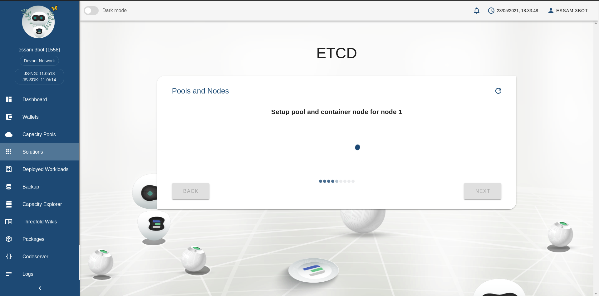

- Select Pool
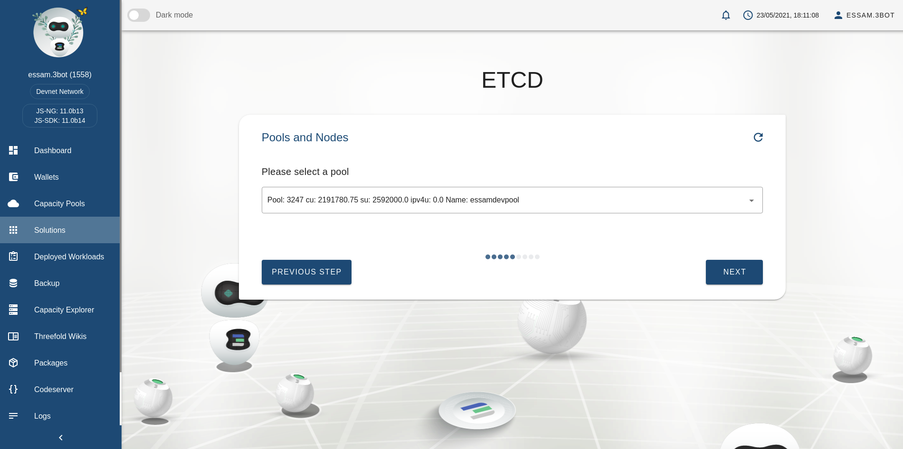

- Select Node

Here you can choose if you want to select a specific node on the grid or let it automatically selected. 

If there is no specific node to be used then choose `Yes`.
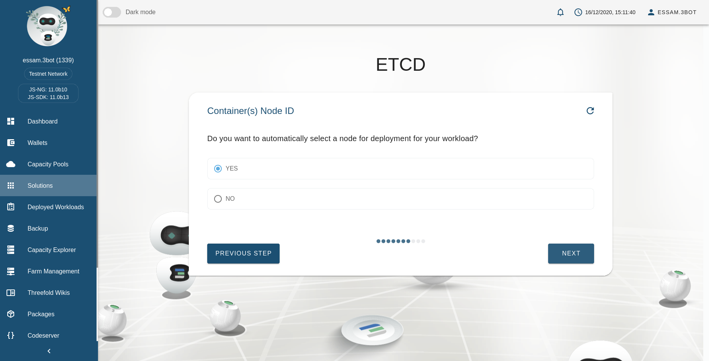

For Manual Selection, choose `No`, and a choose a node from the list.
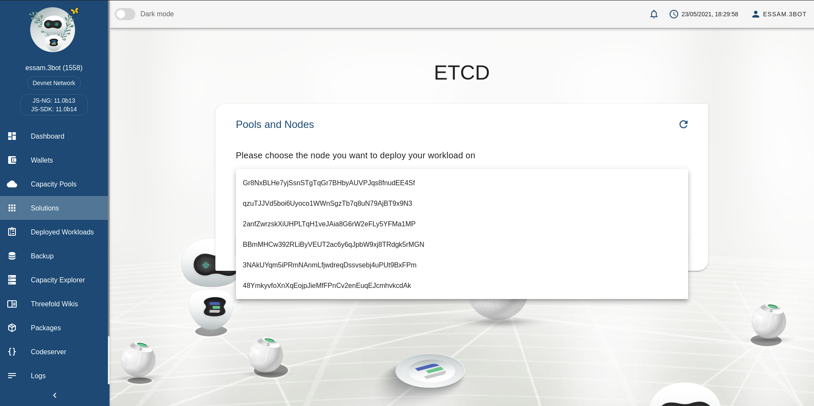

### Choose a Network

### Choosing Private IP

It will appear according to the number of ETCD nodes.
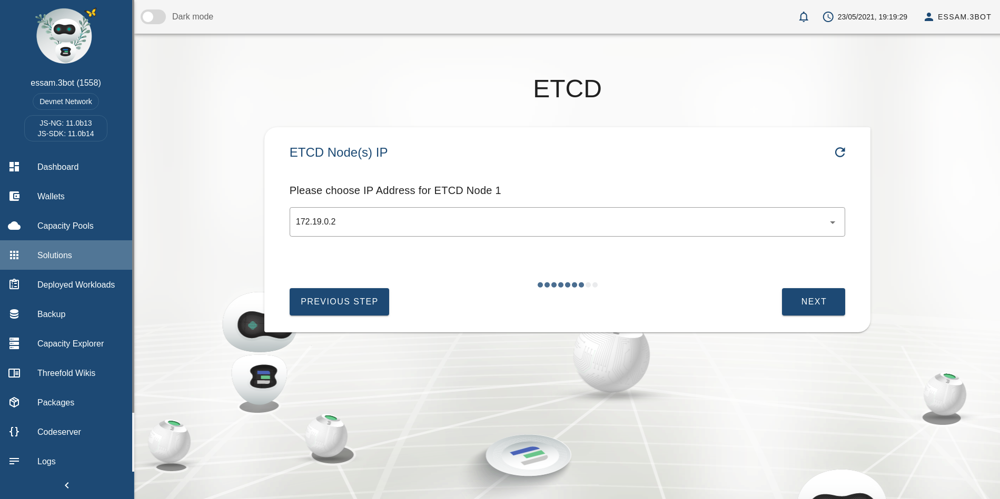

### Success Message
After deploying your solution, a message appears with the instruction to help you. 
- Single Node
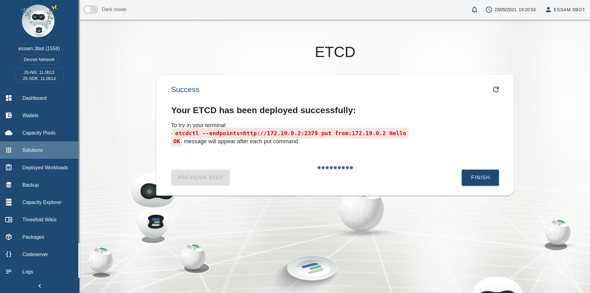

- Cluster Nodes
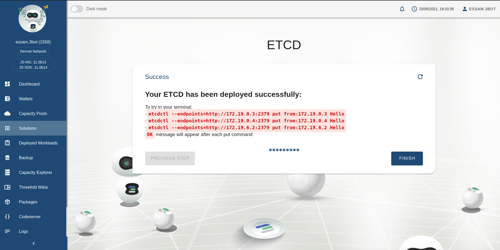

## Try ETCD From Your Terminal

> By using the command(s) from success message
> Make sure you connect to your network using Wireguard
`sudo wg-quick up YOUR_CONFIG_FILE`

- Single node

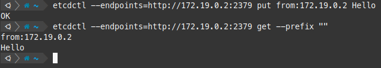

- Cluster nodes

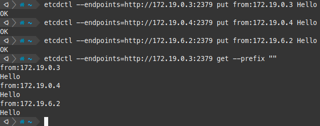

## ETCD Info

You can access info of your solution from dashboard and will appear like the following:

### Single Node Info
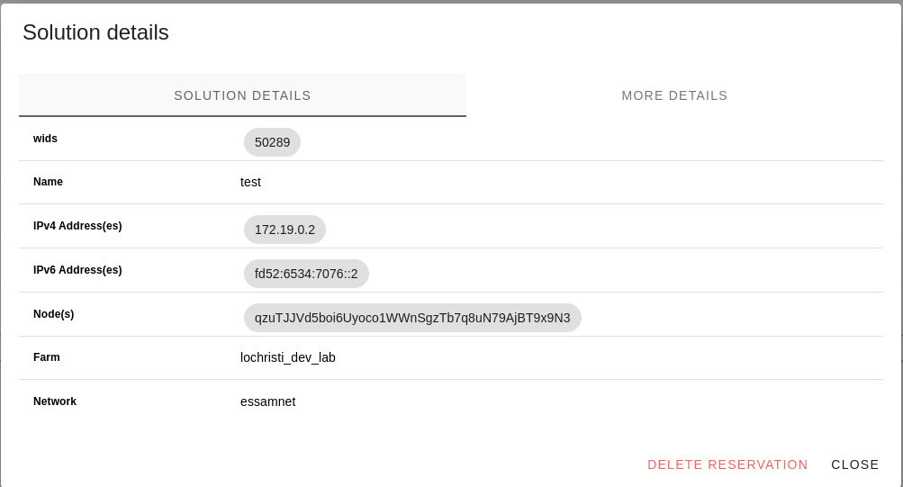

### Cluster Nodes Info
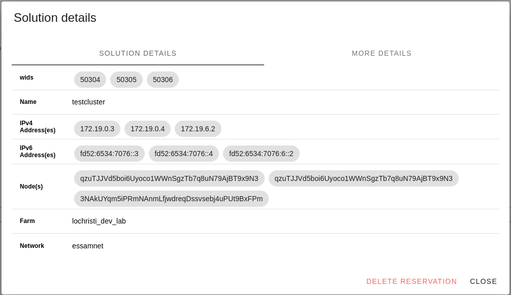