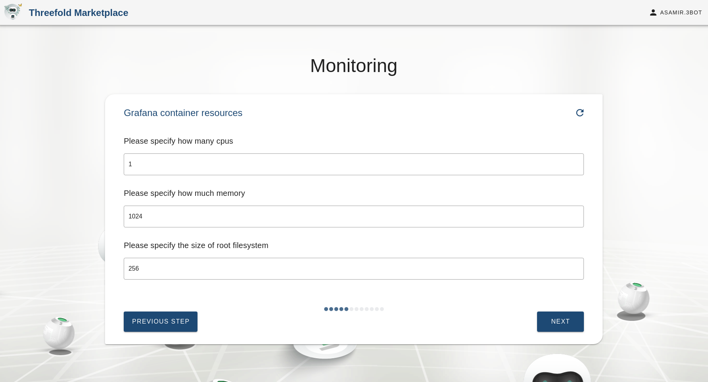
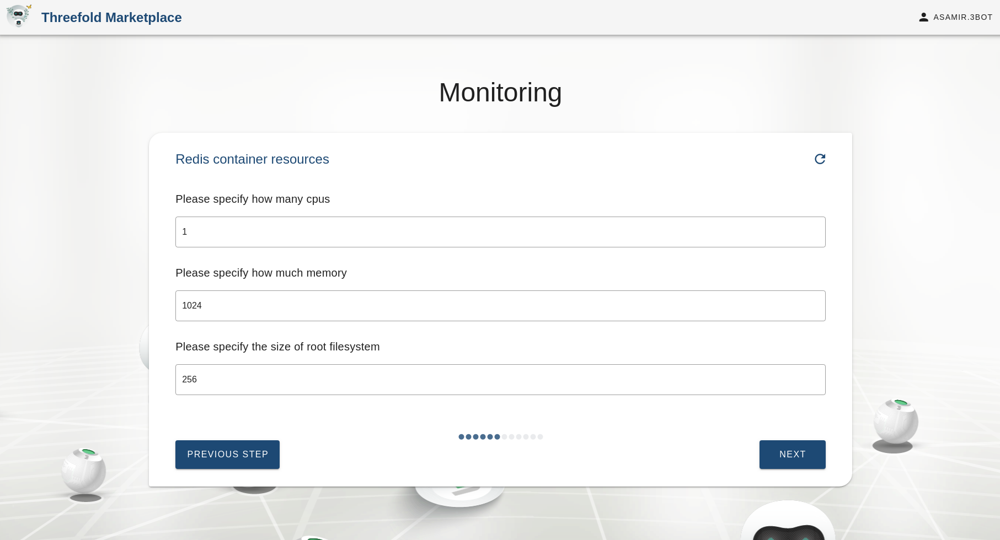
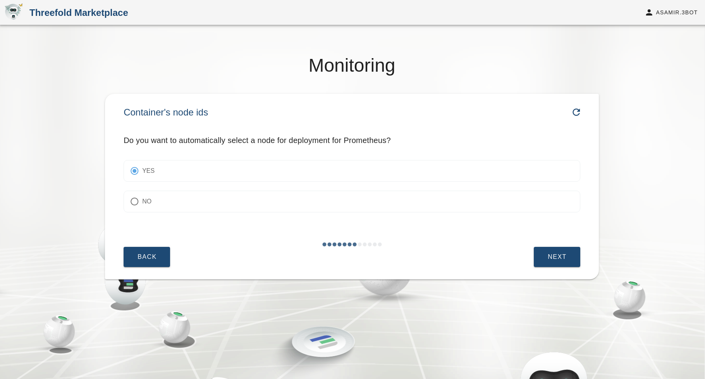
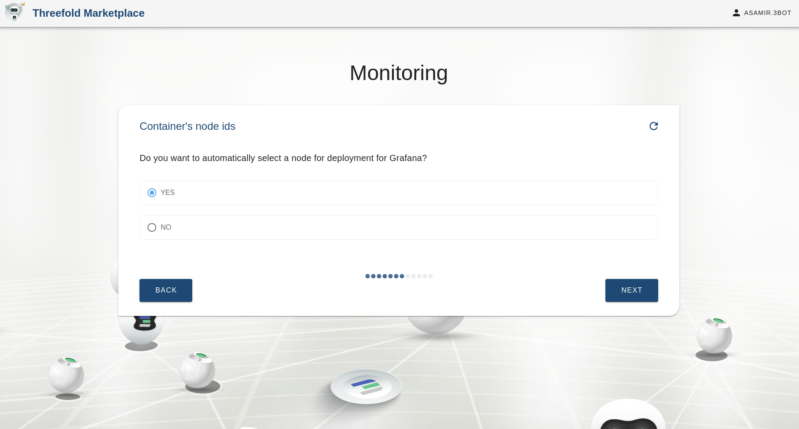
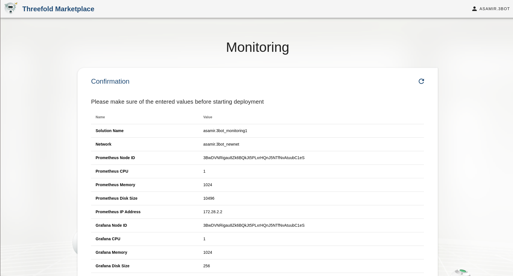
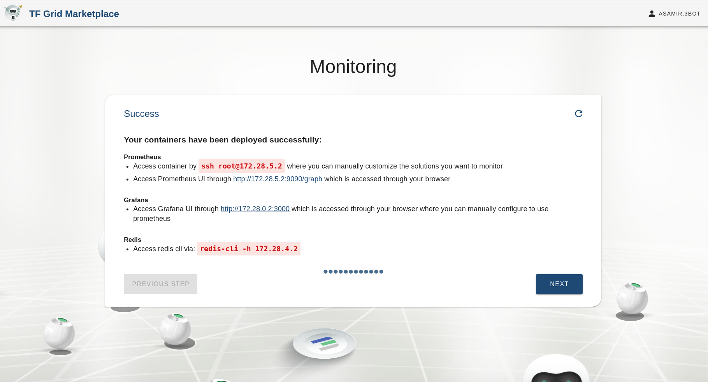

# Monitoring solution

Deploy monitoring solution with Grafana and prometheus and redis

## Steps

### Solution name

### Add your sshkey to be able to access the containers

### Select Prometheus container resources

### Select Prometheus volume size

### Select Grafana container resources

### Select Redis container resources

### Select a pool for Redis container

### Optional, select the node id you want to deploy Redis on

### Select a pool for Prometheus container

### Optional, select the node id you want to deploy prometheus on

### Select a pool for Grafana container

### Optional, select the node id you want to deploy Grafana on

### Select the network to deploy the solution on

### Select Redis container ip

### Select Prometheus container ip

### Select Grafana container ip

### Summary for the solution information

### Deploying the solution

### Congratulations your solution has been deployed

### Access container via web or ssh

<!--- to be deleted once link from sdk moved to solution_monitoring.md --->