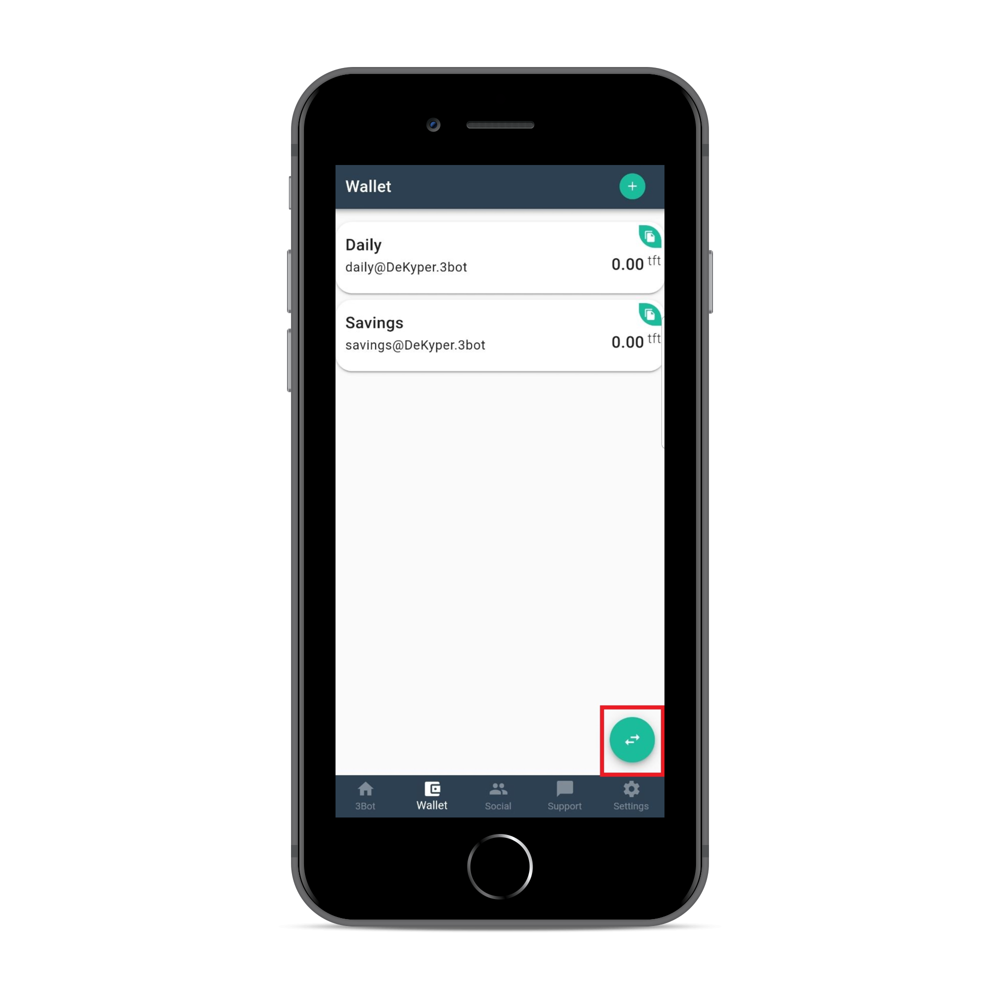
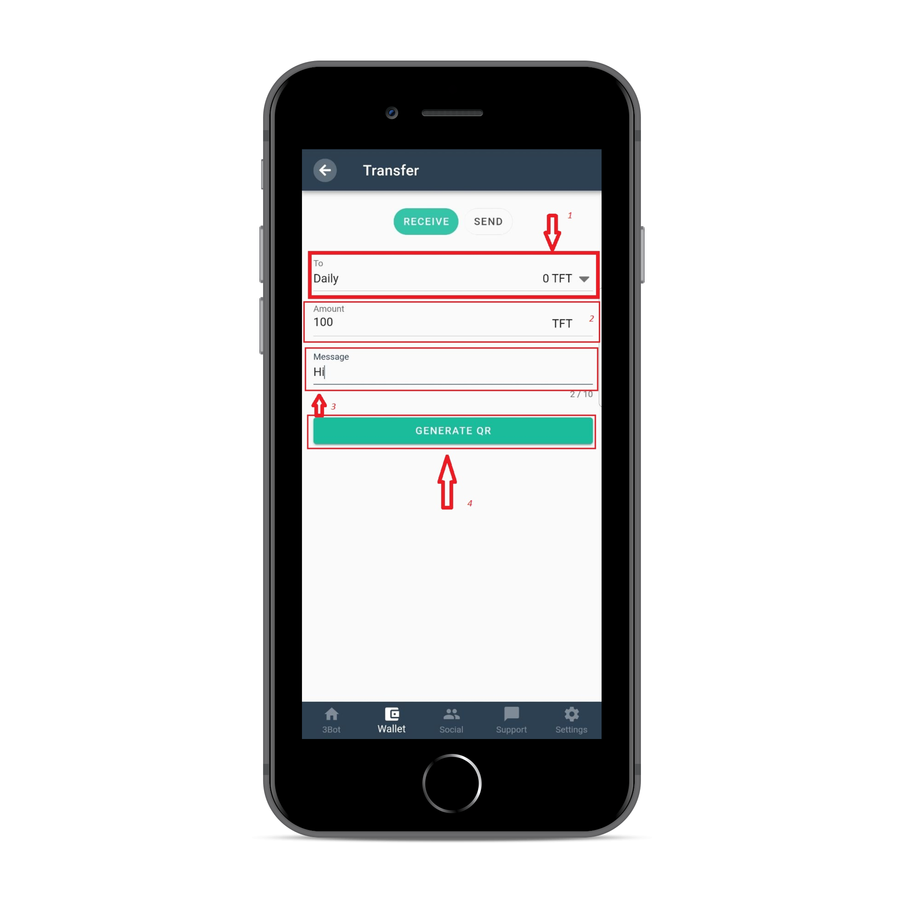

<!--- original content: https://github.com/Threefoldfoundation/info_Threefold/tree/development/src/docs/token/apps_wallets --->
# ThreeFold Connect App

## Home Page

This is the Home Page of your ThreeFold Connect App. It offers a gateway to your digital life. 

## Wallet

In this tab you could check your ThreeFold Tokens wallets and balances. You could copy your wallet address using the green "Copy" buttons for each specific wallet. Using the button in the bottom right side you could send or generate QR code to receive ThreeFold Tokens:

### Generate QR Code to receive ThreeFold Tokens

To receive your ThreeFold Tokens you could copy your button or you have to fill next fields:

1) `To` : choose the wallet that receives the transaction
2) `Amount` : amount of TFT to receive
3) `Message` : message to transaction
4) `Generate QR` : this button generates a QR code that holds all info, allowing an easy way to exchange the payment information. 

### Send

1) `From` : choose your wallet with TFT to make transaction
2) `To` : paste the reciever wallet adress
3) `Amount` : amount of TFT to send
4) `Message` : message to transaction
5) `Scould QR` : easy way to scould the QR code generated by the receiving party. Scouldning the QR automatically fills the fields introduced by the tokens receiver. 

## Settings
You could check your Secret Phrase here, change your pin code, activate access through biometric (fingerprint) or remove your account in `Advanced Settings` tab.

