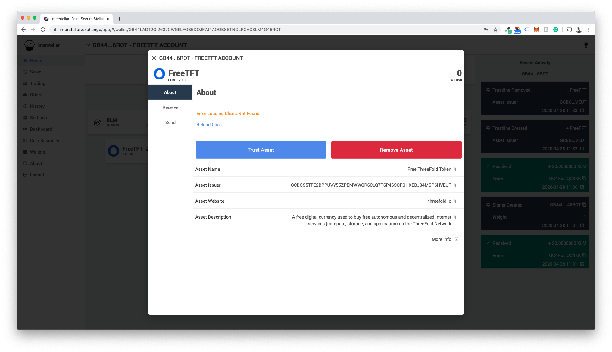
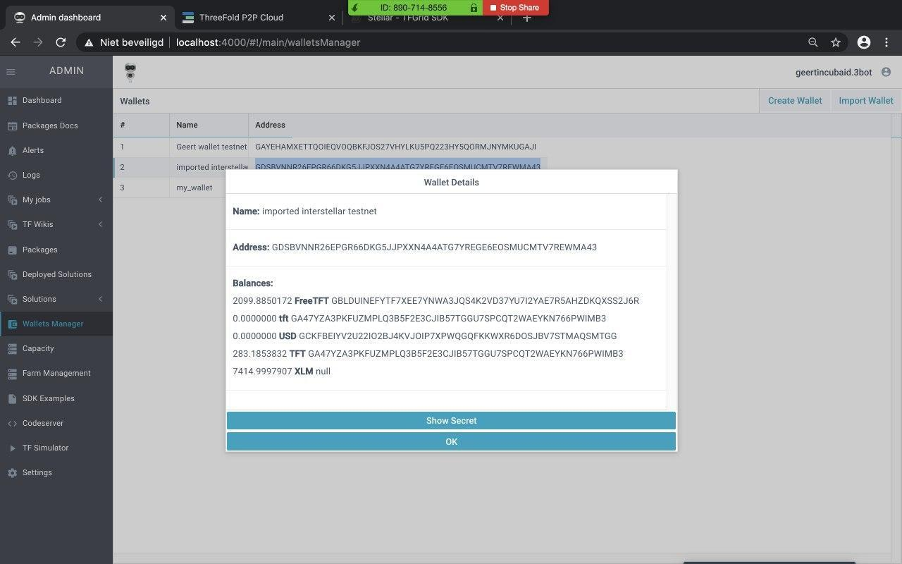

## Receiving tokens in the 3SDK Wallets

You can apply for FreeTFT here: [GetFreeTFT.ThreeFold.io](https://www.getfreetft.threefold.io)
But before you do please make sure you create a wallet that has a trustlin to receive the tokens in.

**Important note: SDK Wallets automatically have a trustline for the TFT, FreeTFT & TFTA assets.**

In the SDK you can easily set up Stellar based wallets for both TFT, FreeTFT and TFTA

In the left Menu click Wallets Manager.

Click Create Wallet and give it a name

Your wallet has now been created and should show up in your list

And you can copy the address to receive tokens on it.

## Receiving TFT, FreeTFT or TFTA on a different Stellar based wallet

To receive FreeTFT on other Stellar wallets you will need to meet a few prerequisites:

1. It needs to be funded with some XLM (activated)

2. You will need to set up a trustline to receive the assets

For this example, we will use interstellar.exchange to receive our FreeTFT’s but any stellar based wallet will support FreeTFT. Please refer to the wallet of your choice on how to add assets.

### Step 1: Adding the Token

Click Add Token

### Step 2: Go to "manual" and Use the following information

`Asset code` : FreeTFT

`Issuer` : GCBGS5TFE2BPPUVY55ZPEMWWGR6CLQ7T6P46SOFGHXEBJ34MSP6HVEUT

You have now added the asset. Now you need to set up a trustline.

### Step 3: Setting up the Trustline

Click "Trust Asset"

### Step 4: Confirm the trustline-transaction with your password

Upon completing this successfully you have a trustline for FreeTFTs setup and we can now send them your way!

### Step 5: Fill the faucet form

Go to the [FreeTFT Faucet form](https://www.getfreetft.threefold.io/) and fill it in. You should receive your FreeTFT within one working day. 

## Importing Wallets into the 3SDK

You can also choose to import an already existing wallet (like an interstellar wallet) into the SDK.

We’re using Interstellar as an example again, but any Stellar wallet will be possible.

Go to Interstellar and click security in the leftside menu.

Scroll down and click `View Secret Keys`

In this section you will find the secret key / public key / wallet name. 

You will have to copy the first part only: the secret key.

Now go to the SDK Wallets Manager and Click Import Wallet.
Give the wallet a name and paste your wallet secret.

You have now imported the Interstellar wallet and it will show up in your Wallets Manager.

The public address of the account is the same for all assets. So by setting up the account, you have also an overview of all tokens / assets for which a trustline has been created. 

