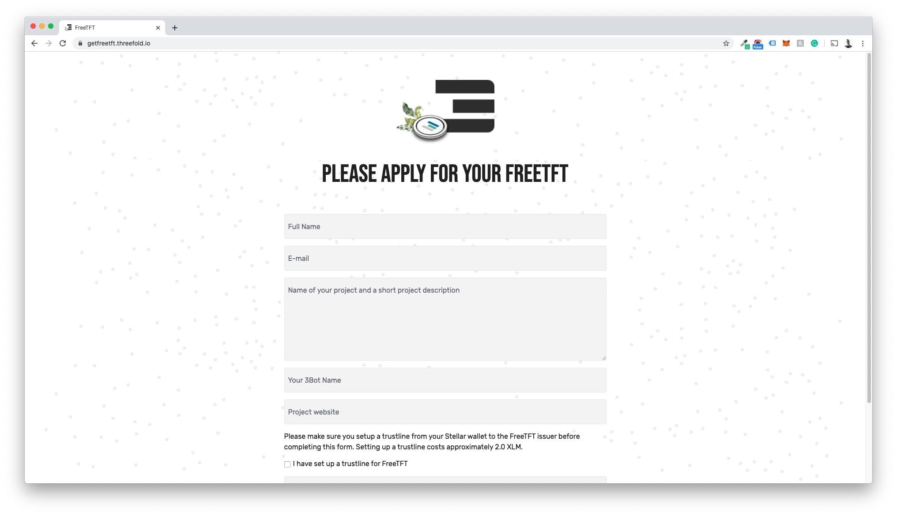

To receive FreeTFT you will need to meet a few prerequisites:

1. You need a stellar based wallet
2. It needs to be funded with a little XLM to set up a trustline

For this example, we will use interstellar.exchange to receive our FreeTFT’s but any stellar based wallet will support FreeTFT. Please refer to the wallet of your choice on how to add assets.

Step 1: Adding the Token

Click Add Token

Step 2: Go to "manual" and Use the following information

Asset code: FreeTFT

Issuer: GCBGS5TFE2BPPUVY55ZPEMWWGR6CLQ7T6P46SOFGHXEBJ34MSP6HVEUT

You have now added the asset. Now you need to set up a trustline.

Step 3: Setting up the Trustline

Click "Trust Asset"

Step4: Confirm the trustline-transaction with your password.

Upon completing this successfully you have a trustline for FreeTFTs setup. You can now fill out or complete your application for FreeTFT on **[getfreetft.threefold.io](https://www.getfreetft.threefold.io)**

