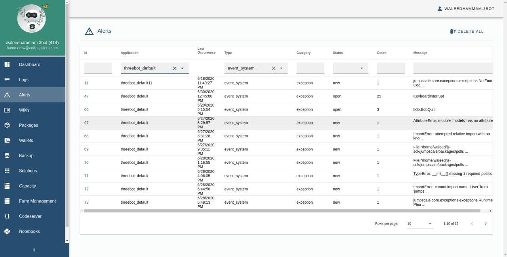
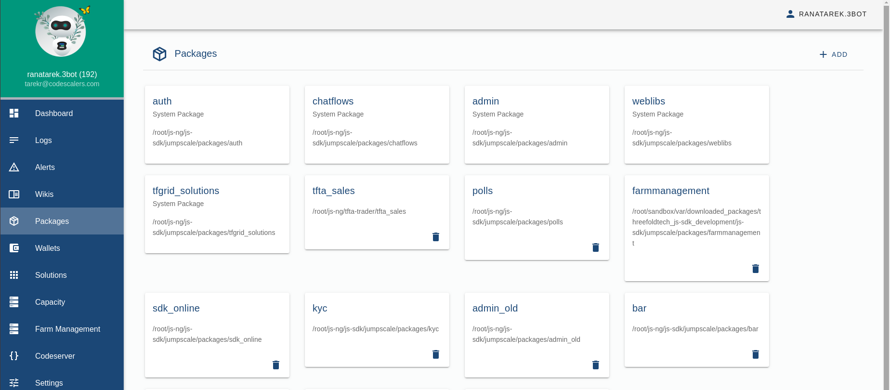
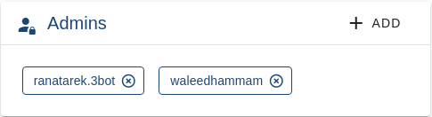
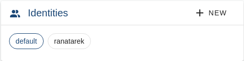

# Admin panel overview


The 3Bot admin panel is a versatile tool to administrate and control processes and activities of the TFGrid SDK.

### Home

Shows system versions, network, processes status, memory consumptions and some health checks


### Logs
Allows seeing logs per application


### Alerts
Advanced alerts system



check [alerts.md](admin_alerts.md) for info about its actors
### Package management system
Easy way to install/stop packages available on the filesystem or from a trusted git repository




### Online code editor

If you want to edit code from the dashboard directly you can do so using CodeServer package


### Details

#### Installation

Admin dashboard is installed by default, you also can install it by path or git url as any other package.

You can view the dashboard by navigating to `http://<host>/admin`.

#### Login

The dashboard is protected by 3Bot connect. To access it in the first place, the user should have started threebot server using their saved identity  or their 3bot name was added by the initial user giving them access to the dashboard.

Giving admin access to other users can be done from `Settings` or admins can be dded to `j.tools.threebot.me.default.admins` via `jsng` shell:

```python3
j.core.identity.me.admins.append("ahmed.3Bot")
j.core.identity.me.save()
```



The user can also choose to use between multiple identities as long as that identity is registered from the 3bot connect app. This can be done in the `Settings`as well.



#### Extending Admin Dashboard

Please check [extending admin dashboard](admin_extending.md)


