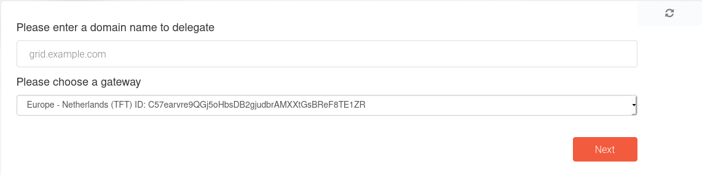

# Delegate Domain

Our grid provides functionality to delegate subdomains of your domains allowing us to create subdomain for your solutions [see](solution_expose.md).
Todo this you will need to configure your dns manager. In your dns manager you will need to add a `ns` record pointing to the dns_server of the chosen gateway.
The chatflow will also instruct you todo so.

First you will be instructed to provide your domain name and the gateway you wish to delgate your domain on

Next you will be asked to choose for how long you want to delgate your domain

Finally you will be shown a message that your domain was delegated successfully and will show you which domain to use in the `ns` record you have to create

