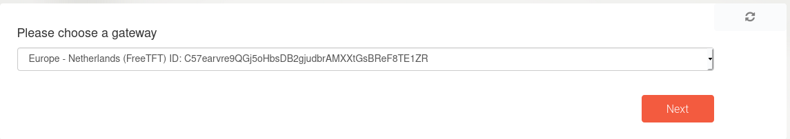

# 4 to 6 Gateway

Our grid uses IPv6 internally, the problem is not everyone in the world has access to IPv6, so to make easier for people to connect to our services we have created a gateway which make it possible to access IPv6 over IPv4

1. Select which gateway to use

2. Enter the duration of your gateway

3. Optionally enter the public key of your wireguard (if left empty one will be generated for you)

4. The reservation will be deployed, the wizard will inform you how to install wireguard

5. The wireguard configuration will be offered for download.

