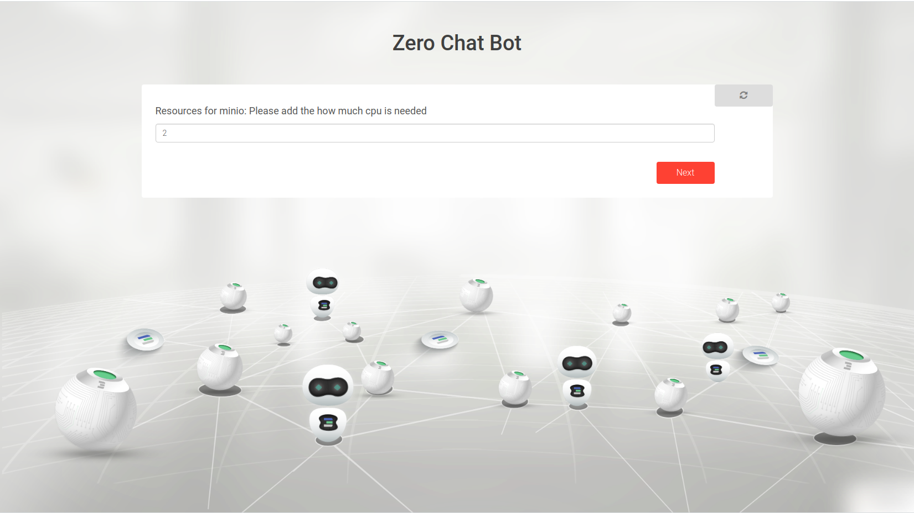
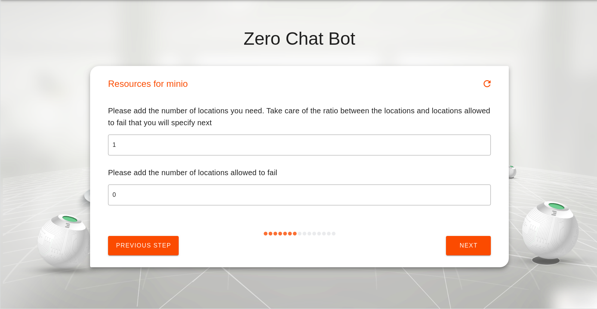
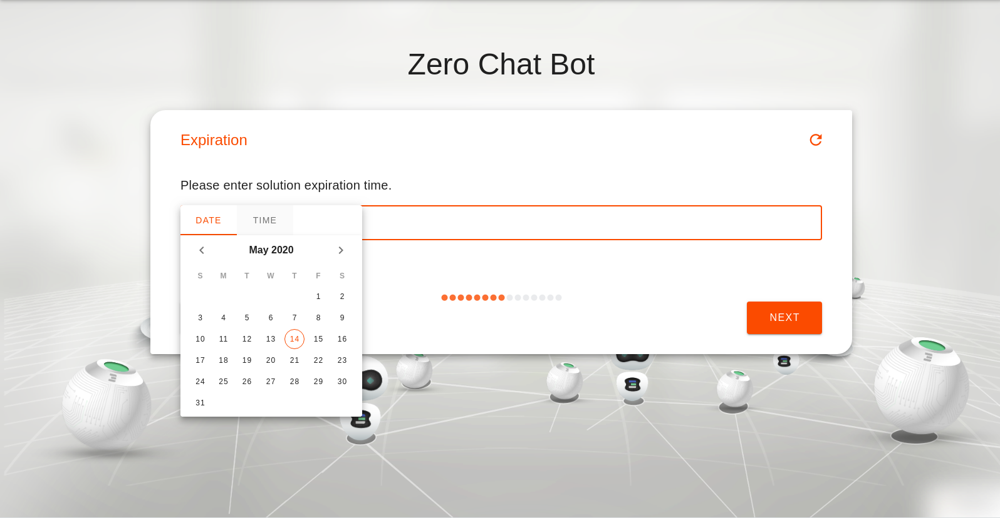
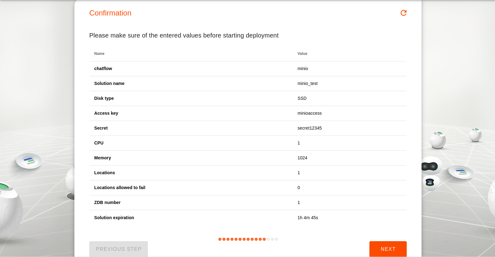

# Storage Cluster deployment

MinIO is a high performance object storage. With the assist of the chatflow the user will deploy a machine with MinIO along with the number of zdbs needed for storage.

### Accessing the solution

Go to your admin dashboard `https://localhost:4000/admin` and click on Network

### Inputs

- `container name` a name of your conatiner to help you to get it again with reservation id.
- `db password` : password used for all zdb storage
- `disk type for storage` : (SSD or HDD) disk type to be used by zdb databases where storage will take place
- `database mode` : (seq or user) mode in which all zdb databases will run with
- `access key & secret` : access key and secret pair that will be used to access MinIO deployed. This should be kept safely as it will provide access to the deployed infrastructure.
- `cpu needed` : Number of cpu needed
- `memory size` : Memory size needed example 2048
- `number of data drives and parity drives` : number of drives needed and hence the number of zdbs to be created. Take care of the ratio between the number of data drives and the number of parity drives ([more info about drives](https://docs.min.io/docs/minio-erasure-code-quickstart-guide.html))
    - `Expiration time`: a network expiration time (minutes=m ,hour=h, day=d, week=w, month=M)
    - `IP Address` : choose the ip address for your MinIO machine.

After the deployment of MinIO is complete,  a url will be returned that can be used to access it.

### Deploying MinIO

#### Choosing the network name

Choosing the network to be used from a list of existing networks created by the user

#### Choosing the solution name

Choosing the name of the solution to be deployed. This allows the user to view the solution's reservation info in the dashboard deployed solutions

#### ZDB Storage

Here we set the password for the backend of minio our [0-db](https://github.com/threefoldtech/0-db)

#### Choosing the Disk Type

Now time to choose your disk type either SSD or HDD.

#### User credentials

Here we ask for the key and secret to access minio 

Let's make sure we never lose them
#### Resources for Minio

Here we define the CPU we need

And Now the time to specify the memory resources we need.

#### Locations 

Here we choose the number of locations we want to save data on and number of locations we allow to fail.

#### Expiration time

Now we define the expiration time for the solution on the grid.

#### Confirming 

The user should confirm his reservation details

#### Access information

You will get a message indicating the success of your reservation or error in case of error for any reason.

#### Login Page

Once accessing the url the following is shown once redirected to MinIO login(access key and secret are to be used here)

#### MinIO UI

Once logged in using the previous page, you can upload and use the browser to navigate through all your items

