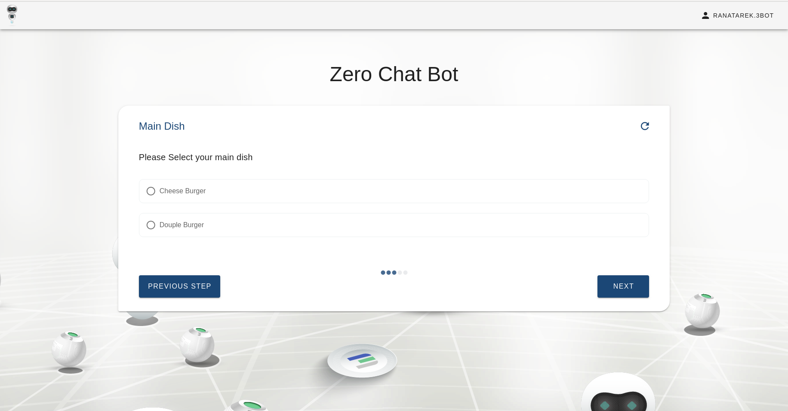

# Chatflows


Chatflows are an interactive communication bot that can be used to interactively ask the user some questions then perform actions based on the user's choices. Think of serving a customer, handling invoices, buying items or in our case provisioning workloads on the grid.

## Create a new Chatflow

It's very easy to define a new bot, you just need to make sure it's added in a package and that package is installed with 3Bot server. The chatflow should be under the `/chats` directory in the package created.

### Main Features
Each chatflow should include these :
- `steps` list:
 It includes the names of the functions of the chatflow steps in the chatflow that will be appearing.
- `chatflow_step` decorator:
 Every step function included in the steps list should have this decorator imported using `from jumpscale.sals.chatflows.chatflows import chatflow_step`. If a custom name is to be added for a step, it can be given as a parameter to the decorator function.
- Title:
 `title ` (optional) parameter will display a custom title for the chatflow.

### Custom Features

A chatflow can include some custom features which are optional. These features can be activated by providing the corresponding parameter to the `chatflow_step` decorator that is added for each chatflow step

- disable_previous:
 If set to **True**, the previous button is deactivated and going to any previous step is no longer possible
- final_step:
 Is set to **True** for the final step to reset the chatflow after reaching the last step when revisiting it in the same session

### Available question types for user inputs:

- string_ask
- secret_ask
- int_ask
- text_ask
- single_choice
- multi_choice
- multi_list_choice
- drop_down_choice
- autocomplete_drop_down
- datetime_picker
- time_delta_ask
- download_file
- upload_file
- qrcode_show
- captcha_ask
- md_show
- md_show_confirm
- loading_show
- multi_values_ask


## Example

### Example code
Here is an example for a simple chatflow that will help you order a meal from one of your favorite restaurants

```python
from jumpscale.loader import j
from jumpscale.sals.chatflows.chatflows import GedisChatBot, chatflow_step


class FoodChat(GedisChatBot):
 # Sample data
 menus = {
  "3 Burger": {"main": ["Cheese Burger", "Douple Burger"], "sides": ["fries", "Onion rings"]},
  "3 Pizza": {"main": ["Chicken Pizza", "Beef Pizza", "Cheese Pizza"], "sides": ["fries", "Cheese"]},
 }
 # title = "Food Chatflow"
 steps = ["client_name_select", "restaurant_select", "restaurant_main_dish", "restaurant_side_dish", "confirmation"]
 title = 'Food Chat'

 @chatflow_step("Name")
 def client_name_select(self):
  # Ask the user about his name
  self.client_name = self.string_ask("Hello, What's your name?", required=True)

 @chatflow_step("Restaurant")
 def restaurant_select(self):
  # display a dropdown containing your favourite Restaurants
  self.restaurant_name = self.drop_down_choice("Please select a Resturant", list(self.menus.keys()))

 @chatflow_step("Main Dish")
 def restaurant_main_dish(self):
  # display the main dishes of the selected restaurant so the user can choose only one dish
  self.main_dish = self.single_choice("Please Select your main dish", self.menus[self.restaurant_name]["main"])

  # ask about the mount (this accepts any integer)
  self.amount = self.int_ask("How many {} do you want".format(self.main_dish))

 @chatflow_step("Side Dish")
 def restaurant_side_dish(self):
  # ask about the side dishes (the user can choose multible side dishes)
  self.side_dish = self.multi_choice(
   "what do you want with your order", self.menus[self.restaurant_name]["sides"]
  )

 @chatflow_step(title="Confirmation", disable_previous=True, final_step=True)
 def confirmation(self):
  # Now you can add any logic you want here to send the order to the restaurant
  # Then we can show a report to the user about his order using md format
  report = f"""# Hello {self.client_name}
## Your order has been confirmed \n\n<br>\n
### You have ordered : {self.amount} {self.main_dish} with {self.side_dish}
  """

  self.md_show(report, md=True)


chat = FoodChat

```

### Usage example for previous code
<!-- # TODO Describe chatflows more include step configurations like last step and previous-->

Here's how the previously created chatflow will look like

- Asking what the user's name is as string `string_ask`


- Asking what restaurant the user wants from a list of options using `drop_down_choice`


- Asking what main dish the user will be having from a list of options using `single_choice`


- Asking about the amount of the main dish to be ordered using `int_ask`


- Asking about one or more side dishes to be ordered with the main dish using `multi_choice`


- Showing final results using md_show


