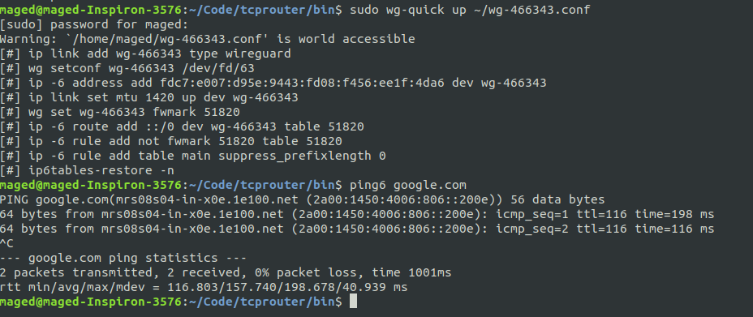

## Using the Web Gateway

### Overview

The aim is to delegate your domain to the gateway, access your running web applications using subdomains of your domain or any managed domains where we need to follow a few steps:

- choose a gateway
- delegate your domain to that gateway.
- create subdomains using that domain.
- create a tcp reverse proxy on the gateway.
- use `trc` flist to expose your running containers.
- managed domain example

Also show how to use the gateway4to6 workloads for users with IPv4 only networks to get IPv6 connectivity through the gateway

#### Choose a gateway

```python
# fetch all gateways
gateway_ids = {g.node_id: g for g in j.sals.zos.gateways_finder.gateways_search() if j.sals.zos.nodes_finder.filter_is_up(g)}

# fetch your pool
pool = j.sals.zos.pools.get(1)

# select a gateway available in your pool
gateway = None
for gid, g in gateway_ids.items():
 if gid in pool.node_ids:
  if not g.dns_nameserver:
   continue
  gateway = g
  break
if not gateway:
 raise j.exceptions.Input(f"pool {pool.pool_id} doesn't include any gateway")
```

#### Delegate your domain to the gateway

```python
# delegate your domain
DOMAIN = "waleed.grid.tf"
domain_delegate = j.sals.zos.gateway.delegate_domain(gateway.node_id, DOMAIN, pool.pool_id)
wid = j.sals.zos.workloads.deploy(domain_delegate)
```

got to your dns manager and create an `ns` record pointing to the gateway name `gateway.dns_nameserver[0]` then you can create subdomains of that domain and the gateway will create A records for it.

#### Create subdomains

```python
# we will use the gateway IP address for the subdomain to use it to expose our workloads
SUBDOMAIN = "srv1.waleed.grid.tf"
gateway_ips = []
for ns in gateway.dns_nameserver:
 gateway_ips.append(j.sals.nettools.get_host_by_name(ns))
subdomain = j.sals.zos.gateway.sub_domain(gateway.node_id, SUBDOMAIN, gateway_ips, pool.pool_id)
wid = j.sals.zos.workloads.deploy(subdomain)
```

now you can actually see that your subdomain is resorvable.


#### Create tcp reverse proxy

```python
# you need to have a secret for your reverse proxy which will be used by trc container to connect to the gateway. the format is {tid}:{arbitary_value}
import uuid
SECRET = f"{j.core.identity.me.tid}:{uuid.uuid4().hex}"

# create your tcp reverse proxy
reverse_proxy = j.sals.zos.gateway.tcp_proxy_reverse(gateway.node_id, SUBDOMAIN, SECRET, pool.pool_id)
wid = j.sals.zos.workloads.deploy(reverse_proxy)
```

#### create trc container to expose an already running workload

```python
# trc container initializes a tunnel with the gateway and forwards the traffic recieved on that tunnel to a specified address (the workload you want to expose)
# solution address config

SOLUTION_IP_ADDRESS = "10.212.2.2" # IP address of the workload you want to expose
SOLUTION_PORT = 8000
# I'm using an ubuntu container running python3 -m http.server to demonstrate so the below port will not be used
SOLUTION_TLS_PORT = 8443 
GATEWAY_IP = gateway_ips[0]

entrypoint = f"/bin/trc -local {SOLUTION_IP_ADDRESS}:{SOLUTION_PORT} -local-tls {SOLUTION_IP_ADDRESS}:{SOLUTION_TLS_PORT}" f" -remote {GATEWAY_IP}:{gateway.tcp_router_port}"

# trc container deployment
NODE_ID = "2m3nHPSAMyZFSeg5HPozic2NGBMtrXrBkhtNcVmd5Ss6"
NETWORK = "demo_net"
FLIST_URL = "https://hub.grid.tf/tf-official-apps/tcprouter:latest.flist"
CONTAINER_IP_ADDRESS = "10.212.2.10"
secret_env = {"TRC_SECRET": j.sals.zos.container.encrypt_secret(NODE_ID, SECRET)}
container = j.sals.zos.container.create(
 node_id=NODE_ID,
 network_name=NETWORK,
 ip_address=CONTAINER_IP_ADDRESS,
 flist=FLIST_URL,
 capacity_pool_id=pool.pool_id,
 entrypoint=entrypoint,
 secret_env=secret_env,
)
wid = j.sals.zos.workloads.deploy(container)
```

now you can access your server using the gateway


#### Managed domains example

- gateways can have managed domains that you can use to create subdomains directly without the need of delegating domains or having a domain in the first place.

```python
gateway.managed_domains # list of the managed domains
domain = gateway.managed_domains[0] # the gateway I'm using is "tfgw-testnet-01.gateway.tf"

# create a subdomain of a managed domain
subdomain = j.sals.zos.gateway.sub_domain(gateway.node_id, f"srv3.{domain}", gateway_ips, pool.pool_id)
wid = j.sals.zos.workloads.deploy(subdomain)
```

now you can use that subdomain in your tcp reverse proxy as above

## Gateway4to6

This workload gives you a connection to IPv6 networks using a wireguard tunnel.

```python
# first you need a keypair to be used for your wireguard cofiguration.
# you can use existing ones or generate a pair like this
private_key, public_key = j.tools.wireguard.generate_key_pair()

# create gateway4to6 workload
gateway4to6 = j.sals.zos.gateway.gateway_4to6(gateway.node_id, public_key.decode(), pool.pool_id)
wid = j.sals.zos.workloads.deploy(gateway4to6)

# get result to build your wireguard config
result = j.sals.zos.workloads.get(wid).info.result


cfg = j.data.serializers.json.loads(result.data_json)
wgconfigtemplate = """
[Interface]
Address = {{cfg.ips[0]}}
PrivateKey = {{privatekey}}

[Peer]
PublicKey = {{peer.public_key}}
AllowedIPs = {{",".join(peer.allowed_ips)}}

Endpoint = {{peer.endpoint}}


"""
config = j.tools.jinja2.render_template(
 template_text=wgconfigtemplate, cfg=cfg, privatekey=private_key.decode()
)

# save your config
filename = "wg-{}.conf".format(wid)
j.sals.fs.touch(f"/home/maged/{filename}")
j.sals.fs.write_file(f"/home/maged/{filename}", config)
```

now you can start your wiregaurd config and access IPv6 addresses

