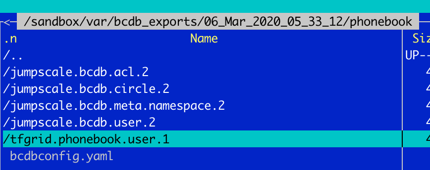

## BCDB export/import

BCDB exposes an export/import functionality.

### Export

to use

```bash
kosmos 'j.data.bcdb.export()'
```

will create a directory under /sandbox/var/bcdb_exports

per bcdb we get following:



per schema (model) we get following


the data gets exported to data (binary) & yaml
for import we only support binary for now.
we also do backup of the old schemas

#### Method

```python
def export(self, name=None, bcdbname=None, path=None, yaml=True, data=True, encrypt=False):
    """Export all models and objects

    kosmos 'j.data.bcdb.export(name="system")'
    kosmos 'j.data.bcdb.export()'

    :param path: path to export to
    :type path: str

    :param name: is the name of the backup, if not chosen will be like '06_Mar_2020_05_00_00'

    """
```

### Import


To import its easy to go to a directory like this and just do


```bash
kosmos 'j.data.bcdb.import_()'
```

make sure you see schema_meta.msgpack

#### Method

```python
def import_(self, path=None, reset=True):
    """
    import back

    kosmos 'j.data.bcdb.import_()'

    if path not specified will look at path you are in, 
    if schema_meta.msgpack found will use that path

```


