# Minio Storage step by step
This tutorial will guide you to install a fully working minio storage instance in master/slave mode. The master slave mode installs 2 minio instances where one of them (slave) is a read only replica of the master instance.

The solution will also show you how to install an additional monitoring solution to check the health of nodes, and more information about the storage capacity and free space.

## Size Calculations

Make sure to read the [capacity requirements](code_hercule.md#Capacity-requirements) before deploying your solution

## Steps
### Installing the network
In your admin panel, click on `Solutions > Network` then click the `Create New` button. This should show up a window as the following one.


Please fill in a network name of your choice. In this example we will use the name `minio`.

Make a payment currency selection. (We choose TFT in this example)


Select expiration date that suit your need.


Network type. We choose `IPv6` in this example
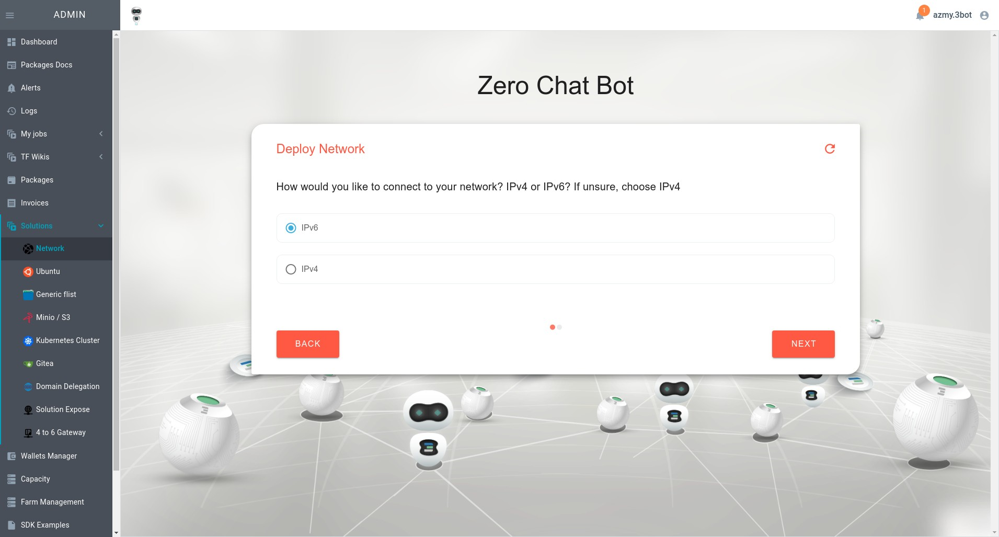

Choose `Choose IP range for me` option.


Finding available capacity and calculating the cost.
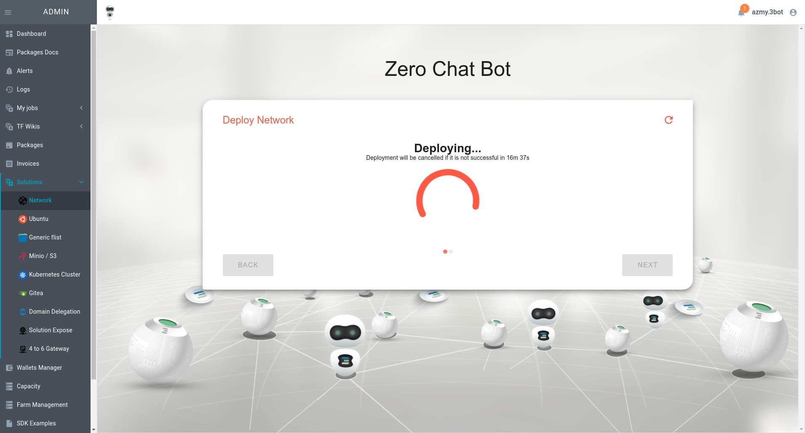

Make sure that you have `wireguard` installed. Also the `wg-quick` tool to quickly grant you access to the network, then click `Next`
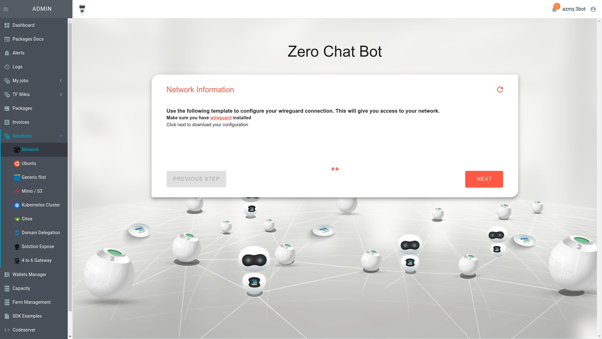

Download or copy the config from the screen, put the config in file `/etc/wireguard/minio.conf`. Then bring the network up by doing
```bash
wg-quick up minio
```
> Writing the config file and bringing the network up, both required `root` access.


Just click `Next` to finish the wizard.
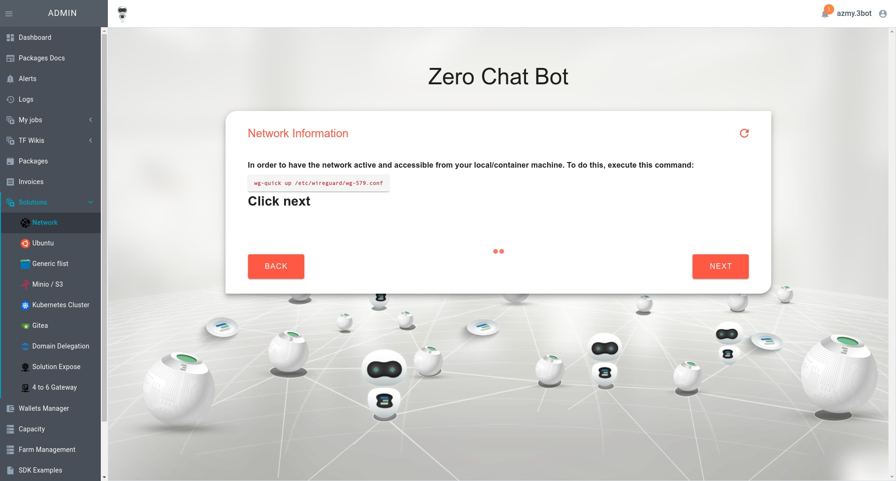

### Installing minio
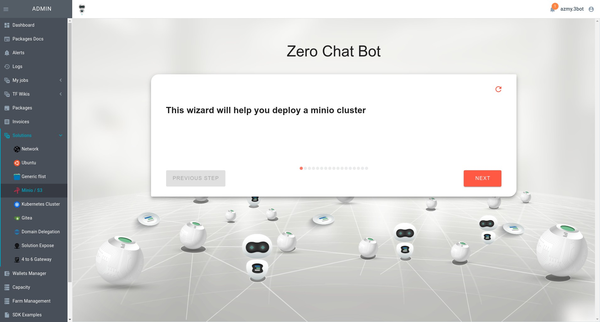

Select your network (the one we just created in the previous step)


Give your solution a name (we called it `minio-storage`) in this example


Choose a `Master/Slave` setup in the setup type window.


For storage type we choose HDD. HDD speed is good enough for archive purposes. Also cheaper and abundant.


Set the username and password for your minio instance. These will be your access KEY, and SECRET.


CPU and Memory capacity giving for each minio instance (each master and slave instance will get 1 CPU and 4096 MB of memory)

> Please make sure to set memory to AT LEAST 4G (4096 MB) of memory


The total number of ZDB instances (2+1 in this case = 3 ZDB instances), with a `DATA/PARITY` ration of `2/1`
> Installation will always install an extra ZDB instance (Transactions Log) in case of Master/Slave setup. So in this scenario we end up with 4 ZDB instances

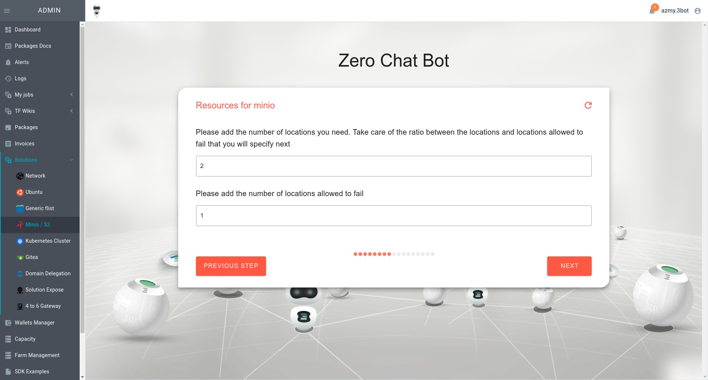

Optional step (but is very recommended) is to upload your public ssh key so you could access both the minio nodes over SSH in case of trouble for debugging purpose. Please use `rsa` key format or any other format supported by `dropbear`.
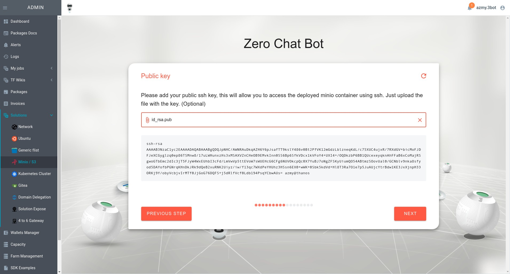

Expiration date for the solution.


Where the ZDB instances are going to deploy. Choose the farm of your choice or leave empty for random farm allocation. A better way to choose which farm is to check the [explorer.grid.tf](https://explorer.grid.tf/) for a farm in your area for the best access speed.


Where the minio instances are going to deploy. This still could be in a different location than your ZDB instances (selected in the previous step), but for best speed, please choose the same farm as your ZDBs, unless you have a good reason not to.


Select IP for your Master minio instance.
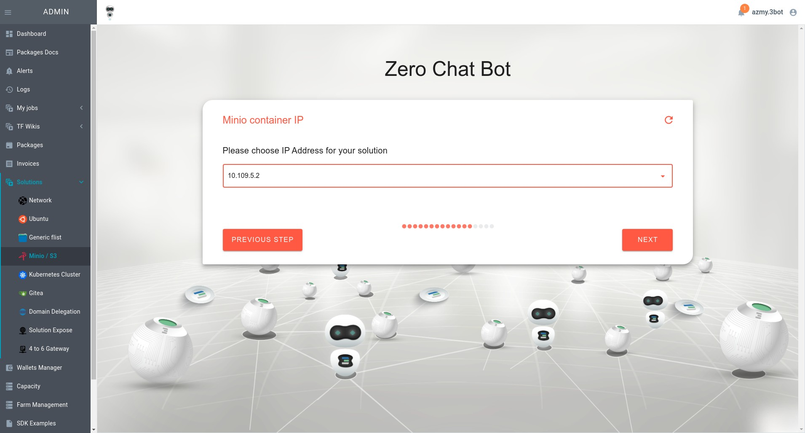

Another IP for the Slave minio instance.
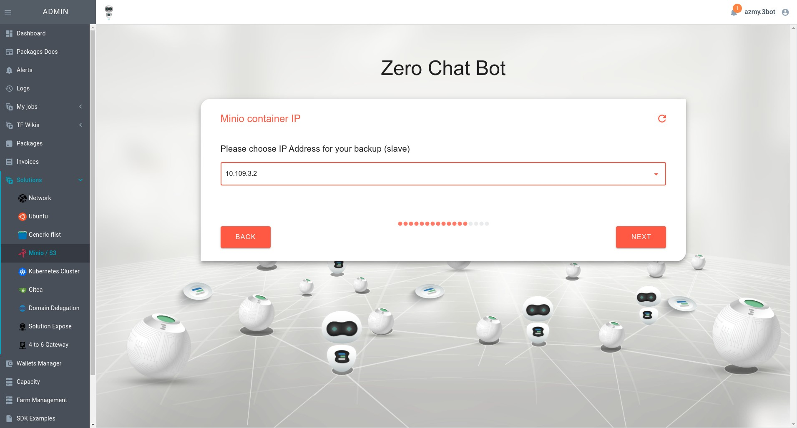

Quick review of your configuration, click `Next` to confirm
> Take a note of IPs of the `master` and `slave`


Calculating prices for your ZDBs
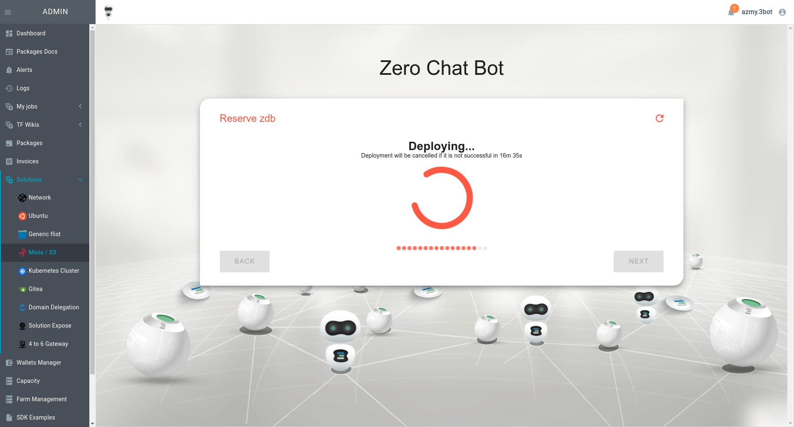

Pay up for your ZDBs, select the wallet you want to pay from. And click `Next`


Deploying the ZDBs instances.


Press `Next` to deploy the minio containers.


Showing the prices for the minio containers workload


Deploying
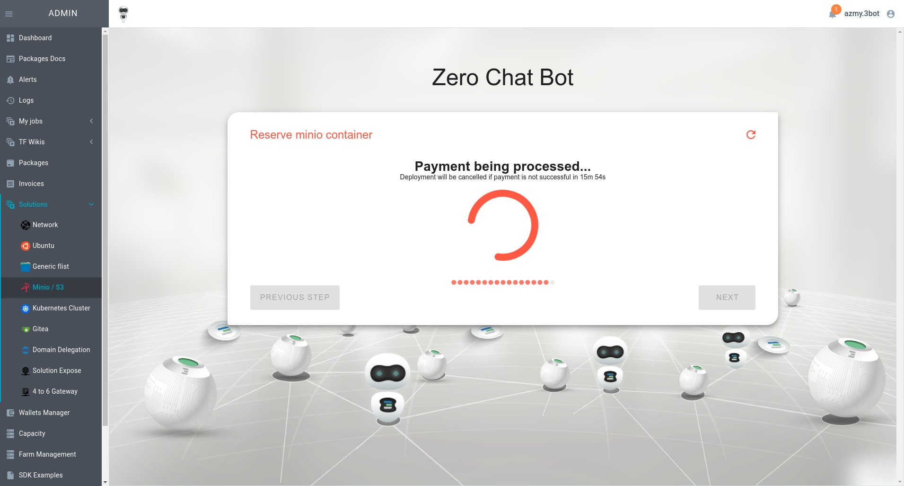

Confirmations with links to your `minio` master and slave instances. Open both in new tabs.

#### Checkpoint
You should already have a fully working minio solution now. You could start creating buckets and uploading files to your `Master` instance. Changes to Master instance will auto reflect to the slave instance. The slave instance could be used to download files only.

### Installing Monitoring (optional)
Next we going to install a monitoring solution for the nodes. This includes a generic `prometheus` setup where you could customize to monitor this solution (and may be other solutions that you install on the same network in the future)

In you `control panel` please select `Solutions > Generic Flist`. Press `Next` to start


Select same network where your minio solution is deployed


Give it a name you could just call it `prometheus`.
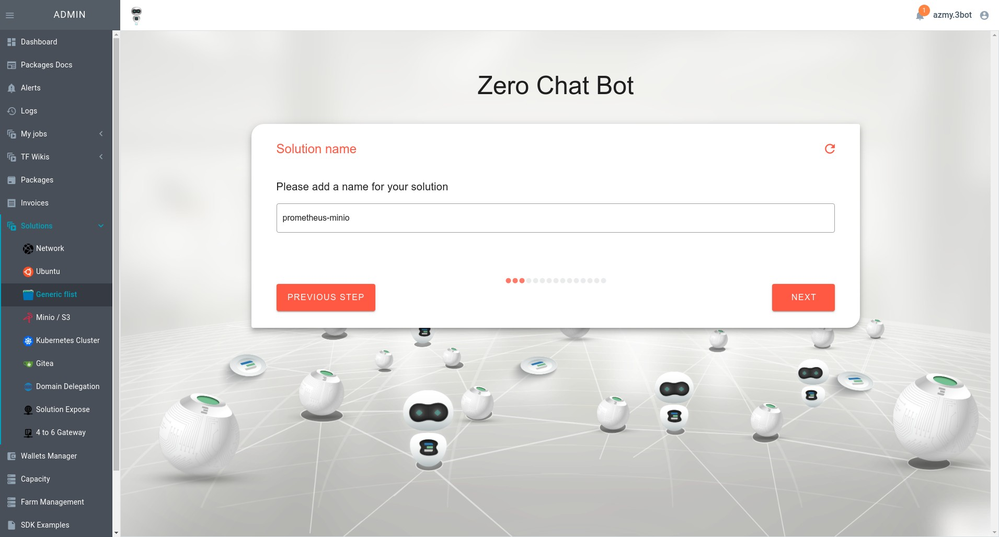

Use this Flist for your deployment `https://hub.grid.tf/tf-official-apps/prometheus:latest.Flist`. and press next


Choose HDD storage again, and accept other default values.


Make sure you select `No` here.


Leave the entrypoint empty and press `Next`
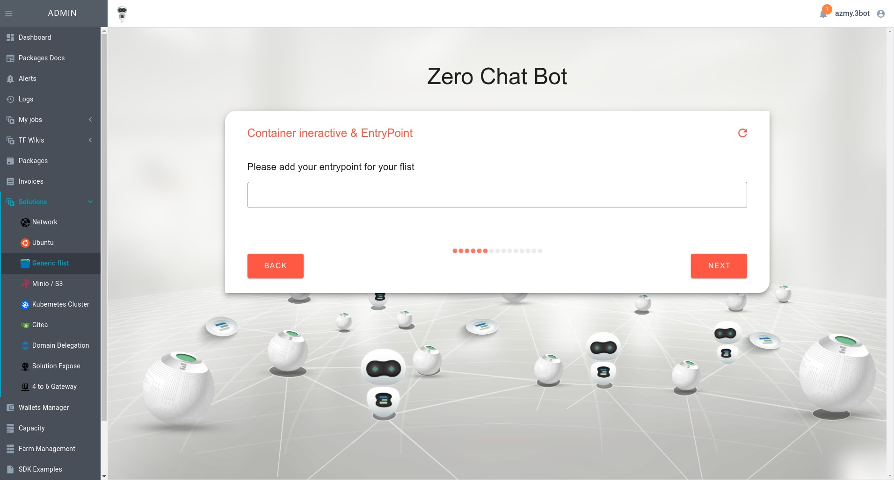

This is very import step. Please add the `SSH_KEY` env var to your container the value should be your SSH public key (the content of `$HOME/.ssh/id_rsa.pub`). Make sure you press the small `(+)` before you press `Next`


Choose the right farm. Again choosing the same farm as your minio solution will grantee a better connectivity. But it doesn't have to.
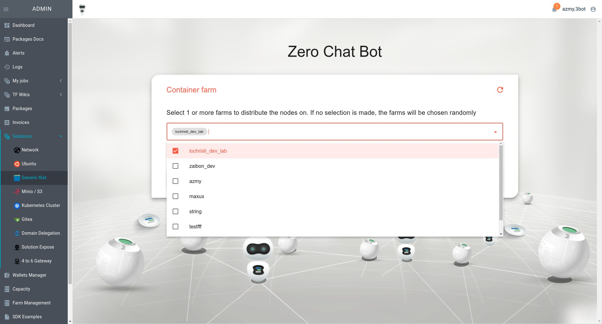

We need to add an extra volume to the solution where `prometheus` is going to save the metrics it collects.


Make sure you have the same values as the screen below and press `Next`
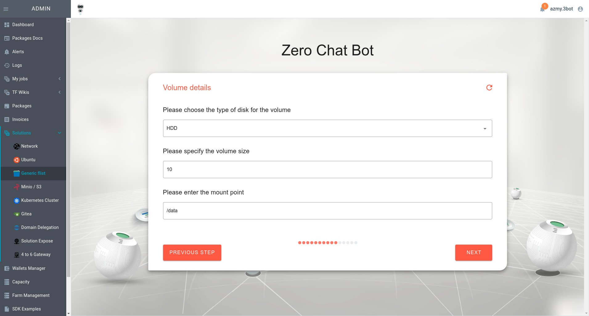

Choose expiration date for your solution.


Select the IP for your prometheus container
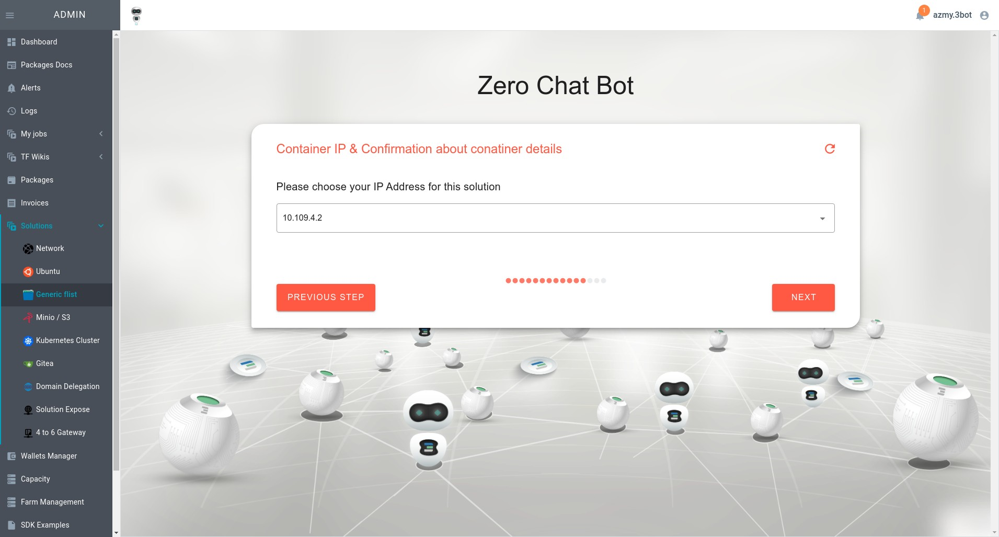

Confirmation, then press `Next` once everything is okay.


Choose wallet to pay.


Deployment in progress.


Take a note of the IP. we need that later to configure prometheus


#### Configuring prometheus to monitor minio
Since you used your SSH public key you could ssh to the prometheus node to configure it. Please do the following (please use the IP of your prometheus setup)
```bash
ssh root@10.109.4.2

# open the config file for editing
vi /etc/prometheus.yml
```
> You could instead download the file, modify it and upload it again. like `scp root@10.109.4.2:/etc/prometheus.yml prometheus.yml`, then upload it again like `scp prometheus.yml root@10.109.4.2:/etc/prometheus.yml`

Add this section at the end of the file. **NOTE** replace the IPs with the correct values you have for your `Master` and `Slave` nodes.
> Make sure indentation is correct.
```yaml
 - job_name: 'minio-job'
 metrics_path: /minio/prometheus/metrics
 scheme: http
 static_configs:
  - targets: ['10.109.5.2:9000', '10.109.3.2:9000']
```

Make sure now to force `prometheus` to reload the config file as following
```bash
zinit kill prometheus SIGHUP

# then you could check prometheus logs to make sure there were no configuration errors by doing
zinit log prometheus
```

You could now visit `http://10.109.4.2:9090/graph` (please use the IP of your prometheus setup) to access the built in prometheus UI. You could then check the available metrics in the UI.

### Installing grafana (optional)
You could totally run grafana locally on your PC and configure it to use the prometheus instance running in the grid. But for the completion of the tutorial we will also show you have to install a generic grafana solution on the grid.

We have to create a new `Generic Flist` solution.
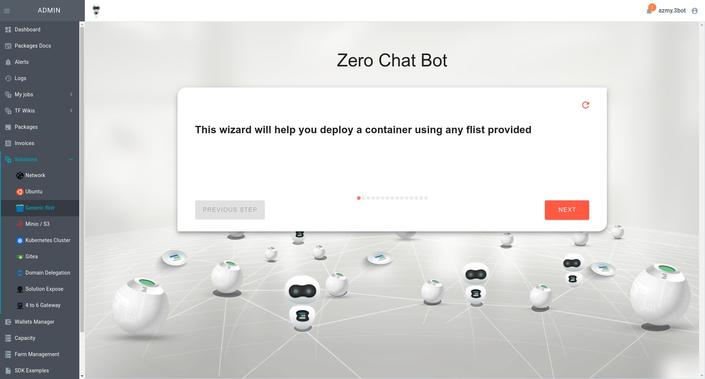

Select the proper network
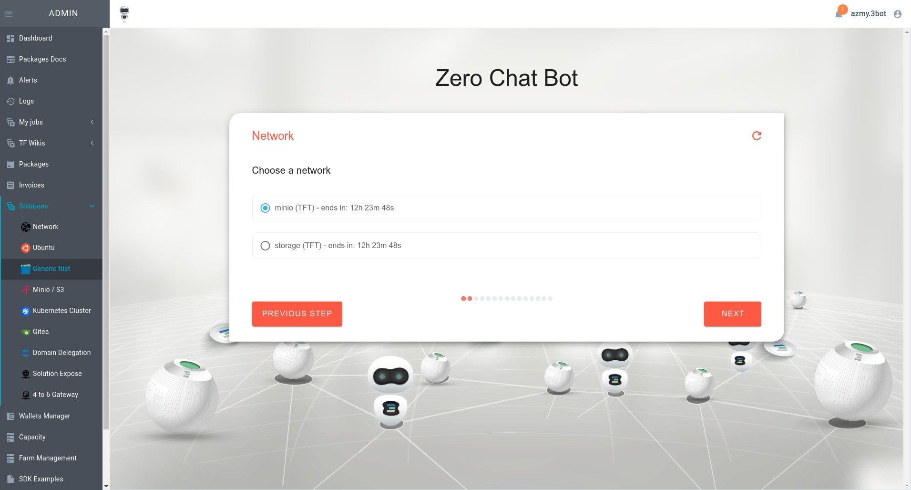

Give your deployment a name


Use this Flist for a generic grafana solution `https://hub.grid.tf/azmy.3Bot/grafana-grafana-latest.Flist`
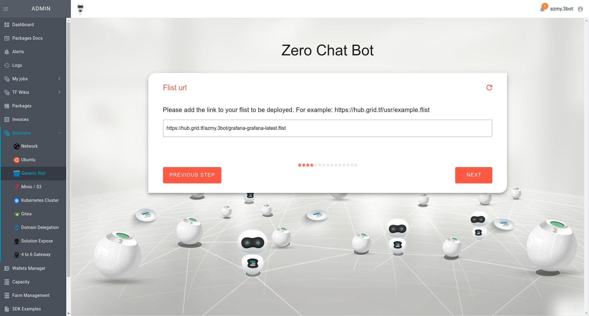

Accept the default settings, but make sure to use HDD storage.
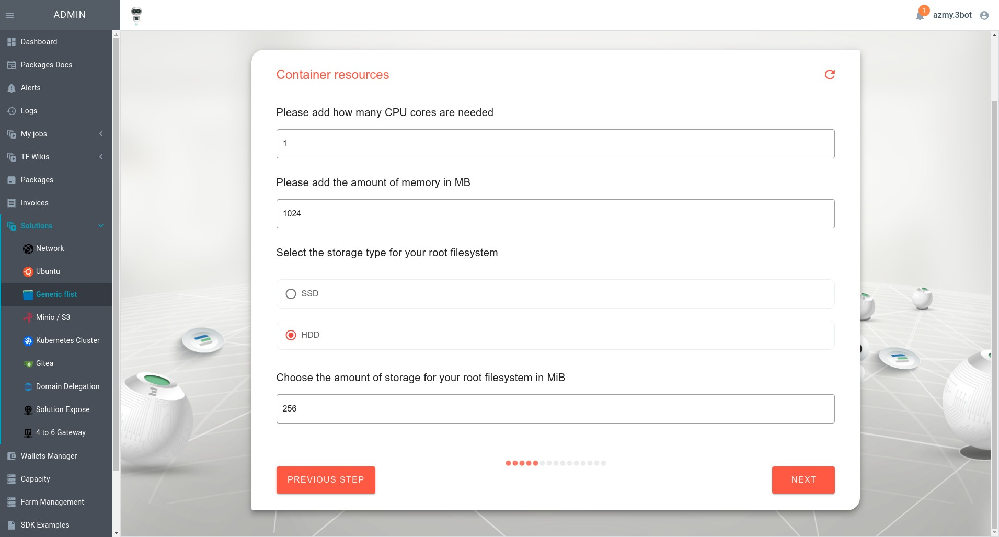

Please select `No` here.


Leave an empty entrypoint


No env vars are needed, just press `Next`
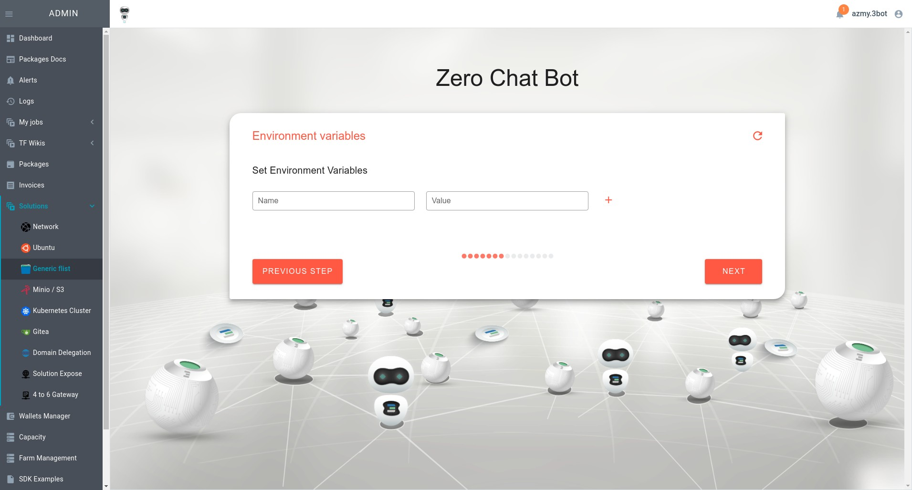

Choose proper farm


No need for extra volumes, since grafana doesn't store any data locally


Select expiration data for your solution


Choose an IP address for grafana


Validate and confirm setup.
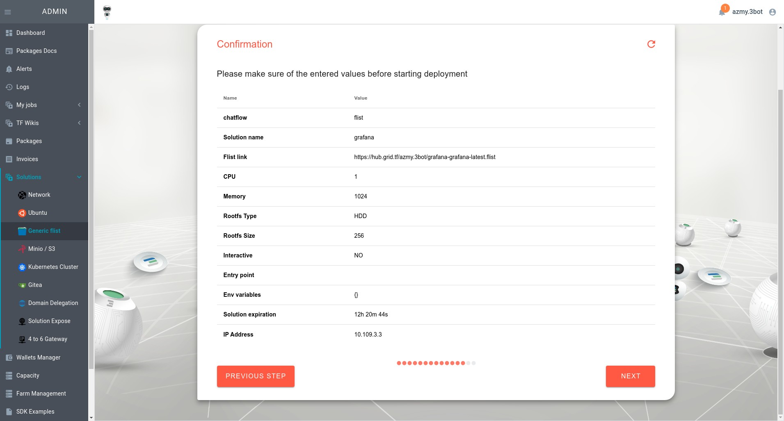

Choose proper wallet to pay
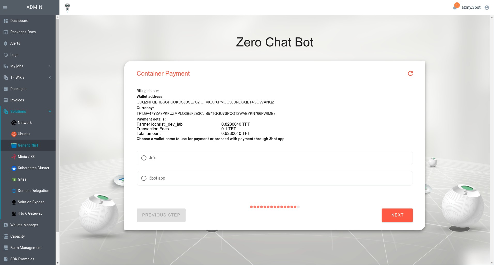

Deployment in progress
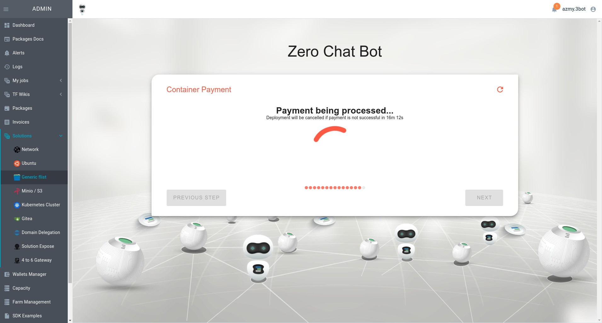

Take note of the granfa IP.


You could now visit `http://10.109.3.3:3000` (please use the IP for your grafana solution instead). Use `admin/admin` to login then you could change the default password.

Go to the settings window, and Press `Add data source`
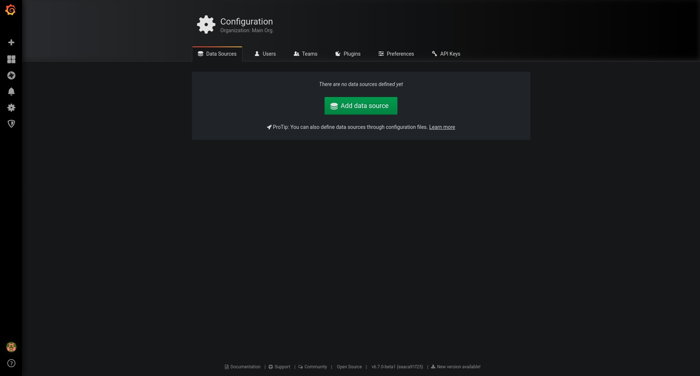

Choose `Prometheus` data source


In the URL please enter your valid prometheus address (it's `http://10.109.4.2:9090` in this example). Once you click `Save & Test` everything should be green as in the example below.


You could quickly go the `Explore` window (click the compass icon on the left)


Clicking the metrics drop down you should see all the `metrics` that are know to prometheus (same ones from prometheus UI)


Later you could add dashboards for `minio` that shows you all minio statistics. We might also later provide a pre-configured minio dashboard that also graph the new custom metrics in minio that were added by `Threefold`

Later you could add dashboards for `minio` that shows you all minio statistics.
Please import this [dashboard](https://raw.githubusercontent.com/Threefoldtech/minio/master-rework/cmd/gateway/zerostor/grafana.json) in grafana which will give you the best overview for tall available metrics.
