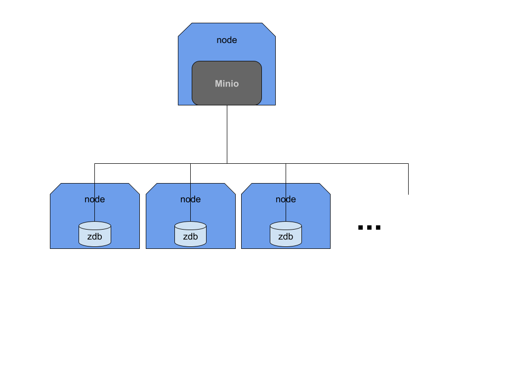

# Introduction
Please check [specifications](https://docs.google.com/document/d/1HzyElPiy3NTELSiYvAaJ47tMAr0-smBjbdJNcASJ5KU/edit#heading=h.ktkmsaklxsca)

The basic idea is to provide a reliable storage solution that leverage on the current grid functionality.

> NOTE: We are discussing a modified version of minio that has be officially released by threefold to have all the feature that is used, and explained in this document. So when we say `minio` we always mean the `threefold` version. You can find the source code [here](https://github.com/threefoldtech/minio)

## Installation tutorial
Please check a full installation tutorial [here](tutorial.md)
# Diagrams



# Data flow
We have a modified version of minio so it can work against our zdb instances. It has been modified to use [0-stor](https://github.com/threefoldtech/0-stor). `0-stor` can do `replication or distribution/erasure coding` out of the box. Hence files uploaded to this version of minio are split into separate smaller chunks, and distributed (erasure coded) across separate instances of `0-db`. The distribution is done according to the configuration (discussed later).

Once files are uploaded, we can afford losing multiple `0-db` instances (below certain threshold) and still able to retrieve the files un-intact. (later we can heal the setup to make sure files are distributed again in an optimal manner)

# Disaster recovery
## Monitoring
Minio provides metrics for prometheus, so you can monitor the health of the instance and also the zdb shards. By checking the rate of the errors owner of the instance can decide to start a heal process.

## Healing
Minio provides a `healer` api where you can kick start healing jobs.
The API  can be used to run a full check on all the objects, or a full bucket, or a single object.
The API provide options so you can do a check without fixing, or check and fix (default). The check or check and fix jobs can either run in the foreground
or in the background

### Foreground jobs
A foreground job will stream back a full detailed report of each check, fix or error that happens on the system while doing the healing. It's up for the client to read this report and process, or aggregate it the way they see fit. A disconnection of the client will stop the job.
### Background jobs
A background job can run in the background, with no detailed report. instead it will keep a summary status of the process. The client can later check on the job status once in a while until it's completely done. Then they can read the summary and drop the job report later on.

### API
```
POST /repair
POST /repair/{bucket}
POST /repair/{bucket}/{object}

GET    /jobs
DELETE /jobs/{id}
```

> All `repair` endpoints accepts optional query `dry-run` and `bg`

#### Query options
- `dry-run` runs a check with no attempt to fix. This flag will make minio report the current status of the zerostore gateway.
- `bg` short for `background` as explained before, this will not produce a report instead only keep a summary of number of objects.

### Example report
running the following curl command in your shell
```
curl -XPOST "localhost:9010/repair/large"
```

Will produce some output like this

```
blob: 18dcb41b-b998-4d8f-ac61-85e02497c0f8 (status: optimal, repaired: false)
object: large/how_to_get_tft.mp4 (blobs: 1, optimal: 1, valid: 0, invalid: 0, errors: 0, repaired: 0)
blob: <empty> (status: optimal, repaired: false)
object: large/subdir/ (blobs: 1, optimal: 1, valid: 0, invalid: 0, errors: 0, repaired: 0)
blob: 1f8168e7-12e0-4824-abcf-b6060db8b06d (status: optimal, repaired: false)
blob: b3f81564-13d7-40ed-9378-d5551a3ece49 (status: optimal, repaired: false)
blob: ff84d290-79ab-49e7-b5a7-6a952979d02a (status: optimal, repaired: false)
blob: 72988083-fc81-4654-8795-32f6377e942f (status: optimal, repaired: false)
blob: dcf03c3d-0c50-4d43-8d35-5cabd8546510 (status: optimal, repaired: false)
blob: 0d2ab8cb-1aee-477a-9c38-9a0596d09df3 (status: optimal, repaired: false)
blob: 3759d5eb-9bc0-4365-a406-6369eab360b9 (status: optimal, repaired: false)
blob: bb4f72c0-fe0a-4016-81f9-e56b66da5e58 (status: optimal, repaired: false)
object: large/subdir/movie.mp4 (blobs: 8, optimal: 8, valid: 0, invalid: 0, errors: 0, repaired: 0)
bucket: large
```

#### How to read the report
Due to the streaming nature of the report, reports makes more sense if they are reading down up. Because we need to check all blobs of a single object before we can give statistics about the object. So blobs of an object comes before the object stats itself.

Also directories are "fake" entries in minio. So they are also checked, while they have one blob that actually doesn't container any data. Hence directories blobs always have `blob: <empty>` and they are always `optimal`. so you can always skip these ones. Again notice that the blob also comes before the directory object.

# Deployment
We going to use these node ids which are in a close proximity to each other (preferably in the same farm) to reduce the networking delays
## Nodes
- node-1 (has public ip)
- node-2
- node-3
- node-4

## Topology
This is completely up to you to decide, this is only explaining how we going to deploy our demo setup.
- We going to use `node-1` as our access point only. No workloads are going to be run there
- We install all our workload on node-2 (minio, grafana, and prometheus). This is not required at all but just to simplify the demo
- zdb namespaces on node-2, node-3 and node-4

So according to our setup above we need to have node-1 (as access) and (node-2) added to our overlay network. Since all our workloads (containers) are hosted on node-2 which is private, so we need to reach it over node-1 which has public interfaces.

## Network
We can use `tfuser` utility to generate our reservations schemas. Please follow [documentations](https://github.com/threefoldtech/zos/tree/master/docs/tfuser#generate-a-network-provisioning-schema) to add the required nodes to your network.

> *NOTE:* this is a sample schema file, you need to use the `tfuser` utility as per the docs above to generate a new one with valid keys and node ids

```json
{
   "created" : "0001-01-01T00:00:00Z",
   "data" : {
      "ip_range" : "172.20.0.0/16",
      "name" : "<network-name>",
      "net_id" : "",
      "net_resources" : [
         {
            "node_id" : "node-1",
            "peers" : [
               {
                  "allowed_ips" : [
                     "172.20.2.0/24",
                     "100.64.20.2/32"
                  ],
                  "endpoint" : "[2a02:1802:5e:0:1001::c]:3693",
                  "subnet" : "172.20.2.0/24",
                  "wg_public_key" : "TteobT8FvfLmgF8eI8okKvH33zuRypMHzRZC0kZxshE="
               },
               {
                  "allowed_ips" : [
                     "10.1.0.0/24",
                     "100.64.1.0/32"
                  ],
                  "endpoint" : "",
                  "subnet" : "10.1.0.0/24",
                  "wg_public_key" : "s1san4mw1Pju3HEQqLi4gGveeEQagPgPA3DCfnvygRs="
               }
            ],
            "subnet" : "172.20.1.0/24",
            "wg_listen_port" : 3895,
            "wg_private_key" : "861ac481373ea2dee2768d2b5d436425550812425df094be0576089102c2513fb69eb3c64241b244d60cd54254b24d1de114afa7a085d54639f1333f7b8a99eeca293b64c17b477f64b898618f97b30a5dce7efc3491450e28c4754f",
            "wg_public_key" : "YgO/aPXXje+oBEonbsk2USYGn6c4cbmumhfWryFs5y0="
         },
         {
            "node_id" : "node-2",
            "peers" : [
               {
                  "allowed_ips" : [
                     "172.20.1.0/24",
                     "100.64.20.1/32",
                     "10.1.0.0/24",
                     "100.64.1.0/32"
                  ],
                  "endpoint" : "[2a02:1802:5e:0:1001::b]:3895",
                  "subnet" : "172.20.1.0/24",
                  "wg_public_key" : "YgO/aPXXje+oBEonbsk2USYGn6c4cbmumhfWryFs5y0="
               }
            ],
            "subnet" : "172.20.2.0/24",
            "wg_listen_port" : 3693,
            "wg_private_key" : "66c765c0be18e201883c9c0f5fb7e8b7ad3c15cdcbbbb049b5697a48b0bcf43febe21e2a335529584e269760cc1649657fc8d5127abd0981142078452441790d0ea08d4ecb137b44d0a5cadcc65f65a3daa82d3ec04ddbcd3fc3fe8c",
            "wg_public_key" : "TteobT8FvfLmgF8eI8okKvH33zuRypMHzRZC0kZxshE="
         }
      ]
   },
   "duration" : 0,
   "id" : "",
   "node_id" : "",
   "to_delete" : false,
   "type" : "network",
   "user_id" : ""
}
```

> *NOTE:* please make sure you do `add-access` to configure your local machine to be able to join the overlay network. Otherwise there is no way you can access the deployed workloads.

## ZDB
We going to use three zdb namespaces in this deployment. We gonna use node-2, node-3 and node-4 as explained above. You need to deploy 3 instances of the following schema, make sure to use the correct node-ids for each reservation

```json
{
   "created" : "0001-01-01T00:00:00Z",
   "data" : {
      "disk_type" : "SSD",
      "mode" : "seq",
      "password" : "password",
      "public" : false,
      "size" : 10
   },
   "duration" : 0,
   "id" : "",
   "node_id" : "<node-id>",
   "to_delete" : false,
   "type" : "zdb",
   "user_id" : ""
}
```

> *NOTE:* while possible, ZDBs nodes doesn't have to be part of your network because all ZDBs deployment has public IPv6 so they are reachable from within your overlay network.

You need to collect the result information of your zdb deployments (this include the IP, Port and Namespace). These information is needed to configure minio in the coming stage.

## Minio
After collecting the zdb(s) information you need to install a minio container as follows
- Build the `SHARDS` string, from the namespaces information you collected on the previous stage
- Set the correct node ID.
- Use the correct network name as configured in <a href='#network'>network</a>
- the `MINIO_PROMETHEUS_AUTH_TYPE=public` is needed by prometheus (later stage)

```json
{
   "created" : "0001-01-01T00:00:00Z",
   "data" : {
      "capacity" : {
         "cpu" : 2,
         "memory" : 4096
      },
      "entrypoint" : "/bin/entrypoint",
      "env" : {
         "ACCESS_KEY" : "minio",
         "DATA" : "2",
         "MINIO_PROMETHEUS_AUTH_TYPE" : "public",
         "PARITY" : "1",
         "SECRET_KEY" : "passwordpassword",
         "SHARDS" : "<ns-2>:password@[<node-2-ip>]:9900,<ns-3>:password@[<node-3-ip>]:9900,<ns-4>:password@[<node-4-ip>]:9900"
      },
      "flist" : "https://hub.grid.tf/azmy.3bot/minio.flist",
      "flist_storage" : "",
      "interactive" : false,
      "mounts" : [],
      "network" : {
         "ips" : [
            "172.20.2.20"
         ],
         "network_id" : "<networ-name>",
         "public_ip6" : false
      },
      "secret_env" : null
   },
   "duration" : 0,
   "id" : "",
   "node_id" : "<node-2>",
   "to_delete" : false,
   "type" : "container",
   "user_id" : ""
}

```

> *NOTE:* in production installation minio container would require an extra volume to store the files metadata, but for the demo purposes this is not needed. We skip this part for simplicity

## Checkpoint
You should have minio now working you can updload/download files to it already. You need to access '172.20.2.20:9000' (or whatever IP you used in the minio container installation)

## Monitoring

### Grafana
Grafana deployment is straight forward, since it's fully configured from the ui. Once deployed visit '172.20.2.10:3000' to check you have access. try login with admin/admin then change password. We will come back here to add prometheus data source once prometheus is installed

```json
{
   "created" : "0001-01-01T00:00:00Z",
   "data" : {
      "capacity" : {
         "cpu" : 4,
         "memory" : 2048
      },
      "entrypoint" : "/run.sh",
      "env" : {},
      "flist" : "https://hub.grid.tf/azmy.3bot/grafana-grafana-latest.flist",
      "flist_storage" : "",
      "interactive" : false,
      "mounts" : [],
      "network" : {
         "ips" : [
            "172.20.2.10"
         ],
         "network_id" : "azmy",
         "public_ip6" : false
      },
      "secret_env" : null
   },
   "duration" : 0,
   "id" : "",
   "node_id" : "<node-2>",
   "to_delete" : false,
   "type" : "container",
   "user_id" : ""
}

```

### Prometheus
Prometheus installation requires an extra storage volume for metics database.

```json
{
   "created" : "0001-01-01T00:00:00Z",
   "data" : {
      "size" : 5,
      "type" : "HDD"
   },
   "duration" : 0,
   "id" : "",
   "node_id" : "<node-2>",
   "to_delete" : false,
   "type" : "volume",
   "user_id" : ""
}
```

Once the volume ID is know, we install prometheus container

```json
{
   "created" : "0001-01-01T00:00:00Z",
   "data" : {
      "capacity" : {
         "cpu" : 4,
         "memory" : 2048
      },
      "entrypoint" : "",
      "env" : {},
      "flist" : "https://hub.grid.tf/azmy.3bot/prom-prometheus-latest.flist",
      "flist_storage" : "",
      "interactive" : true,
      "mounts" : [
         {
            "mountpoint" : "/prometheus",
            "volume_id" : "<volume-id>"
         }
      ],
      "network" : {
         "ips" : [
            "172.20.2.100"
         ],
         "network_id" : "azmy",
         "public_ip6" : false
      },
      "secret_env" : null
   },
   "duration" : 0,
   "id" : "",
   "node_id" : "<node-2>",
   "to_delete" : false,
   "type" : "container",
   "user_id" : ""
}
```

> *NOTE:
- We use `interactive: true` so the container will have corex running so we can access the terminal remotely to configure and run services
- Use the correct volume ID

Once the installation is complete access the container corex interface '172.20.2.100:7681' use the client (or the api) to start a `sh` terminal. You can use that tty now to change prometheus configuration by adding this section to the `scrape_configs`

```yaml
  - job_name: minio-job
    metrics_path: /minio/prometheus/metrics
    scheme: http
    static_configs:
    - targets: ['<minio-ip>:9000']
```

Then start prometheus.

### Configure grafana
Now go back to grafana, add the prometheus data source (the IP in this example is 172.20.2.100). You should now be able to use the explorer to check the minio metrics, and also able to add a dashboard.
