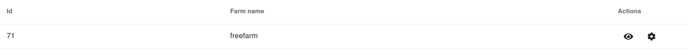
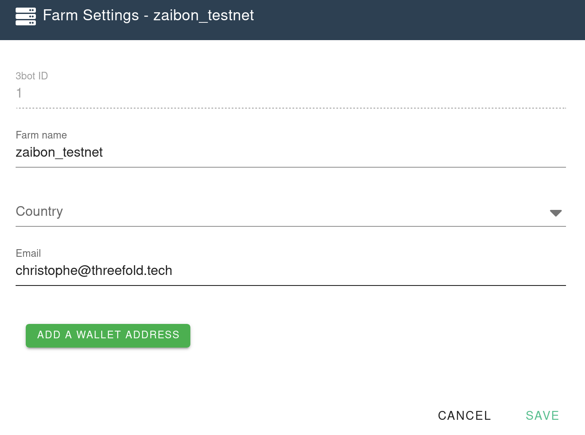

# Configure the TFT wallet address of your farm

In order for users to reserve capacity from your farm and pay for it. The users needs to know the wallet address where to send the tokens for the reservation.

At the time of writing, 3 currencies are supported, [TFT](https://github.com/Threefoldfoundation/tft-stellar/#tft), [FreeTFT](https://github.com/Threefoldfoundation/tft-stellar/#freetft) and [TFTA](https://github.com/Threefoldfoundation/tft-stellar/#tfta).

## Configure your farm wallet addresses from the 3SDK GUI

The easiest method to configure the wallet addresses of your farm is to do it from the Farm management page from the [3SDK]([http://wiki.cloud.Threefold.io/gettingstarted/sdk_install.html](http://wiki.cloud.Threefold.io/gettingstarted/sdk_install.html).

1. Click on the little gear in the `Actions` colum of the farm tables



This will open up the configuration page of the farm



Click the big green button `Add wallet address` at the bottom of the form. This will create a new wallet address.
A wallet address is composed of 2 things, the address itself and the asset code. The asset code is used to identify the currency on the stellar blockchain.

Fill in the wallet address with your address and the correct asset. You can add as many addresses as you want. But only one per supported asset you want to accept is required.


Once you are done, click the save button at the bottom right.

That's it, your farm has now it's wallet address configured.

## Configure your farm wallet addresses using the 3SDK kosmos shell

It is also possible to configure your farm using the kosmos shell.
Here is a commented script that shows you how to proceed:

```python
from jumpscale.clients.explorer.models import TF GridDirectoryWallet_address1      

# get a client to the explorer
explorer = j.core.identity.me.explorer
# retrieve the information of your farm
farm = explorer.farms.get(farm_name='freefarm')
# create a new wallet
wallet = TF GridDirectoryWallet_address1()
# configure the wallet address and asset code
wallet.address = '....'
wallet.asset = 'TFT'
# update farm with address and save the instance
farm.wallet_addresses.append(wallet)
farm.save()
# send the updated farm configuration to the explorer
explorer.farms.update(farm)
```
