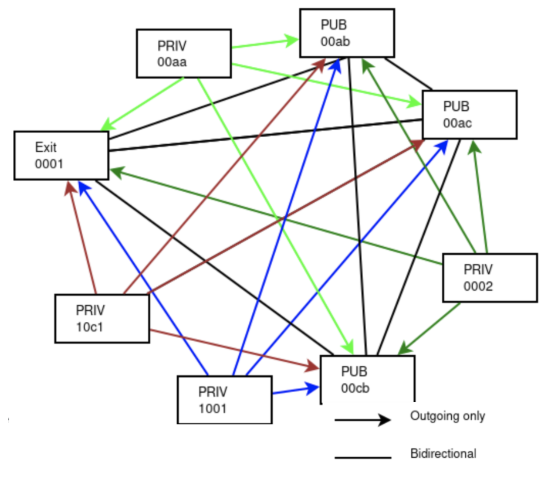

# Planetary Secure Network 

!!!include threefold:threefold_network 

---

- Public side of our planetary secure network.
- connect everyone in the world (mobile & desktop), end2end encrypted
- strongly authenticated at the edge.
- no more need for centralized firewalls, every node in the planetary network arranges it own encryption, routing an authentication
- integrated name services (like DNS)

