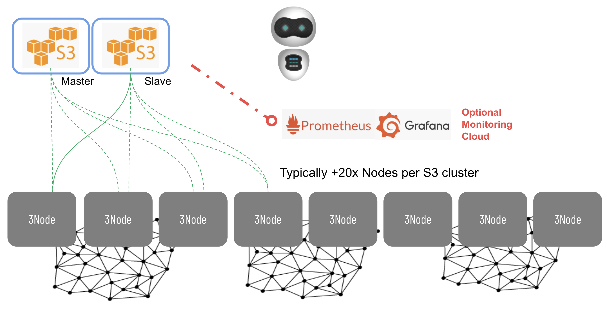

# Quantum-safe Storage system

!!!include threefold:quantumsafe_storage_algo level:2

You can visualize the 'Space Algorithm' (also called FEC = 'Forward-Looking Error Correcting Code') as a description of the data as a collection of equations. Let's state that there are 16 chunks of data to be stored. Each of these chunks has a binary value (for simplicity, the below example uses the decimal system). 

Let's name these chunks a,b,c,d, ... and then let's generate equations with it. 

`a+2b+c+d+e+f+g+h+i+j+k+l+m+n+o+p=100`
`a-3b-c+d+f-g-4h-i+j+2k-l-m-n+o+p=204`
`a-3b-c+d+f-g-h-i+j+k-7l-m-n+o+2p=506`
`...` (20 equations)

Each of these equations reveals information on the value of all data chunks, but none of them is useful individually to retrieve information on what these values might be. Only when 16 out of these 20 equations are combined, one is able to recollect the full data. 

Each of these equations are stored on a different location, in a way that only the one controlling the IT workload that has generated the information is able to reconstruct the original data. Data is 'dispersed' over 20 locations: 16 randomly chosen locations are needed to recollect the pieces, the 4 remaining ones are available as an 'operational backup' : in case 1 or even 4 node go down, the algorithm is robust enough to reassemble the original data. 
---

## Quantum-safe 

ThreeFold has intelligently applied this algorithm to make a quantum-safe storage system. Even a quantumcomputer won't be able to decipher encrypted data, simply because based on the data in one location, there is no way to recompile the original information. 

## Guaranteed Data Privacy and Reliability 

Two of the most essential requirements for a storage system are : 
- Reliability: the storage should remain available even with hardware unavailability of ex. up to any 4 nodes
- Data Privacy

The classic recipes to make this happen are
- For reliability: make 4 copies of the original
- For Data Privacy: encryption of the data

But this approach has quite some disadvantages :
- 4 copies of one source leads to 400% overhead 
- 5 times the bandwidth is required to store on multiple locations
- A hacker only needs to have one copy of the original, so he only needs to hack himself into one location

By not copying the full objects integrally but dispersing the parts after encryption over multiple devices with low redundancy, both privacy and reliability are achieved and substantially optimized, compared to classic systems.  

## Summary of the Advantages

- **Space efficient** : only 20% space overhead is required. This is a factor 20 better than classic systems to achieve the same reliability; 
- **Flexible** : the order of retrieval is not important to recunstruct the original data;
- **Hacker proof and Quantum-safe** : A hacker needs to break into physical 16 locations and have the encryption key before he can try to reconstruct the data. Same counts for a supercomputer, that is not capable to reconstruct the info as it misses data. 
- **Ultra Reliable** : more than one nodes can go down without performance degradation or data loss
- **Scalable** : scaling is possible without limits
- **Auditable** : data can never be lost, unlimited history, auditing on digital ledger layer
- **Energy-efficient** : 10x less power utilization due to the reduced storage volumes
- **Self-healing** : service can be automatically recovered in the event of outage with no human intervention. The 3Bot as your Virtual System Administrator can monitor your storage on node outages and can trigger the reconstruction of data (read: new equations) on the fly. 

## Usage

The algorithm has been implemented on the ThreeFold Grid as the [**Planetary Secure File System**](cloud:threefold_filesystem).

This Quantum-Safe File System can be used as back-end storage for **any** file format : 

- Archive systems
- S3 storage systems
- VDisk backend systems (block device access) (OEM only)
- Virtual file system (container FS)
- CDN = Content Delivery Networks
- Blockchain Storage Backends (here optimisation is a factor 50 or more, depending on the number of participating nodes)
- Distributed file sharing formats such as IPFS and Hypercore
- ...

